# WildTrack Platform — Architecture Document

**Document:** SDD-02 Architecture  
**Version:** 1.0.0  
**Date:** 2026-06-13  
**Status:** Draft — Pending Approval  
**References:** SDD-01 Requirements v1.2.0, ADR-001, ADR-002, ADR-003, ADR-004

---

## Table of Contents

1. [System Context Diagram — C4 Level 1](#1-system-context-diagram--c4-level-1)
2. [Container Diagram — C4 Level 2](#2-container-diagram--c4-level-2)
3. [Component Diagram — C4 Level 3 Backend](#3-component-diagram--c4-level-3-backend)
4. [Backend Modular Monolith](#4-backend-modular-monolith)
5. [Frontend Architecture](#5-frontend-architecture)
6. [Database Architecture](#6-database-architecture)
7. [MQTT Architecture](#7-mqtt-architecture)
8. [Media Storage Architecture](#8-media-storage-architecture)
9. [Geoportal Architecture](#9-geoportal-architecture)
10. [Analytics Architecture](#10-analytics-architecture)
11. [Deployment Architecture](#11-deployment-architecture)
12. [Sequence Diagrams](#12-sequence-diagrams)

---

## 1. System Context Diagram — C4 Level 1

This diagram shows the highest-level boundary of the WildTrack system, who interacts with it, and which external systems it depends on.

**People:** Administrators, Researchers, and Field Operators access the system through a web browser. **External systems:** ESP32 feeder devices communicate via MQTT and never touch the REST API. OpenStreetMap provides base map tiles to the frontend; no user data is sent to it.

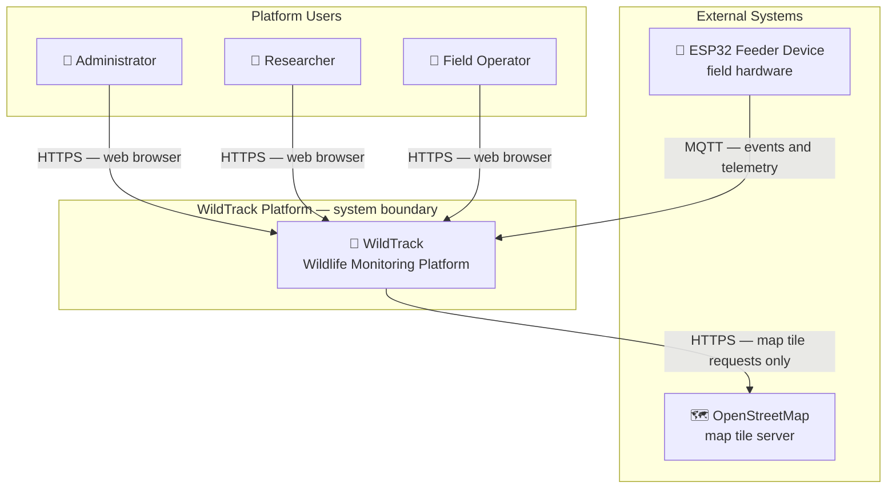

**Boundary rules:**
- All human interaction enters through the web frontend via HTTPS.
- All device communication enters exclusively through MQTT; devices never call the REST API.
- OpenStreetMap receives only anonymous tile requests; no WildTrack user data leaves the boundary.

---

## 2. Container Diagram — C4 Level 2

This diagram decomposes the system boundary into its deployable containers and shows how they communicate.

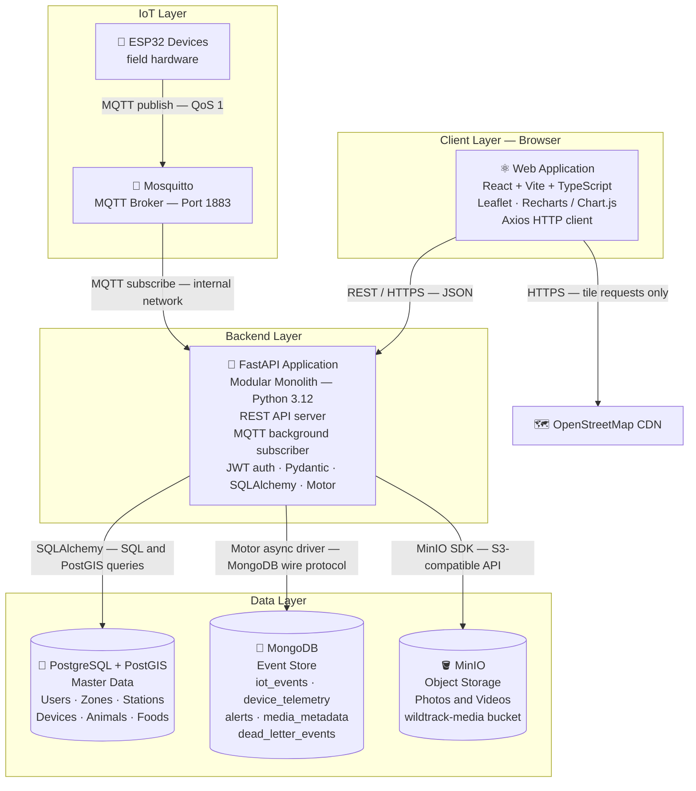

**Protocol summary:**

| From | To | Protocol | Notes |
|------|----|----------|-------|
| Browser | Backend API | HTTPS / REST | JSON; JWT in Authorization header |
| Browser | OpenStreetMap | HTTPS | Tile fetches only; no auth |
| ESP32 | Mosquitto | MQTT 3.1.1 | QoS 1; no TLS in MVP |
| Mosquitto | Backend | MQTT subscribe | Docker internal network |
| Backend | PostgreSQL | TCP / SQL | SQLAlchemy async connection pool |
| Backend | MongoDB | TCP | Motor async driver |
| Backend | MinIO | HTTP / S3 API | MinIO Python SDK |

---

## 3. Component Diagram — C4 Level 3 Backend

This diagram shows the internal structure of the FastAPI application. Each business module is self-contained with its own router, service, repository, schemas, and models. Shared infrastructure is used by all modules through dependency injection.

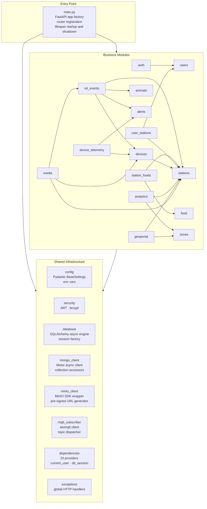

---

## 4. Backend Modular Monolith

### 4.1 Module Responsibilities

| Module | Responsibility | Primary Store |
|--------|---------------|---------------|
| `auth` | Public self-registration, login, JWT issuance | PostgreSQL |
| `users` | User CRUD, role changes, deactivation by admin | PostgreSQL |
| `zones` | Zone registration, coordinates, soft delete | PostgreSQL + PostGIS |
| `stations` | Station lifecycle, location, status, ownership | PostgreSQL + PostGIS |
| `devices` | Device registration, station assignment, firmware and last_seen tracking | PostgreSQL |
| `animals` | Global animal registry, RFID management | PostgreSQL |
| `food` | Food type catalog | PostgreSQL |
| `station_foods` | Food-station associations with active flag | PostgreSQL |
| `user_stations` | User-to-station assignment and access enforcement | PostgreSQL |
| `iot_events` | MQTT feeding event ingestion, validation, RFID resolution, storage | MongoDB |
| `device_telemetry` | MQTT heartbeat ingestion, device status updates | MongoDB + PostgreSQL |
| `alerts` | Alert generation, open/resolved lifecycle | MongoDB |
| `analytics` | Aggregated metrics and time-series queries | MongoDB + PostgreSQL |
| `geoportal` | Read-only spatial and event summary data for the map | PostgreSQL + MongoDB |
| `media` | Media file upload to MinIO, metadata storage | MinIO + MongoDB |

### 4.2 Module Boundary Rules

- Each module's **repository** is the only layer that issues database queries or storage calls.
- Each module's **service** contains all business logic and orchestrates cross-repository calls.
- Each module's **router** handles HTTP routing and input validation only; it delegates to the service immediately.
- Cross-module access is only permitted through service-to-service calls. Repositories never import from other modules.
- `iot_events` and `device_telemetry` handlers may call `alerts.service` to generate alerts. `alerts` never imports from either of them.

### 4.3 Module Dependency Graph

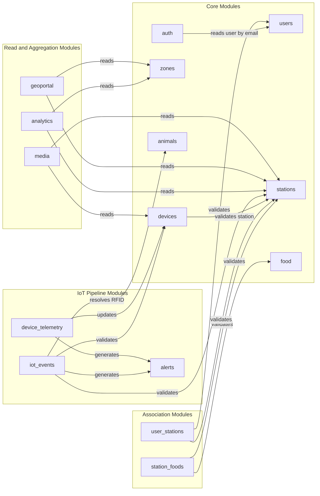

---

## 5. Frontend Architecture

The frontend is a React SPA built with Vite and TypeScript. It communicates only with the backend REST API. All map rendering uses Leaflet with OpenStreetMap tiles.

### 5.1 Layer Structure

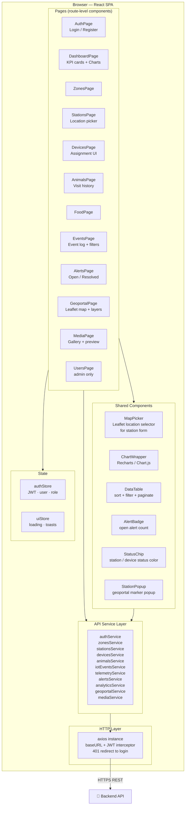

### 5.2 Route Structure

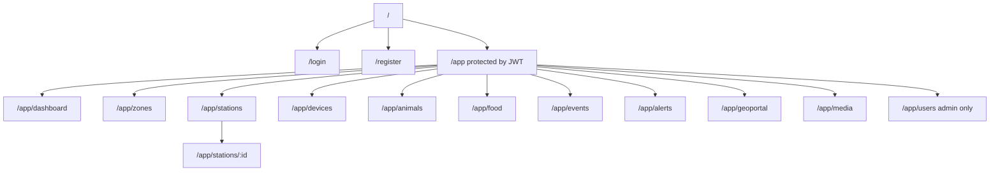

### 5.3 Location Capture Flow

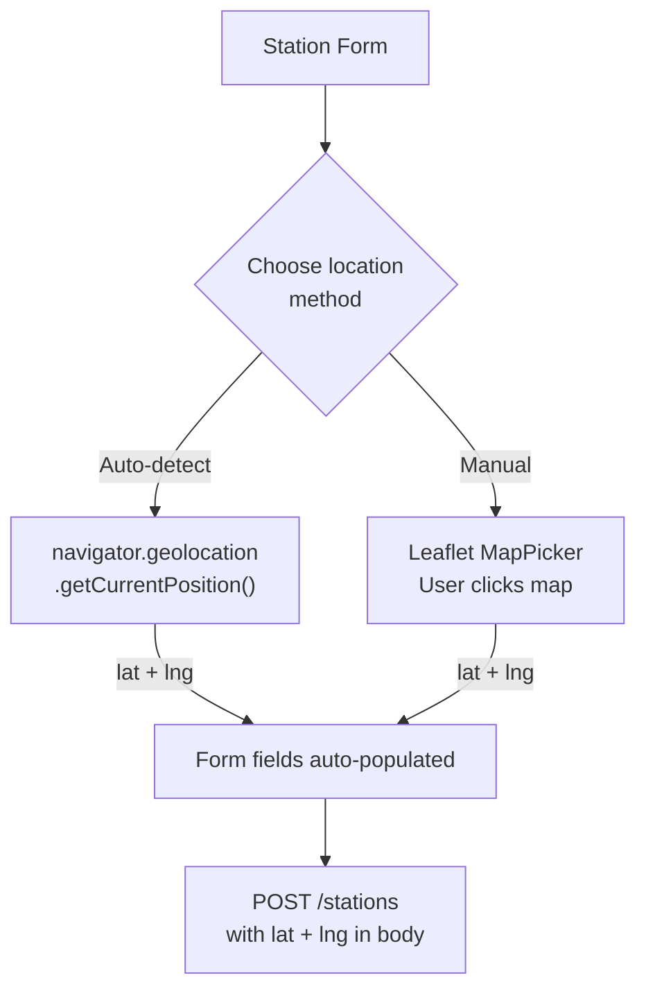

---

## 6. Database Architecture

### 6.1 PostgreSQL — Entity Relationship Diagram

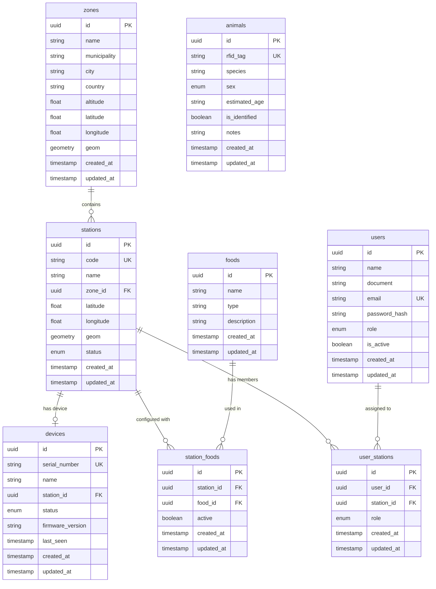

### 6.2 PostgreSQL — Enumeration Types

| Table | Column | Values |
|-------|--------|--------|
| `users` | `role` | `admin`, `researcher`, `field_operator` |
| `stations` | `status` | `active`, `inactive`, `maintenance`, `offline` |
| `devices` | `status` | `online`, `offline`, `unassigned` |
| `animals` | `sex` | `male`, `female`, `unknown` |
| `user_stations` | `role` | `owner`, `researcher`, `field_operator` |

### 6.3 MongoDB — Collections Overview

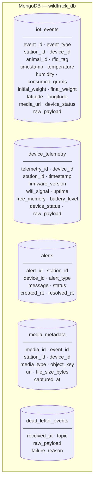

### 6.4 MongoDB — Index Strategy

| Collection | Indexes |
|------------|---------|
| `iot_events` | `{station_id, timestamp}`, `{device_id, timestamp}`, `{animal_id}`, `{rfid_tag}`, `{event_type}` |
| `device_telemetry` | `{device_id, timestamp}`, `{station_id, timestamp}` |
| `alerts` | `{station_id, status}`, `{device_id, status}`, `{alert_type, status}` |
| `media_metadata` | `{event_id}`, `{station_id}` |
| `dead_letter_events` | `{received_at}` |

### 6.5 MinIO — Bucket Structure

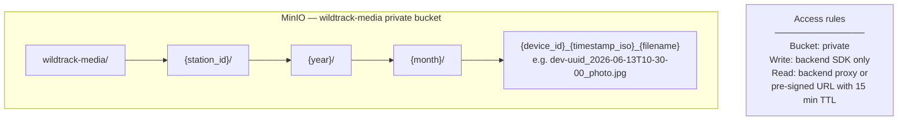

---

## 7. MQTT Architecture

### 7.1 Topic Namespace

| Topic pattern | Publisher | Subscriber | Message type |
|---------------|-----------|------------|-------------|
| `wildtrack/events/{station_id}` | ESP32 | Backend | Feeding event JSON |
| `wildtrack/telemetry/{device_id}` | ESP32 | Backend | Heartbeat JSON |

### 7.2 Message Flow

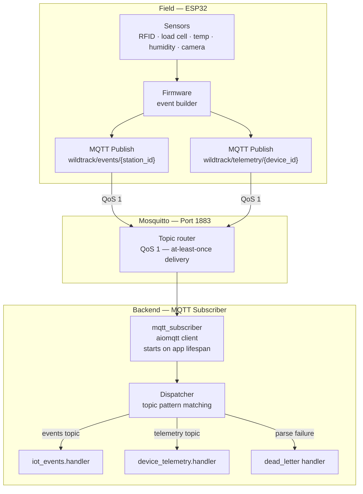

### 7.3 Dead-Letter Routing

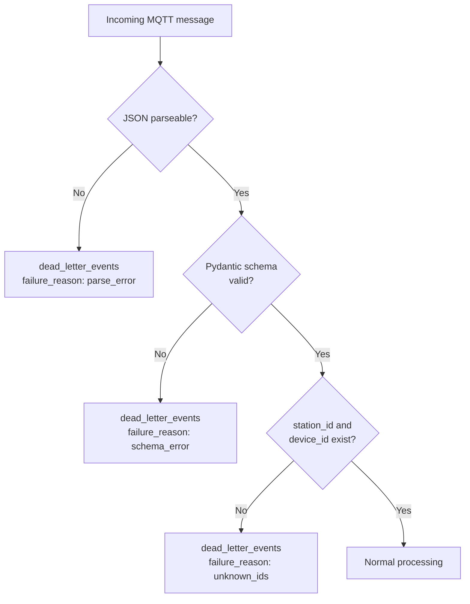

### 7.4 Payload Schemas

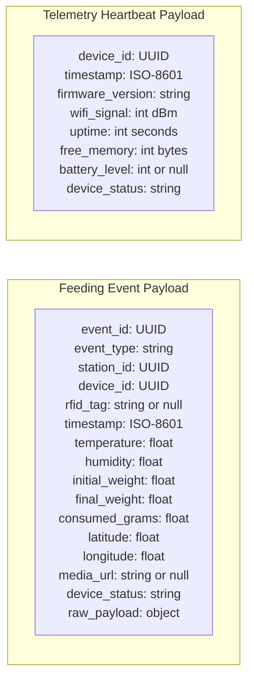

---

## 8. Media Storage Architecture

### 8.1 Upload Flow — Backend Proxy

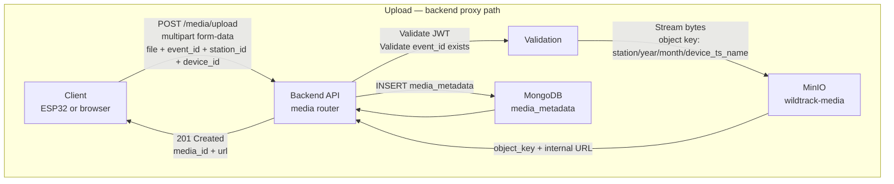

### 8.2 Retrieval Flow — Pre-Signed URL

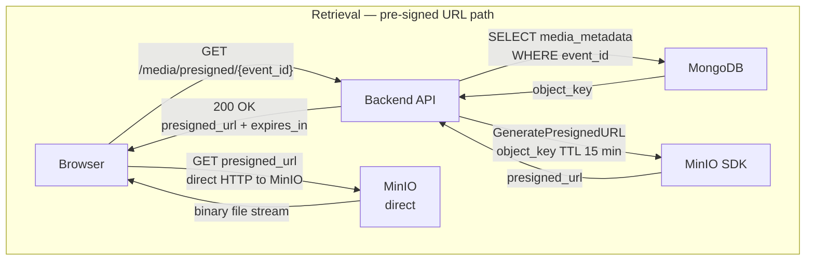

### 8.3 Access Control Model

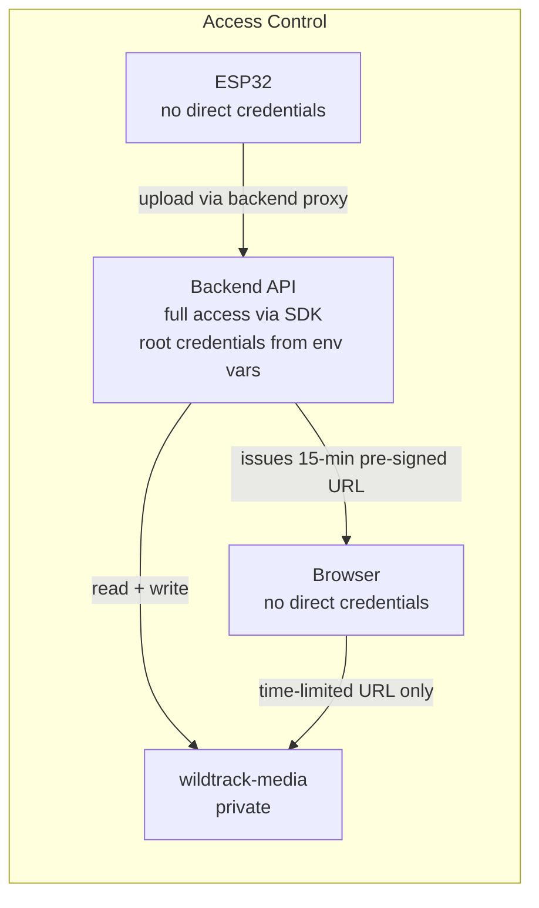

---

## 9. Geoportal Architecture

### 9.1 Component Structure

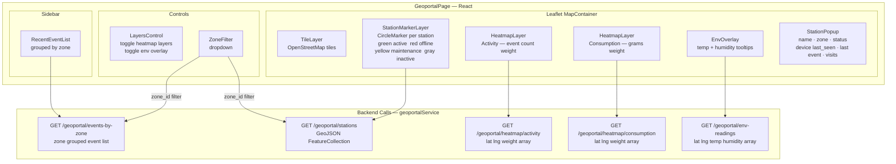

### 9.2 Geoportal Data Assembly

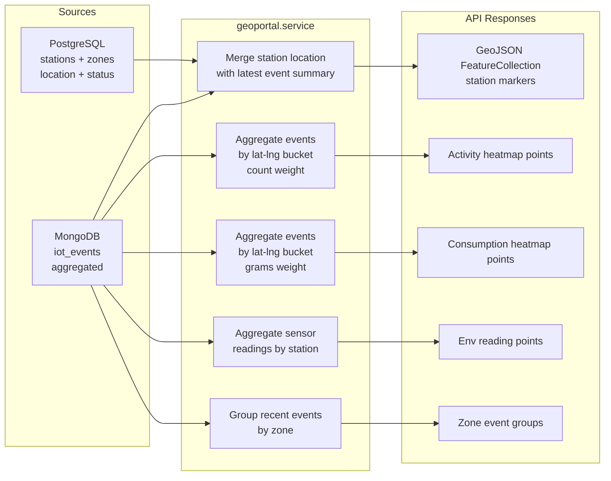

---

## 10. Analytics Architecture

### 10.1 Data Aggregation Pipeline

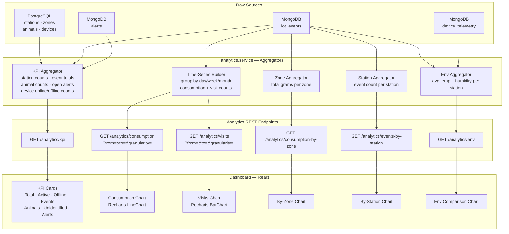

### 10.2 Caching Note

The MVP uses no explicit cache layer. Dashboard polling every 60 seconds is the refresh strategy. MongoDB aggregation pipelines are indexed on `station_id` + `timestamp`. Post-MVP, a Redis cache layer can be inserted between the service and the router without changing the API contract.

---

## 11. Deployment Architecture

### 11.1 Docker Compose Services

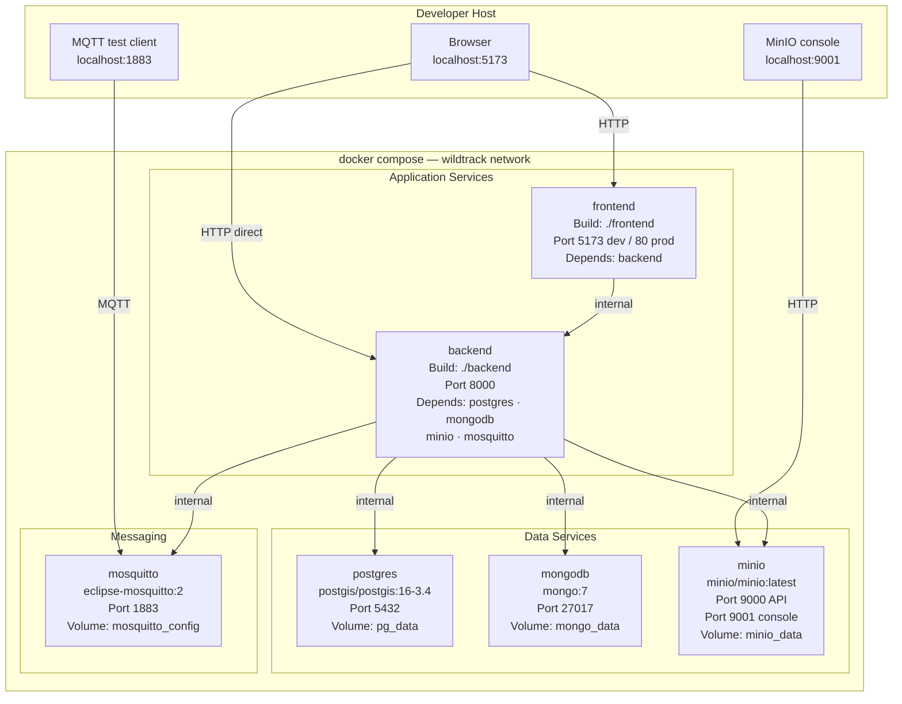

### 11.2 Environment Variables

| Service | Variable | Purpose |
|---------|----------|---------|
| backend | `DATABASE_URL` | PostgreSQL connection string |
| backend | `MONGODB_URI` | MongoDB connection string |
| backend | `MINIO_ENDPOINT` | MinIO host:port |
| backend | `MINIO_ACCESS_KEY` | MinIO root user |
| backend | `MINIO_SECRET_KEY` | MinIO root password |
| backend | `MQTT_HOST` | Mosquitto hostname |
| backend | `MQTT_PORT` | Mosquitto port (default 1883) |
| backend | `JWT_SECRET` | HMAC signing secret |
| backend | `JWT_EXPIRY_HOURS` | Token lifetime (default 24) |
| backend | `ADMIN_SEED_EMAIL` | First admin email for bootstrap |
| backend | `ADMIN_SEED_PASSWORD` | First admin password for bootstrap |
| backend | `DEVICE_OFFLINE_THRESHOLD_MINUTES` | Heartbeat absence before device goes offline |
| postgres | `POSTGRES_USER` / `POSTGRES_PASSWORD` / `POSTGRES_DB` | DB credentials |
| mongodb | `MONGO_INITDB_ROOT_USERNAME` / `MONGO_INITDB_ROOT_PASSWORD` | DB credentials |
| minio | `MINIO_ROOT_USER` / `MINIO_ROOT_PASSWORD` | Object store credentials |

---

## 12. Sequence Diagrams

### 12.1 User Self-Registration

```mermaid
sequenceDiagram
    actor U as User
    participant FE as Frontend
    participant API as Backend API
    participant PG as PostgreSQL

    U->>FE: Fill registration form (name, document, email, password)
    FE->>API: POST /auth/register
    API->>API: Validate Pydantic schema
    API->>PG: SELECT users WHERE email = ?
    PG-->>API: Result

    alt Email already exists
        API-->>FE: 409 Conflict
        FE-->>U: Show error
    else Email available
        API->>API: bcrypt hash password
        API->>PG: INSERT users (role = researcher)
        PG-->>API: user_id
        API-->>FE: 201 Created — user_id + email + role
        FE-->>U: Success — redirect to login
    end
```

### 12.2 Station Creation with Location Capture

```mermaid
sequenceDiagram
    actor U as Researcher
    participant FE as Frontend
    participant GEO as Browser Geolocation
    participant MAP as Leaflet MapPicker
    participant API as Backend API
    participant PG as PostgreSQL

    U->>FE: Open station creation form

    alt Browser geolocation
        U->>FE: Click Detect my location
        FE->>GEO: navigator.geolocation.getCurrentPosition()
        GEO-->>FE: latitude + longitude
        FE-->>U: Auto-populate lat/lng fields
    else Manual map selection
        U->>FE: Click Select on map
        FE-->>U: Show embedded Leaflet map
        U->>MAP: Click point on map
        MAP-->>FE: latitude + longitude
        FE-->>U: Auto-populate lat/lng fields and show pin
    end

    U->>FE: Fill code, name, zone_id and submit
    FE->>API: POST /stations (code, name, zone_id, latitude, longitude)
    API->>API: Validate JWT — role researcher or admin
    API->>PG: SELECT zones WHERE id = zone_id
    PG-->>API: Zone found
    API->>PG: INSERT stations (with geom = ST_Point)
    PG-->>API: station_id
    API->>PG: INSERT user_stations (user_id, station_id, role = owner)
    PG-->>API: OK
    API-->>FE: 201 Created — station_id + status
    FE-->>U: Station appears in list and on map
```

### 12.3 Device Registration and Assignment

```mermaid
sequenceDiagram
    actor A as Admin
    participant FE as Frontend
    participant API as Backend API
    participant PG as PostgreSQL

    A->>FE: Open device form — enter serial_number and name
    FE->>API: POST /devices (serial_number, name)
    API->>API: Validate JWT — role admin
    API->>PG: SELECT devices WHERE serial_number = ?
    PG-->>API: Empty — serial available
    API->>PG: INSERT devices (status = unassigned)
    PG-->>API: device_id
    API-->>FE: 201 Created — device_id + status unassigned
    FE-->>A: Device visible in device list

    A->>FE: Select device — choose station to assign
    FE->>API: PATCH /devices/{device_id}/assign (station_id)
    API->>API: Validate JWT — role admin
    API->>PG: SELECT stations WHERE id = station_id
    PG-->>API: Station exists
    API->>PG: SELECT devices WHERE station_id = ? AND status != unassigned
    PG-->>API: Empty — station has no active device
    API->>PG: UPDATE devices SET station_id = ?, status = online
    PG-->>API: OK
    API-->>FE: 200 OK — device_id + station_id + status online
    FE-->>A: Device shows as assigned and online
```

### 12.4 Feeding Event Ingestion

```mermaid
sequenceDiagram
    participant ESP as ESP32 Device
    participant BRK as Mosquitto
    participant SUB as MQTT Subscriber
    participant HDL as iot_events.handler
    participant PG as PostgreSQL
    participant MG as MongoDB
    participant ALT as alerts.service

    ESP->>BRK: PUBLISH wildtrack/events/{station_id} — event JSON
    BRK->>SUB: Deliver message QoS 1
    SUB->>HDL: Dispatch event topic

    HDL->>HDL: Parse JSON and validate Pydantic schema

    alt Parse or schema failure
        HDL->>MG: INSERT dead_letter_events (raw_payload, failure_reason)
    else Valid
        HDL->>PG: SELECT stations WHERE id = station_id
        PG-->>HDL: Station record

        alt Station not found
            HDL->>MG: INSERT dead_letter_events (failure_reason: unknown_station)
        else Station found
            HDL->>PG: SELECT devices WHERE id = device_id
            PG-->>HDL: Device record
            HDL->>PG: UPDATE devices SET last_seen = NOW(), status = online
            PG-->>HDL: OK

            alt rfid_tag present
                HDL->>PG: SELECT animals WHERE rfid_tag = ?
                PG-->>HDL: animal_id or null
                HDL->>HDL: Enrich event with animal_id
            end

            HDL->>MG: INSERT iot_events (enriched document)
            MG-->>HDL: inserted_id

            alt Event contains anomaly flags
                HDL->>ALT: generate_alert(station_id, device_id, alert_type)
                ALT->>MG: INSERT alerts (status = open)
                MG-->>ALT: alert_id
            end
        end
    end
```

### 12.5 Telemetry Heartbeat

```mermaid
sequenceDiagram
    participant ESP as ESP32 Device
    participant BRK as Mosquitto
    participant SUB as MQTT Subscriber
    participant HDL as device_telemetry.handler
    participant PG as PostgreSQL
    participant MG as MongoDB
    participant ALT as alerts.service

    loop Every 60 seconds
        ESP->>BRK: PUBLISH wildtrack/telemetry/{device_id} — heartbeat JSON
        BRK->>SUB: Deliver message
        SUB->>HDL: Dispatch telemetry topic
        HDL->>HDL: Parse JSON and validate schema
        HDL->>PG: SELECT devices WHERE id = device_id
        PG-->>HDL: Device (previous_status, station_id)
        HDL->>MG: INSERT device_telemetry (heartbeat document)
        MG-->>HDL: inserted_id
        HDL->>PG: UPDATE devices SET firmware_version = ?, last_seen = NOW(), status = online
        PG-->>HDL: OK

        alt Device was previously offline
            HDL->>PG: UPDATE stations SET status = active WHERE id = station_id
            PG-->>HDL: OK
            HDL->>ALT: resolve_alert(station_id, alert_type = device_offline)
            ALT->>MG: UPDATE alerts SET status = resolved, resolved_at = NOW()
            MG-->>ALT: OK
        end
    end
```

### 12.6 Media Upload

```mermaid
sequenceDiagram
    participant ESP as ESP32 Device
    participant API as Backend API
    participant MG as MongoDB
    participant MN as MinIO

    ESP->>API: POST /media/upload — multipart form-data (file, event_id, station_id, device_id, media_type)
    API->>API: Validate fields
    API->>MG: SELECT iot_events WHERE event_id = ?
    MG-->>API: Event exists
    API->>API: Build object_key: station_id/year/month/device_ts_filename
    API->>MN: PUT object (bucket wildtrack-media, key, file bytes)
    MN-->>API: ETag + internal URL
    API->>MG: INSERT media_metadata (event_id, station_id, device_id, object_key, url, file_size_bytes, captured_at)
    MG-->>API: media_id
    API-->>ESP: 201 Created — media_id + url

    Note over API,MN: Retrieval flow

    actor U as User
    U->>API: GET /media/presigned/{event_id}
    API->>MG: SELECT media_metadata WHERE event_id = ?
    MG-->>API: object_key
    API->>MN: GeneratePresignedURL (object_key, TTL 15 min)
    MN-->>API: presigned_url
    API-->>U: 200 OK — presigned_url + expires_in 900
    U->>MN: GET presigned_url — direct to MinIO
    MN-->>U: Binary file stream
```

### 12.7 Geoportal Query

```mermaid
sequenceDiagram
    actor U as User
    participant FE as Frontend GeoportalPage
    participant OSM as OpenStreetMap
    participant API as Backend API
    participant PG as PostgreSQL
    participant MG as MongoDB

    U->>FE: Navigate to /app/geoportal
    FE->>OSM: GET tile tiles (Leaflet auto-fetch)
    OSM-->>FE: Map tile images

    FE->>API: GET /geoportal/stations
    API->>PG: SELECT stations JOIN zones (id, name, lat, lng, status, zone_name)
    PG-->>API: Station rows
    API->>MG: Aggregate iot_events — latest event per station
    MG-->>API: Per-station event summary
    API->>API: Build GeoJSON FeatureCollection
    API-->>FE: GeoJSON features
    FE->>FE: Render CircleMarker per station colored by status
    FE-->>U: Map with station markers

    U->>FE: Click station marker
    FE-->>U: StationPopup with name, zone, status, device last_seen, last event

    U->>FE: Toggle Activity Heatmap
    FE->>API: GET /geoportal/heatmap/activity
    API->>MG: Aggregate iot_events GROUP BY lat-lng bucket
    MG-->>API: Array of lat, lng, weight
    API-->>FE: Heatmap data points
    FE->>FE: Render leaflet-heat layer
    FE-->>U: Activity heatmap visible on map

    U->>FE: Select zone in filter
    FE->>API: GET /geoportal/events-by-zone?zone_id={id}
    API->>MG: Aggregate recent events joined with zone data
    MG-->>API: Zone grouped event list
    API-->>FE: Events by zone
    FE-->>U: Sidebar panel updated
```

---

*End of SDD-02 Architecture Document — v1.0.0*
