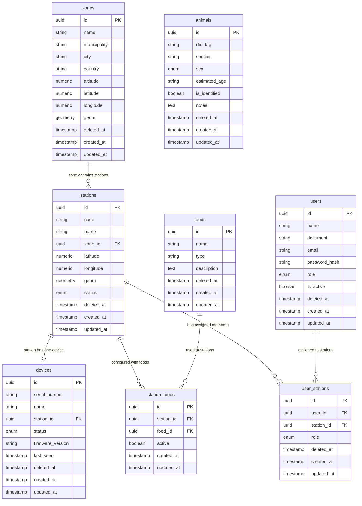
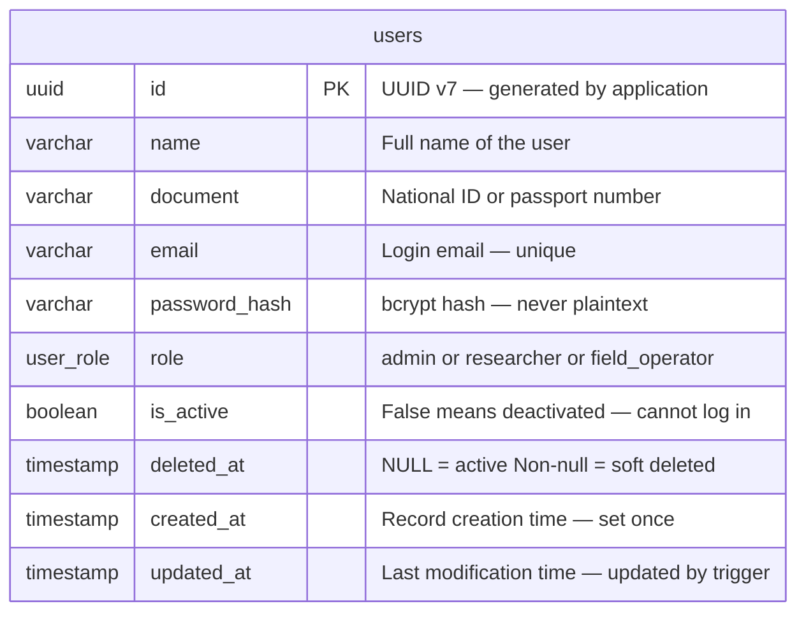
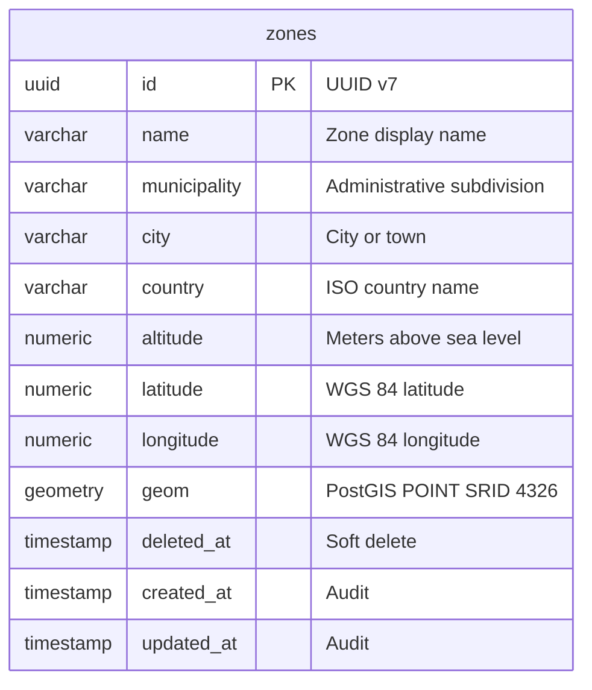
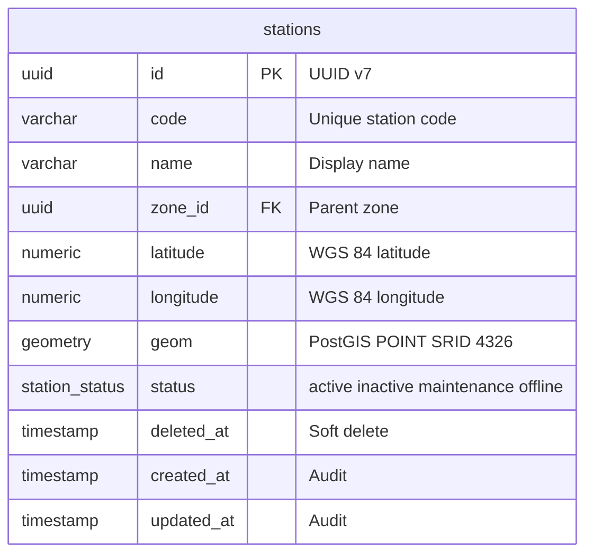
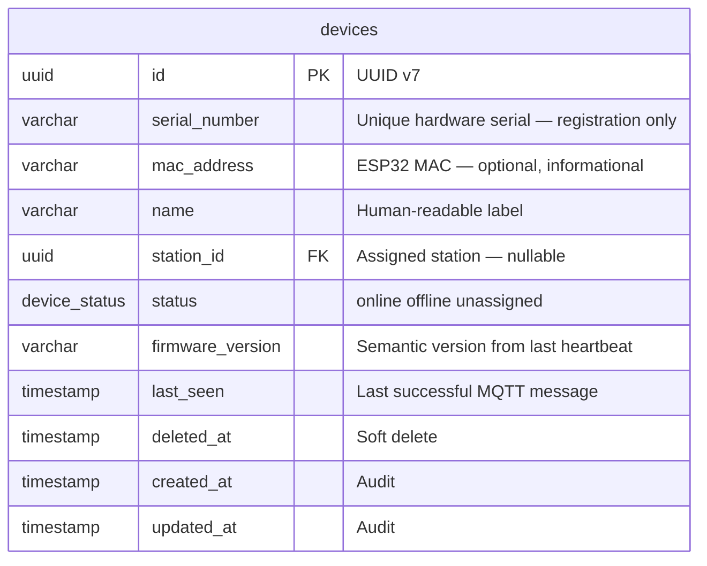
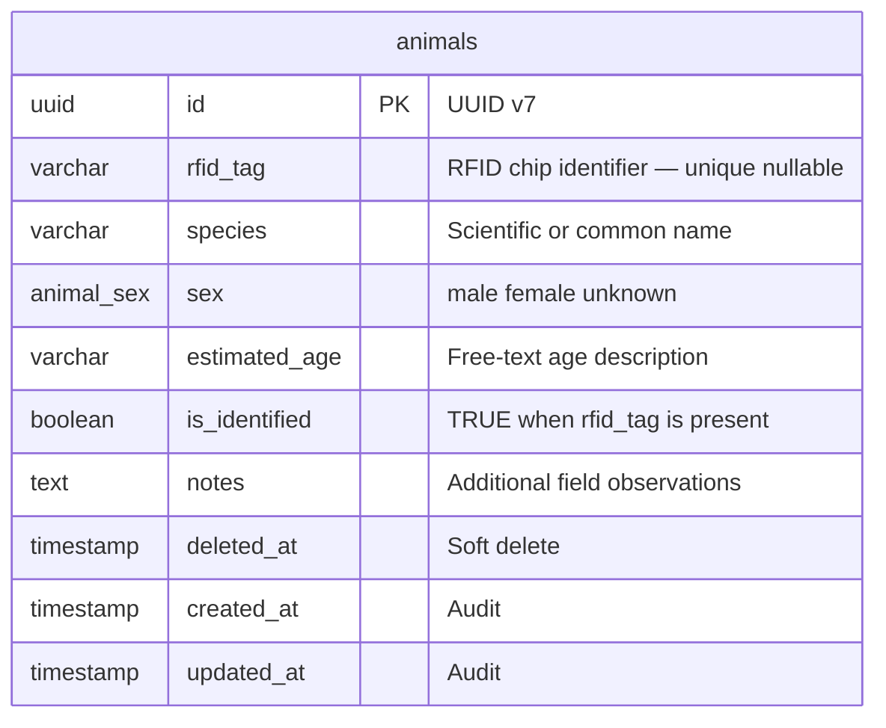
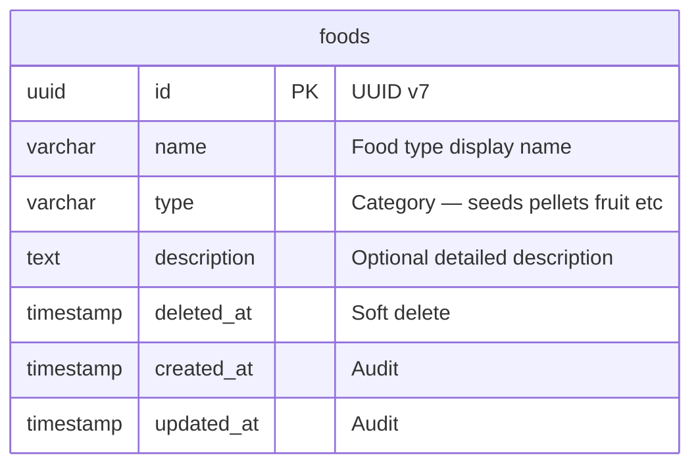
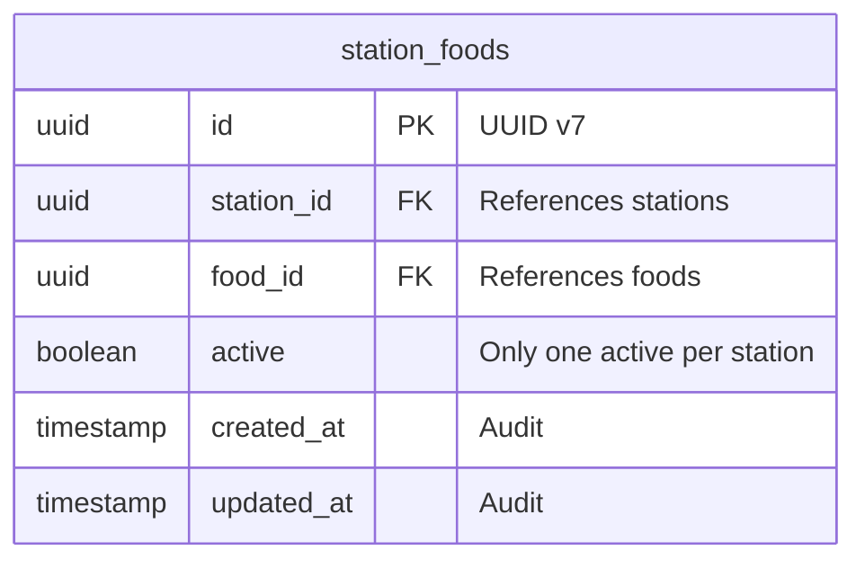
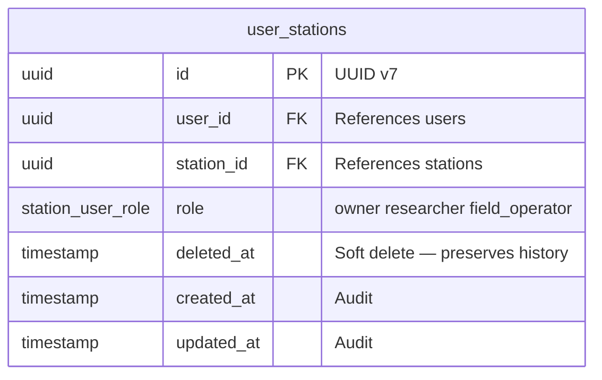
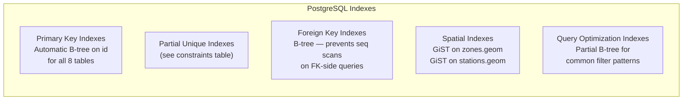

# WildTrack Platform — Data Model

**Document:** SDD-03 Data Model  
**Version:** 1.0.0  
**Date:** 2026-06-13  
**Status:** Draft — Pending Approval  
**References:** SDD-01 Requirements v1.2.0, SDD-02 Architecture v1.0.0, ADR-002, ADR-004

---

## Table of Contents

1. [Design Principles](#1-design-principles)
2. [PostgreSQL Logical Model](#2-postgresql-logical-model)
3. [Enumeration Types](#3-enumeration-types)
4. [PostgreSQL Physical Model](#4-postgresql-physical-model)
   - 4.1 [users](#41-table-users)
   - 4.2 [zones](#42-table-zones)
   - 4.3 [stations](#43-table-stations)
   - 4.4 [devices](#44-table-devices)
   - 4.5 [animals](#45-table-animals)
   - 4.6 [foods](#46-table-foods)
   - 4.7 [station_foods](#47-table-station_foods)
   - 4.8 [user_stations](#48-table-user_stations)
5. [Cross-Cutting Concerns](#5-cross-cutting-concerns)
   - 5.1 [UUID v7 Strategy](#51-uuid-v7-strategy)
   - 5.2 [Audit Fields Strategy](#52-audit-fields-strategy)
   - 5.3 [Soft Delete Strategy](#53-soft-delete-strategy)
   - 5.4 [PostGIS Geometry Strategy](#54-postgis-geometry-strategy)
6. [PostgreSQL Constraints Summary](#6-postgresql-constraints-summary)
7. [PostgreSQL Index Strategy](#7-postgresql-index-strategy)
8. [MongoDB Collection Schemas](#8-mongodb-collection-schemas)
   - 8.1 [iot_events](#81-collection-iot_events)
   - 8.2 [device_telemetry](#82-collection-device_telemetry)
   - 8.3 [alerts](#83-collection-alerts)
   - 8.4 [media_metadata](#84-collection-media_metadata)
   - 8.5 [dead_letter_events](#85-collection-dead_letter_events)
9. [MongoDB Index Strategy](#9-mongodb-index-strategy)
10. [MinIO Object Naming Strategy](#10-minio-object-naming-strategy)
11. [Data Retention Strategy](#11-data-retention-strategy)
12. [Backup Strategy](#12-backup-strategy)
13. [Migration Strategy](#13-migration-strategy)

---

## 1. Design Principles

The WildTrack data model is built on the following principles.

**Separation of stores by data class.** PostgreSQL holds structured, relational master data that requires transactional guarantees and referential integrity. MongoDB holds IoT event documents, telemetry, and operational data that are write-heavy, schema-flexible, and benefit from document-oriented aggregation. MinIO holds binary object files. The three stores are never mixed: no binary blobs in PostgreSQL or MongoDB, no relational joins in MinIO.

**UUID v7 for all primary keys.** All entities use UUID v7 (time-ordered universally unique identifiers). This avoids sequential integer enumeration, supports distributed generation without coordination, gives B-tree indexes better insert performance than random UUID v4, and embeds a creation timestamp in the identifier.

**Soft delete for all primary entities.** No `DELETE` statement is issued against any main entity table. A `deleted_at TIMESTAMP` column records when a record was logically removed. All queries filter `WHERE deleted_at IS NULL` by default. This preserves referential integrity and supports audit trails.

**Explicit audit fields on every table.** Every PostgreSQL table carries `created_at` and `updated_at` timestamps. `updated_at` is maintained by a trigger.

**PostGIS for all geographic data.** All points (zone centroid, station location) are stored as `GEOMETRY(POINT, 4326)` using the WGS 84 coordinate reference system. This is the same CRS used by GPS devices and OpenStreetMap. Raw `latitude` and `longitude` columns are retained alongside `geom` for direct application-layer access without PostGIS function calls.

**MongoDB documents are self-describing.** Every MongoDB document carries all fields needed to answer the primary query for that collection. Cross-collection joins are performed in the application service layer, not at the database level.

---

## 2. PostgreSQL Logical Model

### 2.1 Entity Relationship Diagram



### 2.2 Relationship Summary

| Relationship | Cardinality | Constraint |
|---|---|---|
| zone → stations | 1 : many | A station belongs to exactly one zone |
| station → device | 1 : 0..1 | A station has at most one device; a device belongs to at most one station |
| station → station_foods | 1 : many | A station can have many food associations |
| station → user_stations | 1 : many | A station can have many user assignments |
| user → user_stations | 1 : many | A user can be assigned to many stations |
| food → station_foods | 1 : many | A food type can be used at many stations |
| animals | isolated | No FK to stations; station associations are event-derived from MongoDB |

---

## 3. Enumeration Types

All enumeration types are created as PostgreSQL `ENUM` types. This enforces values at the database level independently of application-layer validation.

### `user_role`

| Value | Description |
|-------|-------------|
| `admin` | Full platform access; can manage all resources and users |
| `researcher` | Creates and manages own stations; read access to assigned stations |
| `field_operator` | Read and limited write access to assigned stations |

### `station_status`

| Value | Description |
|-------|-------------|
| `active` | Station is operational and receiving events |
| `inactive` | Station has been administratively disabled |
| `maintenance` | Station is temporarily offline for planned maintenance |
| `offline` | Station's device has lost connectivity or stopped reporting |

### `device_status`

| Value | Description |
|-------|-------------|
| `online` | Device is connected and sending telemetry heartbeats |
| `offline` | Device has exceeded the `last_seen` threshold without a heartbeat |
| `unassigned` | Device is registered but not yet linked to a station |

### `animal_sex`

| Value | Description |
|-------|-------------|
| `male` | Male individual |
| `female` | Female individual |
| `unknown` | Sex not determined at time of registration |

### `station_user_role`

| Value | Description |
|-------|-------------|
| `owner` | User who created the station; full management rights |
| `researcher` | Read access to station events and analytics |
| `field_operator` | Operational access: can register animals, update food config, resolve alerts |

---

## 4. PostgreSQL Physical Model

### 4.1 Table: `users`

Stores all registered platform user accounts. Self-registered users always receive `role = researcher`. The first `admin` account is created via the seed bootstrap process.



| Column | Type | Nullable | Default | Description |
|--------|------|----------|---------|-------------|
| `id` | `UUID` | NO | — | Primary key. UUID v7, generated by the application before insert. |
| `name` | `VARCHAR(255)` | NO | — | Full display name of the user. |
| `document` | `VARCHAR(50)` | NO | — | Government-issued identification number (national ID, passport). |
| `email` | `VARCHAR(255)` | NO | — | Login email address. Must be unique across all users including soft-deleted records (enforced via partial unique index). |
| `password_hash` | `VARCHAR(255)` | NO | — | bcrypt hash of the user's password. Plaintext is never stored. |
| `role` | `user_role` | NO | `'researcher'` | Role assigned at registration or updated by an admin. |
| `is_active` | `BOOLEAN` | NO | `TRUE` | When `FALSE`, the account is deactivated. Login is rejected. Existing JWT tokens are rejected on the next validation. |
| `deleted_at` | `TIMESTAMP WITH TIME ZONE` | YES | `NULL` | Soft delete timestamp. `NULL` = record is active. Set to `NOW()` on logical deletion. |
| `created_at` | `TIMESTAMP WITH TIME ZONE` | NO | `NOW()` | Timestamp of record creation. Immutable after insert. |
| `updated_at` | `TIMESTAMP WITH TIME ZONE` | NO | `NOW()` | Timestamp of last modification. Maintained by a `BEFORE UPDATE` trigger. |

**Constraints:**

| Name | Type | Definition |
|------|------|------------|
| `users_pkey` | PRIMARY KEY | `(id)` |
| `users_email_active_key` | UNIQUE (partial) | `(email) WHERE deleted_at IS NULL` — prevents duplicate active emails while allowing the same email to re-register after soft deletion |
| `users_email_len_chk` | CHECK | `LENGTH(email) >= 5` |
| `users_name_len_chk` | CHECK | `LENGTH(TRIM(name)) > 0` |

---

### 4.2 Table: `zones`

Stores geographic and administrative context for deployment areas. A zone groups one or more feeding stations under a common geographic label.



| Column | Type | Nullable | Default | Description |
|--------|------|----------|---------|-------------|
| `id` | `UUID` | NO | — | Primary key. UUID v7. |
| `name` | `VARCHAR(255)` | NO | — | Human-readable zone name (e.g., "Andean Forest Reserve — Block A"). |
| `municipality` | `VARCHAR(255)` | YES | `NULL` | Administrative municipality or county. Optional. |
| `city` | `VARCHAR(255)` | NO | — | Nearest city or settlement. |
| `country` | `VARCHAR(100)` | NO | — | Country name in full (e.g., "Colombia"). |
| `altitude` | `NUMERIC(8,2)` | YES | `NULL` | Elevation in meters above sea level. Stored with two decimal places. |
| `latitude` | `NUMERIC(10,7)` | NO | — | WGS 84 latitude of the zone reference point. Range: −90 to +90. |
| `longitude` | `NUMERIC(10,7)` | NO | — | WGS 84 longitude of the zone reference point. Range: −180 to +180. |
| `geom` | `GEOMETRY(POINT, 4326)` | NO | — | PostGIS point geometry derived from `latitude` and `longitude`. SRID 4326 (WGS 84). Set on insert via `ST_SetSRID(ST_MakePoint(longitude, latitude), 4326)`. |
| `deleted_at` | `TIMESTAMP WITH TIME ZONE` | YES | `NULL` | Soft delete timestamp. |
| `created_at` | `TIMESTAMP WITH TIME ZONE` | NO | `NOW()` | Record creation timestamp. |
| `updated_at` | `TIMESTAMP WITH TIME ZONE` | NO | `NOW()` | Last modification timestamp. Maintained by trigger. |

**Constraints:**

| Name | Type | Definition |
|------|------|------------|
| `zones_pkey` | PRIMARY KEY | `(id)` |
| `zones_name_country_key` | UNIQUE (partial) | `(name, country) WHERE deleted_at IS NULL` |
| `zones_latitude_chk` | CHECK | `latitude BETWEEN -90.0 AND 90.0` |
| `zones_longitude_chk` | CHECK | `longitude BETWEEN -180.0 AND 180.0` |
| `zones_name_len_chk` | CHECK | `LENGTH(TRIM(name)) > 0` |

---

### 4.3 Table: `stations`

Represents a logical feeding location. A station is the administrative entity that persists regardless of which physical device is deployed at it. Location is captured at registration via browser geolocation or manual Leaflet map selection.



| Column | Type | Nullable | Default | Description |
|--------|------|----------|---------|-------------|
| `id` | `UUID` | NO | — | Primary key. UUID v7. |
| `code` | `VARCHAR(50)` | NO | — | Short unique alphanumeric identifier for the station (e.g., `STA-001`, `WLD-AN-07`). Used in MQTT topic routing and device configuration. |
| `name` | `VARCHAR(255)` | NO | — | Full display name of the station. |
| `zone_id` | `UUID` | NO | — | Foreign key to `zones.id`. A station must belong to exactly one zone. |
| `latitude` | `NUMERIC(10,7)` | NO | — | WGS 84 latitude of the feeder installation point. |
| `longitude` | `NUMERIC(10,7)` | NO | — | WGS 84 longitude of the feeder installation point. |
| `geom` | `GEOMETRY(POINT, 4326)` | NO | — | PostGIS point. Derived from `latitude` and `longitude` at insert/update time. |
| `status` | `station_status` | NO | `'active'` | Operational status. `offline` is set automatically by the device health monitor. |
| `deleted_at` | `TIMESTAMP WITH TIME ZONE` | YES | `NULL` | Soft delete timestamp. |
| `created_at` | `TIMESTAMP WITH TIME ZONE` | NO | `NOW()` | Record creation timestamp. |
| `updated_at` | `TIMESTAMP WITH TIME ZONE` | NO | `NOW()` | Last modification timestamp. Maintained by trigger. |

**Constraints:**

| Name | Type | Definition |
|------|------|------------|
| `stations_pkey` | PRIMARY KEY | `(id)` |
| `stations_code_key` | UNIQUE (partial) | `(code) WHERE deleted_at IS NULL` |
| `stations_zone_id_fkey` | FOREIGN KEY | `(zone_id) REFERENCES zones(id)` — no cascade; zone must exist |
| `stations_latitude_chk` | CHECK | `latitude BETWEEN -90.0 AND 90.0` |
| `stations_longitude_chk` | CHECK | `longitude BETWEEN -180.0 AND 180.0` |
| `stations_code_format_chk` | CHECK | `code ~ '^[A-Z0-9\-]{2,50}$'` — uppercase alphanumeric and hyphens |

---

### 4.4 Table: `devices`

Represents a physical ESP32 feeder unit. A device is registered independently of any station and may be assigned, unassigned, or reassigned over its lifetime. Only the device's `last_seen` and `firmware_version` are written by the backend on every telemetry heartbeat; all other fields are managed administratively.



| Column | Type | Nullable | Default | Description |
|--------|------|----------|---------|-------------|
| `id` | `UUID` | NO | — | Primary key. UUID v7. |
| `serial_number` | `VARCHAR(100)` | NO | — | Unique hardware serial number printed on the device. Used at registration. Must not be used in MQTT topics (use `id` instead). See ADR-027. |
| `mac_address` | `VARCHAR(17)` | YES | `NULL` | ESP32 WiFi MAC address (format: `AA:BB:CC:DD:EE:FF`). Informational only — used for provisioning traceability and debugging. Not a unique constraint; not referenced in MQTT topics or API endpoints. |
| `name` | `VARCHAR(255)` | YES | `NULL` | Optional human-readable label (e.g., "Feeder Alpha — North Trail"). |
| `station_id` | `UUID` | YES | `NULL` | Foreign key to `stations.id`. `NULL` means the device is not currently assigned to any station (`status = unassigned`). |
| `status` | `device_status` | NO | `'unassigned'` | Connectivity status. Updated automatically by the telemetry handler and the device health monitor job. |
| `firmware_version` | `VARCHAR(50)` | YES | `NULL` | Semantic version string of the currently running firmware (e.g., `1.4.2`). Updated on every telemetry heartbeat. `NULL` before first heartbeat. |
| `last_seen` | `TIMESTAMP WITH TIME ZONE` | YES | `NULL` | Timestamp of the last received MQTT message (event or heartbeat). `NULL` before first contact. Updated on every incoming message. |
| `deleted_at` | `TIMESTAMP WITH TIME ZONE` | YES | `NULL` | Soft delete timestamp. |
| `created_at` | `TIMESTAMP WITH TIME ZONE` | NO | `NOW()` | Record creation timestamp. |
| `updated_at` | `TIMESTAMP WITH TIME ZONE` | NO | `NOW()` | Last modification timestamp. Maintained by trigger. |

**Constraints:**

| Name | Type | Definition |
|------|------|------------|
| `devices_pkey` | PRIMARY KEY | `(id)` |
| `devices_serial_key` | UNIQUE (partial) | `(serial_number) WHERE deleted_at IS NULL` |
| `devices_station_id_fkey` | FOREIGN KEY | `(station_id) REFERENCES stations(id) ON DELETE SET NULL` — removing a station unassigns its device |
| `devices_station_unique` | UNIQUE (partial) | `(station_id) WHERE status != 'unassigned' AND deleted_at IS NULL` — enforces at-most-one active device per station |
| `devices_status_station_chk` | CHECK | `(status = 'unassigned' AND station_id IS NULL) OR (status != 'unassigned' AND station_id IS NOT NULL)` — unassigned devices must have no station; assigned devices must have one |

---

### 4.5 Table: `animals`

Stores wildlife individuals registered in the platform. Animals are **global records with no permanent station assignment**. Their associations with stations are derived at query time from `iot_events` in MongoDB by aggregating events that carry a resolved `animal_id`. An animal with an `rfid_tag` is `is_identified = TRUE`; one without is `FALSE`.



| Column | Type | Nullable | Default | Description |
|--------|------|----------|---------|-------------|
| `id` | `UUID` | NO | — | Primary key. UUID v7. |
| `rfid_tag` | `VARCHAR(100)` | YES | `NULL` | RFID chip identifier as read by the feeder's RFID module. Must be unique when present. `NULL` for untagged individuals. |
| `species` | `VARCHAR(255)` | NO | — | Species name (common or scientific). Free text; no controlled vocabulary in MVP. |
| `sex` | `animal_sex` | NO | `'unknown'` | Sex of the individual. Defaults to `unknown` when not determined. |
| `estimated_age` | `VARCHAR(100)` | YES | `NULL` | Free-text age description (e.g., `"juvenile"`, `"~2 years"`, `"adult"`). Not a strict date or numeric field. |
| `is_identified` | `BOOLEAN` | NO | `FALSE` | `TRUE` when the animal has a registered RFID tag. Automatically maintained: `TRUE` if `rfid_tag IS NOT NULL`, `FALSE` otherwise. |
| `notes` | `TEXT` | YES | `NULL` | Free-text field for additional field observations or physical descriptions. |
| `deleted_at` | `TIMESTAMP WITH TIME ZONE` | YES | `NULL` | Soft delete timestamp. |
| `created_at` | `TIMESTAMP WITH TIME ZONE` | NO | `NOW()` | Record creation timestamp. |
| `updated_at` | `TIMESTAMP WITH TIME ZONE` | NO | `NOW()` | Last modification timestamp. Maintained by trigger. |

**Constraints:**

| Name | Type | Definition |
|------|------|------------|
| `animals_pkey` | PRIMARY KEY | `(id)` |
| `animals_rfid_key` | UNIQUE (partial) | `(rfid_tag) WHERE rfid_tag IS NOT NULL AND deleted_at IS NULL` — allows multiple rows with NULL rfid_tag but no duplicate non-null tags |
| `animals_identified_chk` | CHECK | `(is_identified = TRUE AND rfid_tag IS NOT NULL) OR (is_identified = FALSE)` — a tagged animal must always be marked as identified |
| `animals_species_len_chk` | CHECK | `LENGTH(TRIM(species)) > 0` |

---

### 4.6 Table: `foods`

Catalog of food types that can be configured at feeding stations. Food types are platform-wide shared resources, not owned by any specific station or user.



| Column | Type | Nullable | Default | Description |
|--------|------|----------|---------|-------------|
| `id` | `UUID` | NO | — | Primary key. UUID v7. |
| `name` | `VARCHAR(255)` | NO | — | Display name of the food type (e.g., `"Mixed Seeds"`, `"High-Protein Pellets"`). |
| `type` | `VARCHAR(100)` | NO | — | Category label (e.g., `"seeds"`, `"pellets"`, `"fruit"`, `"grain"`). Free text in MVP; may become an enum post-MVP. |
| `description` | `TEXT` | YES | `NULL` | Optional longer description of the food composition or usage notes. |
| `deleted_at` | `TIMESTAMP WITH TIME ZONE` | YES | `NULL` | Soft delete timestamp. |
| `created_at` | `TIMESTAMP WITH TIME ZONE` | NO | `NOW()` | Record creation timestamp. |
| `updated_at` | `TIMESTAMP WITH TIME ZONE` | NO | `NOW()` | Last modification timestamp. Maintained by trigger. |

**Constraints:**

| Name | Type | Definition |
|------|------|------------|
| `foods_pkey` | PRIMARY KEY | `(id)` |
| `foods_name_key` | UNIQUE (partial) | `(name) WHERE deleted_at IS NULL` |
| `foods_name_len_chk` | CHECK | `LENGTH(TRIM(name)) > 0` |
| `foods_type_len_chk` | CHECK | `LENGTH(TRIM(type)) > 0` |

---

### 4.7 Table: `station_foods`

Junction table associating food types with stations. A station can have multiple food associations but at most **one active configuration** at a time, enforced by a partial unique index. This table does not use soft delete; the `active` flag serves as the deactivation mechanism.



| Column | Type | Nullable | Default | Description |
|--------|------|----------|---------|-------------|
| `id` | `UUID` | NO | — | Primary key. UUID v7. |
| `station_id` | `UUID` | NO | — | Foreign key to `stations.id`. |
| `food_id` | `UUID` | NO | — | Foreign key to `foods.id`. |
| `active` | `BOOLEAN` | NO | `TRUE` | Whether this food configuration is currently in use at the station. At most one row per station may have `active = TRUE`. |
| `created_at` | `TIMESTAMP WITH TIME ZONE` | NO | `NOW()` | Record creation timestamp. |
| `updated_at` | `TIMESTAMP WITH TIME ZONE` | NO | `NOW()` | Last modification timestamp. Maintained by trigger. |

**Constraints:**

| Name | Type | Definition |
|------|------|------------|
| `station_foods_pkey` | PRIMARY KEY | `(id)` |
| `station_foods_pair_key` | UNIQUE | `(station_id, food_id)` — a specific food can only be associated with a station once |
| `station_foods_station_fkey` | FOREIGN KEY | `(station_id) REFERENCES stations(id) ON DELETE CASCADE` |
| `station_foods_food_fkey` | FOREIGN KEY | `(food_id) REFERENCES foods(id) ON DELETE RESTRICT` |
| `station_foods_one_active_idx` | UNIQUE (partial) | `(station_id) WHERE active = TRUE` — at most one active food per station |

---

### 4.8 Table: `user_stations`

Junction table managing which users have access to which stations, and in what role. The user who creates a station is automatically inserted as `role = owner`. Soft delete is used to preserve history when a user is removed from a station.



| Column | Type | Nullable | Default | Description |
|--------|------|----------|---------|-------------|
| `id` | `UUID` | NO | — | Primary key. UUID v7. |
| `user_id` | `UUID` | NO | — | Foreign key to `users.id`. |
| `station_id` | `UUID` | NO | — | Foreign key to `stations.id`. |
| `role` | `station_user_role` | NO | — | The role this user holds for this station. `owner` is set when the station is created. |
| `deleted_at` | `TIMESTAMP WITH TIME ZONE` | YES | `NULL` | Soft delete timestamp. When set, the user can no longer access the station. |
| `created_at` | `TIMESTAMP WITH TIME ZONE` | NO | `NOW()` | Timestamp of the assignment. |
| `updated_at` | `TIMESTAMP WITH TIME ZONE` | NO | `NOW()` | Last modification timestamp. Maintained by trigger. |

**Constraints:**

| Name | Type | Definition |
|------|------|------------|
| `user_stations_pkey` | PRIMARY KEY | `(id)` |
| `user_stations_pair_key` | UNIQUE (partial) | `(user_id, station_id) WHERE deleted_at IS NULL` — a user can only have one active assignment per station |
| `user_stations_user_fkey` | FOREIGN KEY | `(user_id) REFERENCES users(id) ON DELETE CASCADE` |
| `user_stations_station_fkey` | FOREIGN KEY | `(station_id) REFERENCES stations(id) ON DELETE CASCADE` |

---

## 5. Cross-Cutting Concerns

### 5.1 UUID v7 Strategy

**What is UUID v7?** UUID version 7 is a time-ordered universally unique identifier standardized in RFC 9562 (2024). The first 48 bits encode a Unix millisecond timestamp; the remaining bits are random. This produces identifiers that are globally unique, require no coordination between nodes, and sort chronologically.

**Why UUID v7 over UUID v4?**

| Property | UUID v4 (random) | UUID v7 (time-ordered) |
|----------|-----------------|------------------------|
| Uniqueness | Guaranteed | Guaranteed |
| B-tree index performance | Poor — random inserts cause page splits | Good — mostly sequential inserts |
| Natural sort order | None | Chronological |
| Embeds creation time | No | Yes (millisecond precision) |
| Readability / debugging | Opaque | Timestamp visible in first 12 hex chars |

**Generation location:** UUID v7 is generated in the application layer (Python) using the `uuid7` package before the `INSERT` statement is issued. PostgreSQL receives the `UUID` value as a parameter; no `gen_random_uuid()` default is used on the column.

**Format:** Standard hyphenated lowercase UUID string: `019281a8-5e2c-7f00-b3d4-a1e2f3c4d5e6`.

**In MongoDB:** The `event_id`, `telemetry_id`, `alert_id`, `media_id` fields in MongoDB documents are stored as UUID v7 strings (not MongoDB `ObjectId`). The `_id` field retains its native `ObjectId` for MongoDB-internal operations.

### 5.2 Audit Fields Strategy

Every PostgreSQL table carries two audit timestamp columns.

| Column | Type | Behavior |
|--------|------|----------|
| `created_at` | `TIMESTAMP WITH TIME ZONE` | Set to `NOW()` on `INSERT`. Immutable; never changed by `UPDATE`. |
| `updated_at` | `TIMESTAMP WITH TIME ZONE` | Set to `NOW()` on `INSERT`. Automatically updated to `NOW()` on every `UPDATE` by a shared `BEFORE UPDATE` trigger function (`set_updated_at()`). The application layer must not set this value manually. |

The trigger function `set_updated_at()` is defined once and applied to all tables via individual trigger declarations. This prevents the application layer from forgetting to update the timestamp.

### 5.3 Soft Delete Strategy

**Mechanism:** Every main entity table (all tables except junction tables `station_foods`) includes a `deleted_at TIMESTAMP WITH TIME ZONE` column. When a record is logically deleted, the service layer issues `UPDATE ... SET deleted_at = NOW()` rather than `DELETE FROM ...`.

**Query filter:** All repository query methods include `WHERE deleted_at IS NULL` by default. A record with a non-null `deleted_at` is invisible to standard application queries.

**Which tables use soft delete:**

| Table | Soft Delete | Reason |
|-------|-------------|--------|
| `users` | Yes | Deactivation/deletion must preserve FK references from `user_stations` |
| `zones` | Yes | Deletion must preserve station history |
| `stations` | Yes | Deletion must preserve device and user_station references |
| `devices` | Yes | Deletion must preserve event history references |
| `animals` | Yes | Deletion must preserve RFID resolution history |
| `foods` | Yes | Deletion must preserve station_food configuration history |
| `station_foods` | No | The `active` flag serves as the deactivation mechanism |
| `user_stations` | Yes | Removal must preserve audit trail of who had access |

**Email uniqueness and soft delete:** The `users` table uses a partial unique index `(email) WHERE deleted_at IS NULL`. This allows an email to be re-used after soft deletion while still preventing duplicate active accounts.

**Cascading soft delete:** The service layer is responsible for cascading logical deletes. For example, soft-deleting a station must also soft-delete all associated `user_stations` rows and set any associated device's `station_id = NULL` and `status = 'unassigned'`. This logic lives in the service layer, not in database cascade rules.

### 5.4 PostGIS Geometry Strategy

**Coordinate Reference System:** All geometry columns use **SRID 4326 (WGS 84)**. This is the same CRS used by GPS receivers and the standard for OpenStreetMap. Latitude and longitude values are in decimal degrees.

**Geometry type:** All geometry columns are `GEOMETRY(POINT, 4326)`. Only points are needed for the MVP. Polygon zone boundaries are a post-MVP feature.

**Column redundancy:** Each spatial table stores both the raw `latitude`/`longitude` decimal columns and the derived `geom` geometry column. This redundancy serves two purposes: the decimal columns allow direct application-layer access without PostGIS function calls, and the `geom` column enables spatial queries (`ST_DWithin`, `ST_Distance`, `ST_Within`).

**Geometry construction:** On every insert or update that changes `latitude` or `longitude`, the service layer passes the geometry value as `ST_SetSRID(ST_MakePoint(:longitude, :latitude), 4326)`. Note the argument order: `ST_MakePoint` takes `(longitude, latitude)` per the GIS convention.

**Spatial index:** A GiST index is created on every `geom` column. This enables efficient spatial queries used by the geoportal heatmap and zone-based filtering.

**Coordinate precision:** `NUMERIC(10,7)` provides seven decimal places, giving sub-centimeter precision (1 decimal place ≈ 11 km; 7 decimal places ≈ 1.1 cm). This precision is more than sufficient for field deployments.

---

## 6. PostgreSQL Constraints Summary

### Primary Keys

| Table | PK Column | Type |
|-------|-----------|------|
| `users` | `id` | UUID |
| `zones` | `id` | UUID |
| `stations` | `id` | UUID |
| `devices` | `id` | UUID |
| `animals` | `id` | UUID |
| `foods` | `id` | UUID |
| `station_foods` | `id` | UUID |
| `user_stations` | `id` | UUID |

### Foreign Keys

| Table | Column | References | On Delete |
|-------|--------|------------|-----------|
| `stations` | `zone_id` | `zones(id)` | RESTRICT |
| `devices` | `station_id` | `stations(id)` | SET NULL |
| `station_foods` | `station_id` | `stations(id)` | CASCADE |
| `station_foods` | `food_id` | `foods(id)` | RESTRICT |
| `user_stations` | `user_id` | `users(id)` | CASCADE |
| `user_stations` | `station_id` | `stations(id)` | CASCADE |

### Unique Constraints

| Table | Columns | Condition | Purpose |
|-------|---------|-----------|---------|
| `users` | `(email)` | `WHERE deleted_at IS NULL` | One active account per email |
| `zones` | `(name, country)` | `WHERE deleted_at IS NULL` | No duplicate zone names per country |
| `stations` | `(code)` | `WHERE deleted_at IS NULL` | Unique station code |
| `devices` | `(serial_number)` | `WHERE deleted_at IS NULL` | Unique hardware serial |
| `devices` | `(station_id)` | `WHERE status != 'unassigned' AND deleted_at IS NULL` | At most one active device per station |
| `animals` | `(rfid_tag)` | `WHERE rfid_tag IS NOT NULL AND deleted_at IS NULL` | Unique RFID tag |
| `foods` | `(name)` | `WHERE deleted_at IS NULL` | Unique food type names |
| `station_foods` | `(station_id, food_id)` | — | No duplicate food associations |
| `station_foods` | `(station_id)` | `WHERE active = TRUE` | At most one active food per station |
| `user_stations` | `(user_id, station_id)` | `WHERE deleted_at IS NULL` | One active assignment per user-station pair |

### Check Constraints

| Table | Constraint | Expression |
|-------|-----------|------------|
| `users` | `users_email_len_chk` | `LENGTH(email) >= 5` |
| `users` | `users_name_len_chk` | `LENGTH(TRIM(name)) > 0` |
| `zones` | `zones_latitude_chk` | `latitude BETWEEN -90.0 AND 90.0` |
| `zones` | `zones_longitude_chk` | `longitude BETWEEN -180.0 AND 180.0` |
| `stations` | `stations_latitude_chk` | `latitude BETWEEN -90.0 AND 90.0` |
| `stations` | `stations_longitude_chk` | `longitude BETWEEN -180.0 AND 180.0` |
| `stations` | `stations_code_format_chk` | `code ~ '^[A-Z0-9\-]{2,50}$'` |
| `devices` | `devices_status_station_chk` | `(status = 'unassigned' AND station_id IS NULL) OR (status != 'unassigned' AND station_id IS NOT NULL)` |
| `animals` | `animals_identified_chk` | `(is_identified = TRUE AND rfid_tag IS NOT NULL) OR (is_identified = FALSE)` |
| `animals` | `animals_species_len_chk` | `LENGTH(TRIM(species)) > 0` |
| `foods` | `foods_name_len_chk` | `LENGTH(TRIM(name)) > 0` |
| `foods` | `foods_type_len_chk` | `LENGTH(TRIM(type)) > 0` |

---

## 7. PostgreSQL Index Strategy

### 7.1 Index Catalog



### 7.2 B-tree Indexes on Foreign Keys

PostgreSQL does not automatically create indexes on foreign key columns. Without them, joins and cascade operations cause sequential scans.

| Index Name | Table | Column(s) |
|-----------|-------|-----------|
| `idx_stations_zone_id` | `stations` | `zone_id` |
| `idx_devices_station_id` | `devices` | `station_id` |
| `idx_station_foods_station_id` | `station_foods` | `station_id` |
| `idx_station_foods_food_id` | `station_foods` | `food_id` |
| `idx_user_stations_user_id` | `user_stations` | `user_id` |
| `idx_user_stations_station_id` | `user_stations` | `station_id` |

### 7.3 Spatial Indexes (GiST)

| Index Name | Table | Column | Purpose |
|-----------|-------|--------|---------|
| `idx_zones_geom` | `zones` | `geom` | Zone proximity and containment queries |
| `idx_stations_geom` | `stations` | `geom` | Station-to-zone spatial joins; heatmap bounding box queries |

### 7.4 Partial Indexes for Active Records

| Index Name | Table | Expression | Condition |
|-----------|-------|-----------|-----------|
| `idx_users_email_active` | `users` | `email` | `WHERE deleted_at IS NULL` |
| `idx_stations_status_active` | `stations` | `status` | `WHERE deleted_at IS NULL` |
| `idx_devices_last_seen_active` | `devices` | `last_seen` | `WHERE deleted_at IS NULL AND status != 'unassigned'` — used by the device health monitor job to find devices that have exceeded the offline threshold |
| `idx_animals_rfid_active` | `animals` | `rfid_tag` | `WHERE rfid_tag IS NOT NULL AND deleted_at IS NULL` |

### 7.5 Composite Indexes for Common Query Patterns

| Index Name | Table | Columns | Query Pattern |
|-----------|-------|---------|---------------|
| `idx_stations_zone_status` | `stations` | `(zone_id, status)` | Dashboard and geoportal filter by zone and status |
| `idx_devices_station_status` | `devices` | `(station_id, status)` | Station detail view fetching device health |

---

## 8. MongoDB Collection Schemas

MongoDB uses flexible document schemas. The fields listed below are the expected schema for MVP. Additional fields may be present in `raw_payload` without causing validation failures. All UUID references (`station_id`, `device_id`, `animal_id`) are stored as strings matching the format generated by the application (UUID v7 strings), not MongoDB `ObjectId` values.

### 8.1 Collection: `iot_events`

Stores every validated feeding event and sensor reading received via MQTT.

| Field | Type | Nullable | Description |
|-------|------|----------|-------------|
| `_id` | `ObjectId` | NO | MongoDB internal identifier. Auto-generated. |
| `event_id` | `String (UUID v7)` | NO | Application-assigned unique identifier for this event. Used for idempotency and cross-collection references. |
| `event_type` | `String` | NO | One of: `feeding_session`, `presence_detected`, `rfid_read`, `sensor_reading`. |
| `station_id` | `String (UUID)` | NO | PostgreSQL `stations.id` of the feeder where this event occurred. Validated on ingestion. |
| `device_id` | `String (UUID)` | NO | PostgreSQL `devices.id` of the hardware unit that generated the event. Validated on ingestion. |
| `animal_id` | `String (UUID)` | YES | PostgreSQL `animals.id`, populated when `rfid_tag` is successfully resolved to a registered animal. `null` if unresolved or absent. |
| `rfid_tag` | `String` | YES | Raw RFID tag string as received from the device. `null` if no tag was read. Retained even when `animal_id` is resolved, for audit purposes. |
| `timestamp` | `Date (ISODate)` | NO | Event timestamp as reported by the device (device clock). Stored in UTC. |
| `temperature` | `Double` | YES | Ambient temperature in degrees Celsius at the time of the event. |
| `humidity` | `Double` | YES | Relative humidity percentage (0–100) at the time of the event. |
| `initial_weight` | `Double` | YES | Food weight in grams before the feeding session began. |
| `final_weight` | `Double` | YES | Food weight in grams after the feeding session ended. |
| `consumed_grams` | `Double` | YES | Calculated food consumption: `initial_weight - final_weight`. May differ from direct subtraction if the device applies its own compensation. |
| `latitude` | `Double` | YES | GPS latitude reported by the device at event time. May differ from the station's registered location if the device moves. |
| `longitude` | `Double` | YES | GPS longitude reported by the device at event time. |
| `media_url` | `String` | YES | Internal URL of the associated media object in MinIO. `null` if no media was captured. |
| `device_status` | `String` | YES | Self-reported device status string at the time of the event (e.g., `"ok"`, `"low_battery"`, `"sensor_error"`). |
| `raw_payload` | `Object` | NO | The complete original MQTT payload as received, before any transformation or enrichment. Preserved verbatim for debugging and replay. |
| `ingested_at` | `Date (ISODate)` | NO | Timestamp of when the backend received and stored this event. Set by the application, not the device. |

### 8.2 Collection: `device_telemetry`

Stores periodic heartbeat messages from registered devices. Written separately from `iot_events` to enable independent indexing and retention strategies.

> **MongoDB Time Series consideration:** The `device_telemetry` collection (and potentially `iot_events`) is a strong candidate for MongoDB's native [Time Series Collections](https://www.mongodb.com/docs/manual/core/timeseries-collections/) feature (available since MongoDB 5.0). Time Series collections store time-sequenced data more efficiently: compressed storage, faster range queries, and built-in bucketing by time and metadata (e.g., `device_id`). For the MVP, a standard collection is used to keep setup simple. **Post-MVP**, if `device_telemetry` write volume becomes a bottleneck or storage cost grows, migrating to a Time Series collection (specifying `timeField: "timestamp"`, `metaField: "device_id"`) is the recommended optimization. This change requires a collection recreation but no backend code changes beyond the Motor collection creation call.

| Field | Type | Nullable | Description |
|-------|------|----------|-------------|
| `_id` | `ObjectId` | NO | MongoDB internal identifier. Auto-generated. |
| `telemetry_id` | `String (UUID v7)` | NO | Application-assigned unique identifier for this heartbeat document. |
| `device_id` | `String (UUID)` | NO | PostgreSQL `devices.id`. Validated on ingestion. |
| `station_id` | `String (UUID)` | YES | PostgreSQL `stations.id` at the time of the heartbeat. `null` if the device was unassigned. |
| `timestamp` | `Date (ISODate)` | NO | Heartbeat timestamp as reported by the device. Stored in UTC. |
| `firmware_version` | `String` | YES | Semantic version string of the firmware running on the device (e.g., `"1.4.2"`). `null` if not reported. |
| `wifi_signal` | `Int32` | YES | WiFi signal strength in dBm. Typical range: −90 (weak) to −30 (strong). |
| `uptime` | `Int32` | YES | Seconds since last device reboot or power-on. |
| `free_memory` | `Int32` | YES | Available heap memory in bytes on the ESP32. Used to monitor memory leaks. |
| `battery_level` | `Int32` | YES | Battery charge percentage (0–100). `null` for wired devices. Reserved for future battery-powered variants. |
| `device_status` | `String` | YES | Self-reported device health: `"ok"`, `"warning"`, `"error"`. |
| `raw_payload` | `Object` | NO | Original MQTT heartbeat payload. Preserved verbatim. |
| `ingested_at` | `Date (ISODate)` | NO | Timestamp of backend ingestion. |

### 8.3 Collection: `alerts`

Stores operational alerts generated by the backend. Alerts are created automatically during event and telemetry processing, or by the device health monitor background job.

| Field | Type | Nullable | Description |
|-------|------|----------|-------------|
| `_id` | `ObjectId` | NO | MongoDB internal identifier. |
| `alert_id` | `String (UUID v7)` | NO | Application-assigned unique identifier for this alert. |
| `station_id` | `String (UUID)` | NO | The station this alert is associated with. |
| `device_id` | `String (UUID)` | YES | The specific device, if the alert is hardware-specific (e.g., `device_offline`, `sensor_failure`). `null` for station-level alerts. |
| `alert_type` | `String` | NO | One of: `connectivity_lost`, `device_offline`, `empty_tank`, `sensor_failure`, `camera_failure`, `rfid_read_failure`, `inactive_station`, `abnormal_activity`. |
| `message` | `String` | NO | Human-readable description of the alert condition. |
| `status` | `String` | NO | `"open"` when created. `"resolved"` after an operator acknowledges it. |
| `created_at` | `Date (ISODate)` | NO | Timestamp of alert creation. |
| `resolved_at` | `Date (ISODate)` | YES | Timestamp when the alert was marked resolved. `null` while open. |

**Uniqueness constraint (application-enforced):** Before inserting a new alert, the service checks for an existing open alert of the same `alert_type` for the same `station_id` / `device_id` combination. Duplicate open alerts are suppressed.

### 8.4 Collection: `media_metadata`

Stores metadata for photos and videos captured by field devices. Binary files are stored in MinIO; this collection stores only object references and contextual fields.

| Field | Type | Nullable | Description |
|-------|------|----------|-------------|
| `_id` | `ObjectId` | NO | MongoDB internal identifier. |
| `media_id` | `String (UUID v7)` | NO | Application-assigned unique identifier for this media record. |
| `event_id` | `String (UUID v7)` | NO | Reference to the `iot_events.event_id` this media is associated with. |
| `station_id` | `String (UUID)` | NO | Station where the media was captured. |
| `device_id` | `String (UUID)` | NO | Device that captured the media. |
| `media_type` | `String` | NO | `"photo"` or `"video"`. |
| `object_key` | `String` | NO | MinIO object key (bucket-relative path). Used to construct or regenerate the URL and to generate pre-signed access URLs. |
| `url` | `String` | NO | Internal MinIO URL at the time of upload. This URL requires backend authentication; end-user access uses pre-signed URLs. |
| `file_size_bytes` | `Int64` | NO | File size in bytes. |
| `captured_at` | `Date (ISODate)` | NO | Timestamp of capture as reported by the device. May differ from `ingested_at`. |
| `ingested_at` | `Date (ISODate)` | NO | Timestamp of backend processing. |

### 8.5 Collection: `dead_letter_events`

Stores raw MQTT payloads that failed validation at any stage of the ingestion pipeline. Records in this collection are for operational review only; they do not affect platform behavior.

| Field | Type | Nullable | Description |
|-------|------|----------|-------------|
| `_id` | `ObjectId` | NO | MongoDB internal identifier. |
| `received_at` | `Date (ISODate)` | NO | Timestamp of when the MQTT message was received by the backend. |
| `topic` | `String` | NO | The full MQTT topic on which the message arrived (e.g., `wildtrack/events/sta-uuid-123`). |
| `raw_payload` | `Mixed` | NO | The original message body. Stored as a string if JSON parsing fails; stored as an object if parsing succeeded but schema validation failed. |
| `failure_reason` | `String` | NO | Category of failure: `parse_error`, `schema_error`, `unknown_station`, `unknown_device`. |
| `failure_detail` | `String` | YES | Human-readable description of the specific validation failure. `null` for parse errors where no detail can be extracted. |

---

## 9. MongoDB Index Strategy

### 9.1 `iot_events` Indexes

| Index | Type | Fields | Options | Purpose |
|-------|------|--------|---------|---------|
| `idx_iot_station_ts` | Compound | `{station_id: 1, timestamp: -1}` | — | Primary query pattern: events for a station sorted by time |
| `idx_iot_device_ts` | Compound | `{device_id: 1, timestamp: -1}` | — | Events for a specific device |
| `idx_iot_animal` | Single | `{animal_id: 1}` | Sparse | Lookup events for a given animal |
| `idx_iot_rfid` | Single | `{rfid_tag: 1}` | Sparse | RFID resolution lookup |
| `idx_iot_event_type_ts` | Compound | `{event_type: 1, timestamp: -1}` | — | Filter by event type with time ordering |
| `idx_iot_ts` | Single | `{timestamp: -1}` | — | Global time-range queries for analytics |
| `idx_iot_event_id` | Single | `{event_id: 1}` | Unique | Idempotency check and cross-collection lookup |

### 9.2 `device_telemetry` Indexes

| Index | Type | Fields | Options | Purpose |
|-------|------|--------|---------|---------|
| `idx_tel_device_ts` | Compound | `{device_id: 1, timestamp: -1}` | — | Primary query: heartbeat history for a device |
| `idx_tel_station_ts` | Compound | `{station_id: 1, timestamp: -1}` | Sparse | Heartbeats associated with a station |
| `idx_tel_ts` | Single | `{timestamp: -1}` | — | Global telemetry time-range queries |

### 9.3 `alerts` Indexes

| Index | Type | Fields | Options | Purpose |
|-------|------|--------|---------|---------|
| `idx_alerts_station_status` | Compound | `{station_id: 1, status: 1}` | — | Fetch open alerts for a station |
| `idx_alerts_device_status` | Compound | `{device_id: 1, status: 1}` | Sparse | Fetch open alerts for a device |
| `idx_alerts_type_status` | Compound | `{alert_type: 1, status: 1}` | — | Deduplication check before insert |
| `idx_alerts_created` | Single | `{created_at: -1}` | — | Dashboard sorted alert list |

### 9.4 `media_metadata` Indexes

| Index | Type | Fields | Options | Purpose |
|-------|------|--------|---------|---------|
| `idx_media_event` | Single | `{event_id: 1}` | — | Retrieve media for an event |
| `idx_media_station` | Single | `{station_id: 1}` | — | All media for a station |
| `idx_media_device` | Single | `{device_id: 1}` | — | All media from a device |

### 9.5 `dead_letter_events` Indexes

| Index | Type | Fields | Options | Purpose |
|-------|------|--------|---------|---------|
| `idx_dl_received` | Single | `{received_at: -1}` | — | Operational review sorted by arrival time |
| `idx_dl_reason` | Single | `{failure_reason: 1}` | — | Filter by failure category |

---

## 10. MinIO Object Naming Strategy

### 10.1 Bucket

| Property | Value |
|----------|-------|
| Name | `wildtrack-media` |
| Visibility | Private (no public read) |
| Access | Backend SDK (full) or time-limited pre-signed URLs (15-minute TTL) |
| Created | Automatically by the backend at startup if not present |

### 10.2 Object Key Pattern

```
{station_id}/{year}/{month}/{device_id}_{timestamp_utc}_{original_filename}
```

**Components:**

| Component | Format | Example |
|-----------|--------|---------|
| `station_id` | UUID v7 string | `019281a8-5e2c-7f00-b3d4-a1e2f3c4d5e6` |
| `year` | 4-digit year | `2026` |
| `month` | 2-digit month (zero-padded) | `06` |
| `device_id` | UUID v7 string | `019281a9-ab12-7c00-9f3e-b2d3e4f5a6b7` |
| `timestamp_utc` | ISO 8601 compact, colons replaced with hyphens | `2026-06-13T10-30-00Z` |
| `original_filename` | Sanitized filename from the upload | `photo.jpg` or `capture.mp4` |

**Full example:**
```
019281a8-5e2c-7f00-b3d4-a1e2f3c4d5e6/2026/06/019281a9-ab12-7c00-9f3e-b2d3e4f5a6b7_2026-06-13T10-30-00Z_photo.jpg
```

### 10.3 Object Key Rules

- All path components are lowercase.
- Filenames are sanitized: spaces replaced with underscores, special characters stripped, maximum 100 characters.
- The station ID prefix ensures objects are logically grouped by station, simplifying future per-station access policies.
- Year/month sub-directories allow for efficient lifecycle policy application post-MVP.
- The device ID and timestamp in the filename guarantee uniqueness without relying on collision-prone counters.

### 10.4 Supported Media Types

| Media Type | MIME Types | Extension | Max Size (MVP) |
|------------|-----------|-----------|----------------|
| Photo | `image/jpeg`, `image/png` | `.jpg`, `.jpeg`, `.png` | 10 MB |
| Video | `video/mp4`, `video/x-msvideo` | `.mp4`, `.avi` | 10 MB |

Files exceeding the size limit are rejected with HTTP 413 before reaching MinIO.

---

## 11. Data Retention Strategy

### 11.1 MVP Policy

No automated data purging is implemented in the MVP. All records in all stores are retained indefinitely.

### 11.2 Per-Store Notes

**PostgreSQL:** Soft-deleted records accumulate in all entity tables. No vacuum of soft-deleted rows is scheduled for the MVP. PostgreSQL's standard `AUTOVACUUM` process handles page bloat from updates.

**MongoDB — `iot_events`:** High-write collection with potentially thousands of records per station per day. No TTL index is set in the MVP. Post-MVP, a TTL index on `timestamp` can archive records older than a configurable threshold to cold storage.

**MongoDB — `device_telemetry`:** Highest write frequency (one document per device per 60 seconds). No TTL in MVP. Post-MVP, this collection is the first candidate for a TTL index or migration to a time-series collection.

**MongoDB — `dead_letter_events`:** Accumulates indefinitely in the MVP. Post-MVP, a TTL index of 90 days is recommended to prevent unbounded growth.

**MinIO:** No lifecycle policies are configured in the MVP. All uploaded objects are retained indefinitely.

### 11.3 Post-MVP Retention Recommendations

| Store | Collection | Recommended Post-MVP TTL |
|-------|-----------|--------------------------|
| MongoDB | `device_telemetry` | 180 days (raw); aggregate summaries retained permanently |
| MongoDB | `dead_letter_events` | 90 days |
| MongoDB | `iot_events` | No deletion; archive raw to cold storage after 1 year |
| MinIO | `wildtrack-media` | Align with `iot_events` retention |

---

## 12. Backup Strategy

### 12.1 PostgreSQL

**Method:** `pg_dump` in custom format (`--format=custom`). This format supports parallel restore and selective table restoration.

**Schedule (recommended):** Daily full dump. MVP performs this manually; automated scheduling is post-MVP.

**Storage:** Dump files are stored in a separate MinIO bucket (`wildtrack-backups`) or on an external host volume. They must not be stored in the `wildtrack-media` bucket.

**Restore:** `pg_restore --dbname=wildtrack --clean --if-exists <dump_file>`. A clean restore drops and recreates all objects before restoring.

**Verification:** After each backup, run `pg_restore --list <dump_file>` to confirm the archive is readable.

### 12.2 MongoDB

**Method:** `mongodump` for a full database export, or `mongodump --collection` for per-collection snapshots.

**Schedule (recommended):** Daily. The `iot_events` and `device_telemetry` collections grow fastest and are the highest priority for regular backup.

**Storage:** Same as PostgreSQL — separate bucket or volume.

**Restore:** `mongorestore --drop --nsInclude=wildtrack_db.*`.

**Note:** `mongodump` takes a point-in-time snapshot. In the MVP, there is no replica set or oplog-based continuous backup. Brief data loss (up to the backup interval) is acceptable given the MVP scope.

### 12.3 MinIO

**Method:** MinIO does not have a native `dump` command. Binary objects are backed up via MinIO Client (`mc mirror`) to a secondary storage location.

**Schedule (recommended):** Daily `mc mirror wildtrack/wildtrack-media <backup-destination>` to copy any new or changed objects.

**In MVP:** The MinIO data volume (`minio_data`) is included in host-level Docker volume backups. This is sufficient for single-host MVP deployments.

### 12.4 Backup Summary

| Store | Tool | Frequency | Format | Priority |
|-------|------|-----------|--------|---------|
| PostgreSQL | `pg_dump` | Daily | Custom archive | High |
| MongoDB | `mongodump` | Daily | BSON archive | High |
| MinIO | `mc mirror` | Daily | Object copy | Medium |

---

## 13. Migration Strategy

### 13.1 PostgreSQL — Alembic

PostgreSQL schema changes are managed exclusively via Alembic migration scripts. No schema changes are applied manually to the database.

**Migration lifecycle:**


**Naming convention:** Each Alembic revision file is named `{revision_id}_{short_description}.py`. The revision ID is auto-generated by Alembic.

**Migration rules:**
- Every migration must have both an `upgrade()` and a `downgrade()` function.
- Migrations must be backward-compatible when possible: add columns as nullable first, populate data, then add constraints.
- Dropping a column requires a two-step migration across two releases (first mark unused, then drop).
- Enum type changes (adding a new value) are non-destructive in PostgreSQL. Removing an enum value requires a migration that converts existing rows first.
- Index creation in production uses `CREATE INDEX CONCURRENTLY` to avoid table locks. Alembic's `op.create_index` supports this via the `postgresql_concurrently=True` argument.

**Initial migration content:** The first Alembic migration (`0001_initial_schema.py`) creates: all ENUM types, all tables with columns, all constraints, all indexes, all FK constraints, and the `set_updated_at` trigger function and per-table trigger declarations.

**Seed data:** An Alembic `data migration` or a separate `seed.py` script creates the first admin user from `ADMIN_SEED_EMAIL` and `ADMIN_SEED_PASSWORD` environment variables. Seed data runs once only, guarded by a check for existing admin users.

### 13.2 MongoDB — Schema Evolution

MongoDB has no formal schema migration system. Schema changes are managed through application-layer backward compatibility.

**Approach:**
- New optional fields are added without a migration. Old documents without the new field are treated as having `null` or a default value by the application service.
- Required new fields on existing documents must be backfilled by a one-time Python script run as part of the release process.
- Renamed fields follow a two-phase approach: write both old and new field names in phase 1; read from new field only and stop writing old field in phase 2.
- Dropped fields are ignored by application code first, then removed via a background `updateMany` script in a subsequent release.

**No automated migration runner** is used for MongoDB in the MVP. Schema changes are documented in a `MONGO_SCHEMA_CHANGELOG.md` file and tracked as release tasks.

### 13.3 MinIO — Bucket and Policy Changes

MinIO has no migration system. Bucket creation and initial policy configuration happen automatically on backend startup via the MinIO SDK. Changes to bucket policies or lifecycle rules are applied by the backend startup code when the configuration changes.

Object key format changes are handled by:
1. Writing new objects with the new key format immediately.
2. Leaving old objects in place under the old key format.
3. The `media_metadata` collection stores the `object_key` per object, so the backend always retrieves the correct key regardless of format version.

---

*End of SDD-03 Data Model — v1.0.0*
