# WildTrack Platform — Backend Implementation Architecture

**Document:** SDD-05 Backend Design  
**Version:** 1.0.0  
**Date:** 2026-06-13  
**Status:** Draft — Pending Approval  
**References:** SDD-01 Requirements v1.2.0, SDD-02 Architecture v1.0.0, SDD-03 Data Model v1.0.0, SDD-04 API Contract v1.0.0

---

## Table of Contents

1. [Project Structure](#1-project-structure)
2. [Module Design](#2-module-design)
3. [Layer Responsibilities](#3-layer-responsibilities)
4. [Dependency Rules](#4-dependency-rules)
5. [Database Access Strategy](#5-database-access-strategy)
6. [Authentication Architecture](#6-authentication-architecture)
7. [MQTT Architecture](#7-mqtt-architecture)
8. [Event Processing Architecture](#8-event-processing-architecture)
9. [Error Handling Strategy](#9-error-handling-strategy)
10. [Logging Strategy](#10-logging-strategy)
11. [Testing Strategy](#11-testing-strategy)
12. [Configuration Strategy](#12-configuration-strategy)
13. [ADR Recommendations](#13-adr-recommendations)

---

## 1. Project Structure

### 1.1 Top-Level Layout

```
backend/
├── app/                    # FastAPI application entry point and composition root
├── modules/                # Business domain modules (one folder per domain)
├── shared/                 # Cross-cutting utilities, base classes, types
├── infrastructure/         # External service clients (DB, MongoDB, MinIO, MQTT)
├── tests/                  # All test suites
├── migrations/             # Alembic PostgreSQL migration scripts
├── scripts/                # One-off operational scripts (seed, healthcheck)
├── .env.example            # Environment variable template
├── pyproject.toml          # Project metadata and dependency declarations
└── Dockerfile              # Backend container build definition
```

### 1.2 `app/` — Application Entry Point

```
app/
├── main.py                 # Creates the FastAPI instance, registers all routers, mounts middleware
├── lifespan.py             # Async lifespan context: DB connections, MQTT startup/shutdown
├── middleware.py           # Request logging, CORS, request ID injection
└── dependencies.py         # Shared FastAPI dependency providers (db session, current user, pagination)
```

`main.py` is the composition root. It imports routers from every module and mounts them under `/api/v1`. It does not contain business logic. `lifespan.py` owns all startup and shutdown hooks so that resources are opened and closed cleanly.

### 1.3 `modules/` — Business Domain Modules

```
modules/
├── auth/
├── users/
├── zones/
├── stations/
├── devices/
├── animals/
├── foods/
├── station_foods/
├── user_stations/
├── iot_events/
├── telemetry/
├── alerts/
├── analytics/
├── geoportal/
└── media/
```

Each module is a self-contained vertical slice. It owns its own router, schemas, model, repository, service, and exceptions. Modules may call other modules' **services** but never their repositories or routers directly.

### 1.4 `shared/` — Cross-Cutting Utilities

```
shared/
├── base_model.py           # SQLAlchemy declarative base with UUID v7 PK, timestamps, soft delete
├── base_repository.py      # Abstract generic repository with common CRUD operations
├── base_exception.py       # Base domain exception class
├── pagination.py           # Paginated response schema and helper
├── uuid7.py                # UUID v7 generator wrapper
├── enums.py                # All shared Python enums (UserRole, StationStatus, DeviceStatus, etc.)
├── types.py                # Shared Pydantic type aliases and validators
└── security.py             # bcrypt hashing and JWT encode/decode utilities
```

`shared/` contains no business logic. It provides infrastructure primitives and type definitions that any module may import without creating circular dependencies.

### 1.5 `infrastructure/` — External Service Clients

```
infrastructure/
├── postgres.py             # SQLAlchemy async engine and session factory
├── mongodb.py              # Motor async client and database accessor
├── minio.py                # MinIO client wrapper with pre-signed URL support
├── mqtt/
│   ├── client.py           # MQTT subscriber lifecycle (connect, subscribe, loop)
│   ├── dispatcher.py       # Routes incoming messages to the correct event handler
│   └── topics.py           # Topic name constants and pattern definitions
└── health.py               # Health probe functions for all infrastructure dependencies
```

Infrastructure clients are singletons initialized during application lifespan startup. They are injected into repositories via FastAPI dependency injection or passed explicitly during MQTT handler initialization.

### 1.6 `tests/` — Test Suites

```
tests/
├── conftest.py             # Shared fixtures: test DB session, mock clients, test user factory
├── unit/
│   ├── modules/            # Unit tests per module (service, repository logic in isolation)
│   └── shared/             # Tests for shared utilities
├── integration/
│   ├── api/                # Full HTTP tests using TestClient against a real test DB
│   └── mqtt/               # MQTT ingestion pipeline integration tests
└── fixtures/
    ├── postgres.py         # PostgreSQL test database factory
    ├── mongodb.py          # MongoDB test database factory
    └── factories.py        # Model factories for test data seeding
```

### 1.7 `migrations/` — Alembic Schema Migrations

```
migrations/
├── env.py                  # Alembic environment — imports all SQLAlchemy models
├── script.py.mako          # Migration script template
└── versions/               # Individual revision files (one per schema change)
```

Alembic runs automatically at backend startup via `alembic upgrade head`. New revisions are generated with `alembic revision --autogenerate -m "description"`. The `env.py` imports every module's SQLAlchemy model so autogenerate detects all tables.

### 1.8 `scripts/` — Operational Scripts

```
scripts/
├── seed_admin.py           # Bootstrap first admin user from ADMIN_SEED_EMAIL / ADMIN_SEED_PASSWORD env vars
└── healthcheck.py          # Docker HEALTHCHECK probe script
```

---

## 2. Module Design

Every module follows an identical internal structure:

```
modules/{module_name}/
├── router.py               # FastAPI APIRouter: defines endpoints, depends on service
├── schemas.py              # Pydantic input/output models for this module's API
├── models.py               # SQLAlchemy ORM model (for PostgreSQL modules) or None (for MongoDB-only modules)
├── repository.py           # Data access: queries PostgreSQL and/or MongoDB
├── service.py              # Business logic: validates, orchestrates, calls repository
└── exceptions.py           # Domain exceptions specific to this module
```

The sections below define the content of each file for every module.

---

### 2.1 `auth`

**Purpose:** User registration, login, JWT token issuance, and current-user resolution.

| File | Contents |
|------|----------|
| `router.py` | `POST /auth/register`, `POST /auth/login`, `GET /auth/me` |
| `schemas.py` | `RegisterRequest`, `LoginRequest`, `TokenResponse`, `MeResponse` |
| `models.py` | None (delegates to `users.models`) |
| `repository.py` | `get_user_by_email()`, delegates to `users.repository` |
| `service.py` | `register()`, `login()`, `get_current_user()` — contains password hashing, token generation |
| `exceptions.py` | `InvalidCredentialsError`, `AccountInactiveError`, `EmailAlreadyExistsError` |

---

### 2.2 `users`

**Purpose:** User profile management, role changes, activation and deactivation.

| File | Contents |
|------|----------|
| `router.py` | `GET /users`, `GET /users/{id}`, `PATCH /users/{id}`, `PATCH /users/{id}/role`, `PATCH /users/{id}/deactivate`, `PATCH /users/{id}/activate` |
| `schemas.py` | `UserCreate`, `UserRead`, `UserUpdate`, `UserRoleUpdate`, `UserListResponse` |
| `models.py` | `User` — maps to `users` PostgreSQL table |
| `repository.py` | `find_by_id()`, `find_by_email()`, `list_all()`, `update()`, `soft_delete()` |
| `service.py` | `get_user()`, `list_users()`, `update_profile()`, `change_role()`, `deactivate()`, `activate()` |
| `exceptions.py` | `UserNotFoundError`, `SelfDeactivationError`, `SelfRoleChangeError`, `UserAlreadyActiveError`, `UserAlreadyInactiveError` |

---

### 2.3 `zones`

**Purpose:** Geographic zone registration and management.

| File | Contents |
|------|----------|
| `router.py` | `POST /zones`, `GET /zones`, `GET /zones/{id}`, `PATCH /zones/{id}`, `DELETE /zones/{id}` |
| `schemas.py` | `ZoneCreate`, `ZoneRead`, `ZoneUpdate`, `ZoneListResponse` |
| `models.py` | `Zone` — maps to `zones` table; includes `geom` column typed `Geometry(POINT, 4326)` |
| `repository.py` | `create()`, `find_by_id()`, `list_all()`, `update()`, `soft_delete()`, `has_active_stations()` |
| `service.py` | `create_zone()`, `get_zone()`, `list_zones()`, `update_zone()`, `delete_zone()` |
| `exceptions.py` | `ZoneNotFoundError`, `ZoneNameConflictError`, `ZoneHasActiveStationsError` |

---

### 2.4 `stations`

**Purpose:** Feeding station registration, status management, and spatial data.

| File | Contents |
|------|----------|
| `router.py` | `POST /stations`, `GET /stations`, `GET /stations/{id}`, `PATCH /stations/{id}`, `DELETE /stations/{id}`, `GET /stations/{id}/events`, `GET /stations/{id}/animals` |
| `schemas.py` | `StationCreate`, `StationRead`, `StationDetail`, `StationUpdate`, `StationListResponse`, `StationAnimalSummary` |
| `models.py` | `Station` — maps to `stations` table; includes `geom` column |
| `repository.py` | `create()`, `find_by_id()`, `find_by_code()`, `list_for_user()`, `list_all()`, `update()`, `soft_delete()` |
| `service.py` | `create_station()`, `get_station()`, `list_stations()`, `update_station()`, `delete_station()`, `get_station_events()`, `get_station_animals()` |
| `exceptions.py` | `StationNotFoundError`, `StationCodeConflictError`, `StationAccessDeniedError` |

---

### 2.5 `devices`

**Purpose:** Physical ESP32 device registration, assignment, and lifecycle management.

| File | Contents |
|------|----------|
| `router.py` | `POST /devices`, `GET /devices`, `GET /devices/{id}`, `PATCH /devices/{id}`, `PATCH /devices/{id}/assign`, `PATCH /devices/{id}/unassign`, `DELETE /devices/{id}`, `GET /devices/{id}/telemetry`, `GET /devices/{id}/telemetry/latest` |
| `schemas.py` | `DeviceCreate`, `DeviceRead`, `DeviceUpdate`, `DeviceAssign`, `DeviceListResponse` |
| `models.py` | `Device` — maps to `devices` table |
| `repository.py` | `create()`, `find_by_id()`, `find_by_serial()`, `list_all()`, `update()`, `assign_to_station()`, `unassign()`, `soft_delete()` |
| `service.py` | `register_device()`, `get_device()`, `list_devices()`, `update_device()`, `assign()`, `unassign()`, `delete_device()`, `get_telemetry()`, `get_latest_telemetry()` |
| `exceptions.py` | `DeviceNotFoundError`, `SerialConflictError`, `DeviceAlreadyAssignedError`, `DeviceNotAssignedError`, `StationHasDeviceError` |

---

### 2.6 `animals`

**Purpose:** Global animal record management. Station associations are derived from IoT events, not from a FK.

| File | Contents |
|------|----------|
| `router.py` | `POST /animals`, `GET /animals`, `GET /animals/{id}`, `PATCH /animals/{id}`, `DELETE /animals/{id}`, `GET /animals/{id}/stations` |
| `schemas.py` | `AnimalCreate`, `AnimalRead`, `AnimalUpdate`, `AnimalListResponse`, `AnimalStationHistory` |
| `models.py` | `Animal` — maps to `animals` table |
| `repository.py` | `create()`, `find_by_id()`, `find_by_rfid()`, `list_all()`, `update()`, `soft_delete()` |
| `service.py` | `register_animal()`, `get_animal()`, `list_animals()`, `update_animal()`, `delete_animal()`, `get_station_history()` — calls `iot_events.repository` for station history |
| `exceptions.py` | `AnimalNotFoundError`, `RfidTagConflictError` |

---

### 2.7 `foods`

**Purpose:** Food type catalog management.

| File | Contents |
|------|----------|
| `router.py` | `POST /foods`, `GET /foods`, `GET /foods/{id}`, `PATCH /foods/{id}`, `DELETE /foods/{id}` |
| `schemas.py` | `FoodCreate`, `FoodRead`, `FoodUpdate`, `FoodListResponse` |
| `models.py` | `Food` — maps to `foods` table |
| `repository.py` | `create()`, `find_by_id()`, `find_by_name()`, `list_all()`, `update()`, `soft_delete()`, `is_active_in_any_station()` |
| `service.py` | `create_food()`, `get_food()`, `list_foods()`, `update_food()`, `delete_food()` |
| `exceptions.py` | `FoodNotFoundError`, `FoodNameConflictError`, `FoodInUseError` |

---

### 2.8 `station_foods`

**Purpose:** Association between stations and food types, with single-active-food enforcement.

| File | Contents |
|------|----------|
| `router.py` | `POST /stations/{id}/foods`, `GET /stations/{id}/foods`, `PATCH /stations/{id}/foods/{sf_id}/activate`, `PATCH /stations/{id}/foods/{sf_id}/deactivate`, `DELETE /stations/{id}/foods/{sf_id}` |
| `schemas.py` | `StationFoodCreate`, `StationFoodRead`, `StationFoodListResponse` |
| `models.py` | `StationFood` — maps to `station_foods` table |
| `repository.py` | `create()`, `find_by_id()`, `find_active_for_station()`, `list_for_station()`, `deactivate_all_for_station()`, `delete()` |
| `service.py` | `add_food()`, `list_foods()`, `activate_food()`, `deactivate_food()`, `remove_food()` |
| `exceptions.py` | `StationFoodNotFoundError`, `FoodAlreadyAssociatedError`, `AlreadyActiveError`, `CannotRemoveActiveFoodError` |

---

### 2.9 `user_stations`

**Purpose:** Station membership management. Tracks which users can access which stations and in what role.

| File | Contents |
|------|----------|
| `router.py` | `POST /stations/{id}/members`, `GET /stations/{id}/members`, `PATCH /stations/{id}/members/{us_id}`, `DELETE /stations/{id}/members/{us_id}` |
| `schemas.py` | `MemberAssign`, `MemberRead`, `MemberRoleUpdate`, `MemberListResponse` |
| `models.py` | `UserStation` — maps to `user_stations` table |
| `repository.py` | `create()`, `find_by_id()`, `find_by_user_and_station()`, `list_for_station()`, `update_role()`, `soft_delete()`, `user_has_access()` |
| `service.py` | `assign_member()`, `list_members()`, `update_role()`, `remove_member()`, `assert_user_has_access()` |
| `exceptions.py` | `UserStationNotFoundError`, `AlreadyMemberError`, `CannotAssignOwnerError`, `CannotChangeOwnerRoleError`, `CannotRemoveOwnerError` |

---

### 2.10 `iot_events`

**Purpose:** Read access to IoT feeding events stored in MongoDB. Write path is owned exclusively by the MQTT ingestion pipeline.

| File | Contents |
|------|----------|
| `router.py` | `GET /events`, `GET /events/{event_id}` |
| `schemas.py` | `EventRead`, `EventListResponse`, `EventFilter` |
| `models.py` | None (MongoDB document; no SQLAlchemy model) |
| `repository.py` | `find_by_id()`, `list_filtered()`, `list_for_station()`, `aggregate_by_animal()` — all queries against `iot_events` MongoDB collection |
| `service.py` | `get_event()`, `list_events()` — applies access scoping for non-admin callers |
| `exceptions.py` | `EventNotFoundError` |

---

### 2.11 `telemetry`

**Purpose:** Device heartbeat records stored in MongoDB `device_telemetry`.

| File | Contents |
|------|----------|
| `router.py` | `GET /devices/{id}/telemetry`, `GET /devices/{id}/telemetry/latest` (registered from `devices.router`) |
| `schemas.py` | `TelemetryRead`, `TelemetryListResponse` |
| `models.py` | None (MongoDB document) |
| `repository.py` | `insert()`, `find_latest_by_device()`, `list_by_device()` |
| `service.py` | `get_telemetry()`, `get_latest()`, `ingest_heartbeat()` — `ingest_heartbeat()` is called by the MQTT dispatcher |
| `exceptions.py` | `NoTelemetryError` |

---

### 2.12 `alerts`

**Purpose:** Operational alert storage, retrieval, and resolution. Alerts are written by the event processing pipeline and by the device health monitor background task.

| File | Contents |
|------|----------|
| `router.py` | `GET /alerts`, `GET /alerts/{id}`, `PATCH /alerts/{id}/resolve` |
| `schemas.py` | `AlertRead`, `AlertListResponse`, `AlertFilter` |
| `models.py` | None (MongoDB document) |
| `repository.py` | `insert()`, `find_by_id()`, `list_filtered()`, `resolve()` |
| `service.py` | `get_alert()`, `list_alerts()`, `resolve_alert()`, `create_alert()` — `create_alert()` is used internally by other modules |
| `exceptions.py` | `AlertNotFoundError`, `AlertAlreadyResolvedError` |

---

### 2.13 `analytics`

**Purpose:** Aggregated metrics for the dashboard. All data is read-only. Queries MongoDB and PostgreSQL and combines results in the service layer.

| File | Contents |
|------|----------|
| `router.py` | `GET /analytics/kpi`, `GET /analytics/consumption`, `GET /analytics/visits`, `GET /analytics/consumption-by-zone`, `GET /analytics/events-by-station`, `GET /analytics/env` |
| `schemas.py` | `KpiResponse`, `TimeSeriesResponse`, `ZoneAggregation`, `StationAggregation`, `EnvResponse` |
| `models.py` | None (read-only queries against existing tables and collections) |
| `repository.py` | `count_stations_by_status()`, `count_animals_by_identified()`, `aggregate_consumption_series()`, `aggregate_visits_series()`, `aggregate_by_zone()`, `aggregate_by_station()`, `aggregate_env_readings()` — mixes PostgreSQL and MongoDB sources |
| `service.py` | `get_kpi()`, `get_consumption()`, `get_visits()`, `get_consumption_by_zone()`, `get_events_by_station()`, `get_env()` |
| `exceptions.py` | None (analytics uses general infrastructure exceptions) |

---

### 2.14 `geoportal`

**Purpose:** Map-ready data for the Leaflet-based geoportal. Combines PostgreSQL station/zone geometry with MongoDB event aggregations.

| File | Contents |
|------|----------|
| `router.py` | `GET /geoportal/stations`, `GET /geoportal/heatmap/activity`, `GET /geoportal/heatmap/consumption`, `GET /geoportal/env-readings`, `GET /geoportal/events-by-zone` |
| `schemas.py` | `GeoJsonFeatureCollection`, `HeatmapResponse`, `EnvReadingsResponse`, `EventsByZoneResponse` |
| `models.py` | None (reads from existing `stations` and `zones` tables via PostGIS) |
| `repository.py` | `get_stations_geojson()`, `get_activity_heatmap_points()`, `get_consumption_heatmap_points()`, `get_latest_env_per_station()`, `get_recent_events_by_zone()` |
| `service.py` | `get_station_map()`, `get_activity_heatmap()`, `get_consumption_heatmap()`, `get_env_readings()`, `get_events_by_zone()` |
| `exceptions.py` | None |

---

### 2.15 `media`

**Purpose:** Media file upload to MinIO, metadata storage in MongoDB, and pre-signed URL generation.

| File | Contents |
|------|----------|
| `router.py` | `POST /media/upload`, `GET /media/{event_id}`, `GET /media/{event_id}/presigned` |
| `schemas.py` | `MediaUploadResponse`, `MediaMetadataRead`, `PresignedUrlResponse` |
| `models.py` | None (MongoDB document) |
| `repository.py` | `insert_metadata()`, `find_by_event_id()` |
| `service.py` | `upload()`, `get_metadata()`, `get_presigned_url()` — calls MinIO client from `infrastructure/minio.py` |
| `exceptions.py` | `MediaNotFoundError`, `MinioUnavailableError`, `FileTooLargeError`, `UnsupportedMediaTypeError` |

---

## 3. Layer Responsibilities

The backend is organized into four horizontal layers. Rules about what is allowed and forbidden in each layer prevent logic from leaking across boundaries.

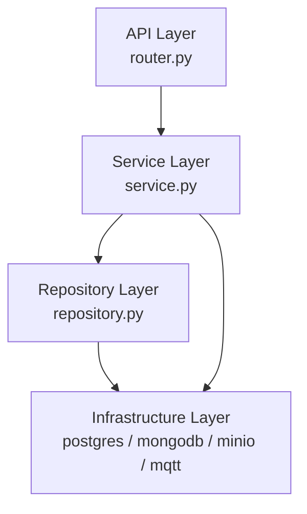

### 3.1 API Layer (`router.py`)

**Allowed:**
- Define HTTP routes using `@router.get`, `@router.post`, etc.
- Declare FastAPI dependencies (`Depends(get_current_user)`, `Depends(get_db_session)`)
- Validate and parse request bodies using Pydantic schemas
- Call service methods and return their results
- Convert domain exceptions to HTTP responses via the global exception handler
- Set HTTP status codes and response models

**Forbidden:**
- Any business logic or conditional logic beyond request parsing
- Direct database queries or repository calls
- Calling infrastructure clients (SQLAlchemy session, Motor, MinIO) directly
- Referencing SQLAlchemy models
- Cross-module router imports (inter-module calls go through services only)

---

### 3.2 Service Layer (`service.py`)

**Allowed:**
- Implement all business rules and domain logic
- Call one or more repository methods to read and write data
- Call other modules' services when cross-domain coordination is required
- Raise domain exceptions defined in `exceptions.py`
- Call `shared/security.py` for password hashing and JWT operations
- Call `infrastructure/minio.py` when media operations require it
- Trigger alert creation by calling `alerts.service.create_alert()`

**Forbidden:**
- Importing or using any FastAPI primitives (`Request`, `Depends`, `HTTPException`, `status`)
- Returning `Response` or `JSONResponse` objects
- Executing raw SQL or MongoDB queries directly (all data access through repositories)
- Calling another module's repository (only its service)
- Performing HTTP calls to external systems

---

### 3.3 Repository Layer (`repository.py`)

**Allowed:**
- Construct and execute SQLAlchemy queries against PostgreSQL
- Construct and execute Motor queries against MongoDB
- Map database rows and documents to domain objects or Pydantic schemas
- Implement pagination with `LIMIT`/`SKIP` logic
- Apply soft-delete filters (`WHERE deleted_at IS NULL`)
- Build MongoDB aggregation pipelines for analytics and geoportal queries

**Forbidden:**
- Any business logic, conditional rules, or policy decisions
- Raising business domain exceptions (raise only infrastructure-level errors or let DB exceptions propagate)
- Calling service methods
- Calling other repositories from different modules (except shared utilities)
- Sending emails, generating tokens, or calling external APIs

---

### 3.4 Infrastructure Layer (`infrastructure/`)

**Allowed:**
- Manage connection lifecycle (connect, disconnect, pool management)
- Expose session factories and client singletons
- Wrap third-party SDK calls with WildTrack-specific error types
- Implement health probes

**Forbidden:**
- Business logic of any kind
- Knowledge of domain models or Pydantic schemas
- Calling module-level code (no imports from `modules/`)

---

## 4. Dependency Rules

The following dependency graph is **strictly enforced**. Violations are detectable by static import analysis.

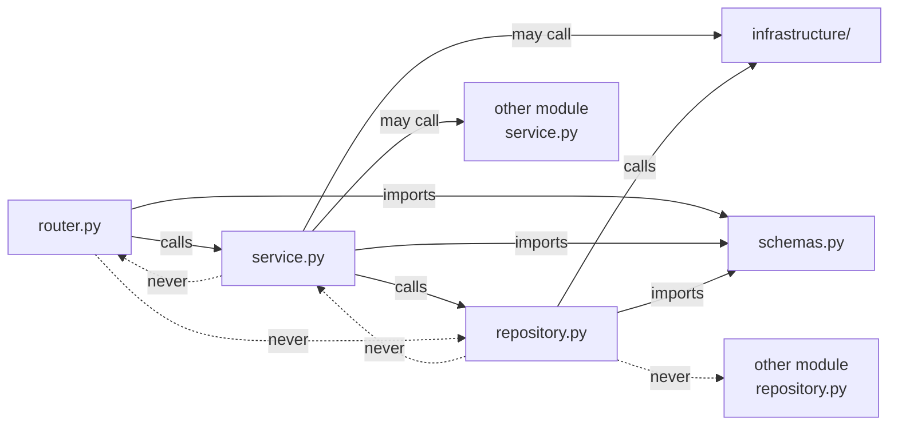

### 4.1 Allowed Import Paths

| From | May import | May NOT import |
|------|-----------|----------------|
| `router.py` | `service.py`, `schemas.py`, `shared/`, `app/dependencies.py` | `repository.py`, `models.py`, `infrastructure/` directly |
| `service.py` | `repository.py`, `schemas.py`, `shared/`, `infrastructure/minio.py`, other modules' `service.py` | `router.py`, FastAPI primitives, other modules' `repository.py` |
| `repository.py` | `models.py`, `schemas.py`, `shared/`, `infrastructure/postgres.py`, `infrastructure/mongodb.py` | `service.py`, `router.py`, other modules' `repository.py` |
| `models.py` | `shared/base_model.py`, `shared/enums.py` | anything from `modules/` |
| `schemas.py` | `shared/types.py`, `shared/enums.py`, `shared/pagination.py` | `models.py`, `service.py`, `repository.py` |
| `exceptions.py` | `shared/base_exception.py` | anything else |

### 4.2 Cross-Module Calls

When module A needs data owned by module B:

- **Correct:** `module_a.service` calls `module_b.service.get_something()`
- **Incorrect:** `module_a.service` calls `module_b.repository.find_something()`
- **Incorrect:** `module_a.router` calls `module_b.service` directly without going through its own service

### 4.3 Module Boundaries That Must Never Be Crossed

- `iot_events.repository` may only be called from `iot_events.service` and the internal MQTT event processor
- `alerts.repository` may only be called from `alerts.service`; other modules call `alerts.service.create_alert()`
- `media.repository` may only be called from `media.service`
- `user_stations.repository.user_has_access()` is the single source of truth for station access checks

---

## 5. Database Access Strategy

### 5.1 SQLAlchemy Strategy

WildTrack uses **SQLAlchemy 2.x async** with an async PostgreSQL driver (`asyncpg`). All database operations are non-blocking.

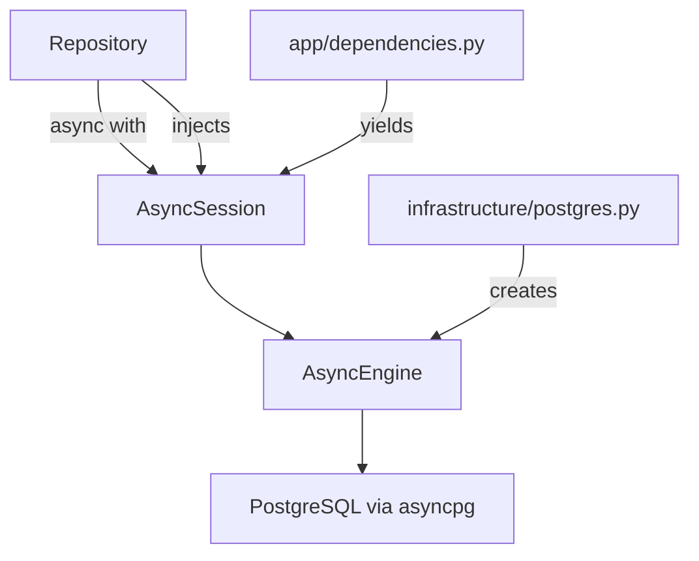

**Session lifecycle:** A new `AsyncSession` is created per HTTP request via `get_db_session()` dependency. The session is committed on successful return and rolled back on exception. The session is never shared across requests or held open between service calls.

**ORM usage:** SQLAlchemy ORM is used for all INSERT, UPDATE, and simple SELECT operations. Raw SQL via `text()` is used only for PostGIS spatial queries where the ORM cannot express the operation cleanly.

**Lazy loading is disabled.** All relationships are accessed via explicit `joinedload()` or `selectinload()` to prevent N+1 queries. No `relationship()` with `lazy="select"` is permitted.

### 5.2 PostgreSQL Access

All PostgreSQL interactions go through the SQLAlchemy `AsyncSession`. No module uses `asyncpg` directly.

**PostGIS geometry construction** in repository methods:

```
ST_SetSRID(ST_MakePoint(:longitude, :latitude), 4326)
```

This is expressed as a `func` call in SQLAlchemy where ORM support is insufficient, or as a `text()` fragment for complex spatial queries.

**Soft-delete filter** is applied in every `list` and `find` repository method. The base repository class provides a helper that appends `WHERE deleted_at IS NULL` automatically.

### 5.3 MongoDB Access

WildTrack uses **Motor** (async MongoDB driver). All queries are non-blocking.

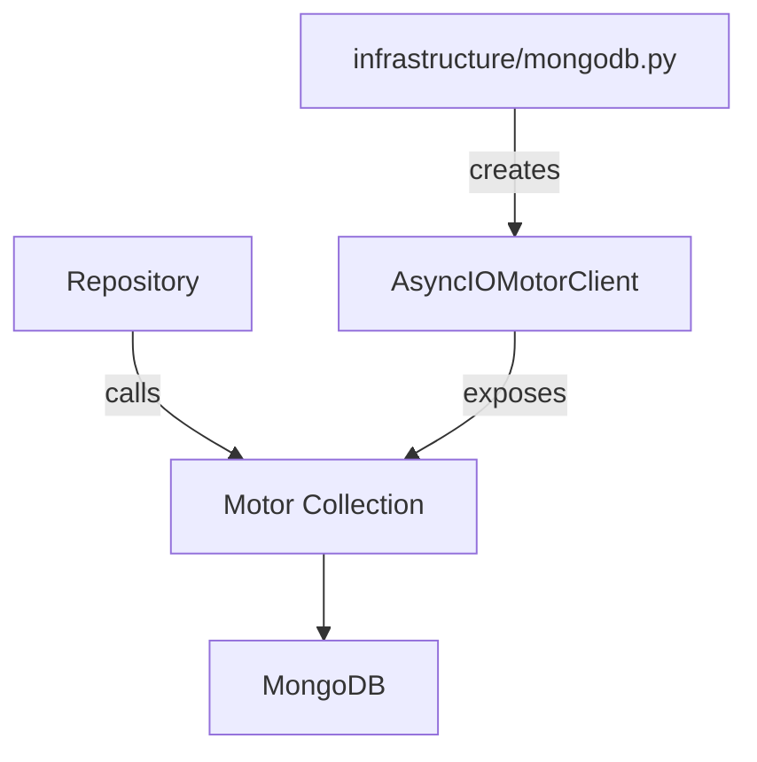

MongoDB repositories do not use an ORM. Documents are inserted and queried as plain Python dicts. Pydantic schemas are used to validate documents before insertion and to parse documents after retrieval.

**Collection names** are defined as constants in `infrastructure/mongodb.py`:

| Constant | Collection |
|----------|-----------|
| `COLLECTION_IOT_EVENTS` | `iot_events` |
| `COLLECTION_TELEMETRY` | `device_telemetry` |
| `COLLECTION_ALERTS` | `alerts` |
| `COLLECTION_MEDIA` | `media_metadata` |
| `COLLECTION_DEAD_LETTER` | `dead_letter_events` |

**Aggregation pipelines** for analytics and geoportal queries are defined as class methods on the repository and accept parameter dictionaries. They are not constructed inline in service methods.

### 5.4 MinIO Access

The `infrastructure/minio.py` wrapper exposes three operations:

| Method | Purpose |
|--------|---------|
| `upload_file(bucket, key, data, content_type)` | Streams binary content to MinIO |
| `generate_presigned_url(bucket, key, expires)` | Returns a time-limited GET URL |
| `delete_object(bucket, key)` | Removes an object (post-MVP) |

The MinIO client uses the synchronous `minio` SDK wrapped in `asyncio.to_thread()` to avoid blocking the event loop.

### 5.5 Repository Interface Pattern

Each repository exposes a consistent method signature. Base operations for PostgreSQL repositories are inherited from `shared/base_repository.py`:

| Method | Returns |
|--------|---------|
| `create(data: Schema) -> Model` | Created ORM instance |
| `find_by_id(id: UUID) -> Model \| None` | ORM instance or None |
| `list_all(filters, page, page_size) -> (list[Model], int)` | Items and total count |
| `update(id, data: Schema) -> Model` | Updated ORM instance |
| `soft_delete(id) -> None` | Sets `deleted_at = now()` |

MongoDB repositories do not inherit from `BaseRepository` but follow the same naming convention. They return plain dicts or Pydantic model instances.

---

## 6. Authentication Architecture

### 6.1 Password Hashing

All password hashing uses **bcrypt** via the `passlib` library with `bcrypt` scheme and a work factor of 12. Plaintext passwords are never stored, logged, or returned.

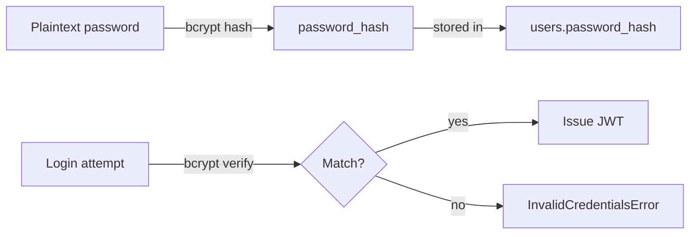

Functions in `shared/security.py`:
- `hash_password(plaintext: str) -> str`
- `verify_password(plaintext: str, hashed: str) -> bool`

### 6.2 JWT Token Generation

Tokens are HS256-signed JWTs issued by `auth.service.login()`.

**Payload (claims):**

| Claim | Value |
|-------|-------|
| `sub` | User UUID (string) |
| `role` | User role string |
| `iat` | Issued-at Unix timestamp |
| `exp` | Expiry Unix timestamp (`iat` + `JWT_EXPIRY_SECONDS`) |

Functions in `shared/security.py`:
- `create_token(user_id: str, role: str) -> str`
- `decode_token(token: str) -> dict`

`decode_token` raises `InvalidTokenError` for expired, malformed, or invalid-signature tokens.

### 6.3 JWT Validation Flow

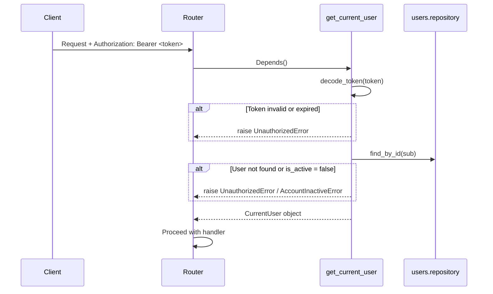

`get_current_user` is a FastAPI dependency in `app/dependencies.py`. It is injected into every protected endpoint via `Depends(get_current_user)`.

### 6.4 Role Authorization

Role checks are implemented as composable FastAPI dependency factories:

```
require_role(*allowed_roles) -> Callable
    Returns a dependency that raises ForbiddenError if the current user's role is not in allowed_roles.

require_admin -> Depends(require_role("admin"))
require_researcher_or_above -> Depends(require_role("admin", "researcher"))
```

Roles form a simple hierarchy. Admins may perform any action. No role inheritance logic is needed beyond this.

### 6.5 Station Access Permission Checks

Station-level access (not role-based, but membership-based) is checked in the service layer by calling `user_stations.service.assert_user_has_access(user_id, station_id)`. This method queries `user_stations.repository.user_has_access()` and raises `StationAccessDeniedError` for non-members. Admins bypass this check (their role is verified before the check is invoked).

The check is **always performed in the service layer**, never in the router.

---

## 7. MQTT Architecture

> **Scope note:** Firmware development is outside the scope of this backend implementation. The backend implements the ingestion side of the MQTT contract defined in SDD-08 §20 (Software-Only Ingestion Contract). The backend does not manage or deploy firmware.

> **Local development:** Connect to Mosquitto on plain port `1883` with no TLS. Set `MQTT_HOST=localhost`, `MQTT_PORT=1883`, `MQTT_USE_TLS=false` in `.env`. TLS configuration (`MQTT_PORT=8883`, certificates) is required only for production deployment.

> **OTA firmware management is post-MVP.** The `wildtrack/ota/{device_id}` topic and any firmware upload endpoints are not implemented in the MVP backend. The backend does not serve or manage firmware binaries for the MVP.

### 7.1 MQTT Subscriber Service

The MQTT client is initialized during application lifespan startup and shut down cleanly during teardown. It runs as a background coroutine alongside the FastAPI event loop.

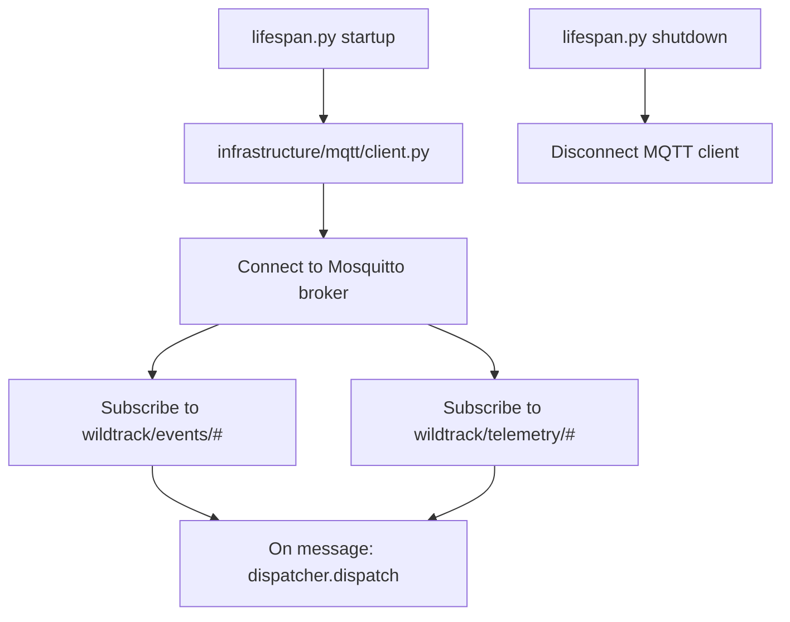

### 7.2 Topic Structure

| Topic Pattern | Handler | QoS |
|--------------|---------|-----|
| `wildtrack/events/{station_id}` | `event_handler.handle()` | 1 |
| `wildtrack/telemetry/{device_id}` | `telemetry_handler.handle()` | 1 |

Topic constants are defined in `infrastructure/mqtt/topics.py`. The dispatcher in `infrastructure/mqtt/dispatcher.py` extracts the topic prefix and routes to the correct handler.

### 7.3 Event Validation Flow

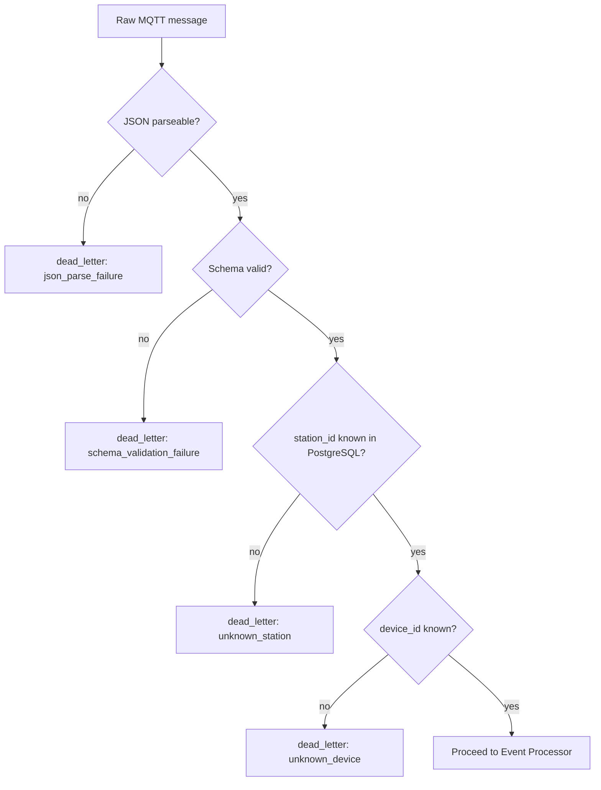

Each dead-letter insertion records: `received_at`, `topic`, `raw_payload`, `failure_reason`, `failure_detail`.

### 7.4 Dead-Letter Strategy

Dead-letter events are written to the `dead_letter_events` MongoDB collection. They are never retried automatically in the MVP. An admin may review them via MongoDB Compass or a future admin API endpoint (post-MVP).

The dead-letter writer is a standalone function in `infrastructure/mqtt/dispatcher.py` that can be called from any point in the processing chain without coupling to the business modules.

---

## 8. Event Processing Architecture

### 8.1 Processing Pipeline Overview

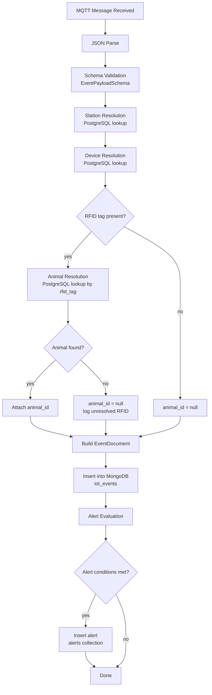

### 8.2 Alert Evaluation Rules

After every successful event insertion, the alert evaluator checks:

| Condition | Alert Type |
|-----------|-----------|
| `device_status == "error"` in payload | `sensor_failure` |
| `consumed_grams == 0` and `initial_weight < EMPTY_TANK_THRESHOLD_GRAMS` | `empty_tank` |
| `rfid_tag` present but no animal matched | `rfid_read_failure` |
| `media_url` expected by config but absent | `camera_failure` |

The threshold constants (`EMPTY_TANK_THRESHOLD_GRAMS`) come from `Settings` (see §12).

### 8.3 Device Health Monitor

A background task separate from the MQTT subscriber checks device liveness on a configurable interval (default every 5 minutes):

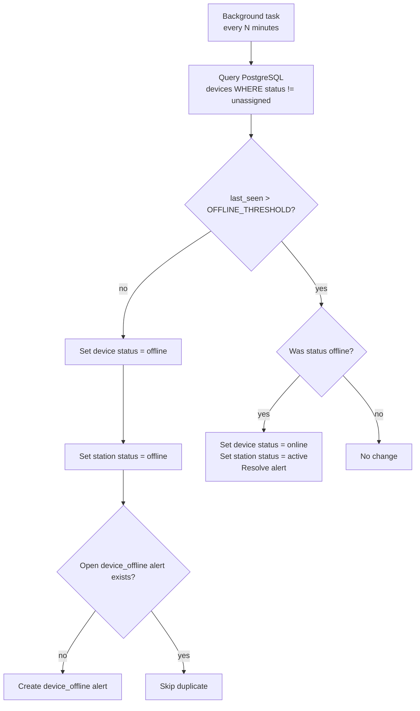

This background task runs inside the FastAPI lifespan and is registered alongside the MQTT client in `lifespan.py`.

### 8.4 Sequence Diagram — Full Feeding Event Ingestion

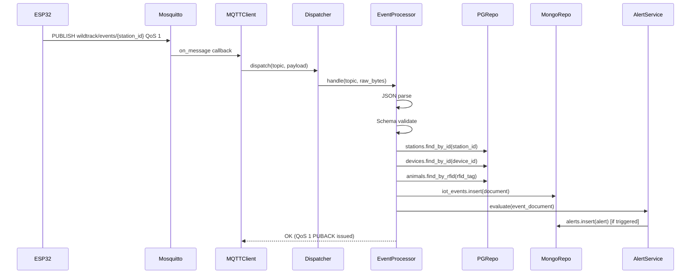

---

## 9. Error Handling Strategy

### 9.1 Exception Hierarchy

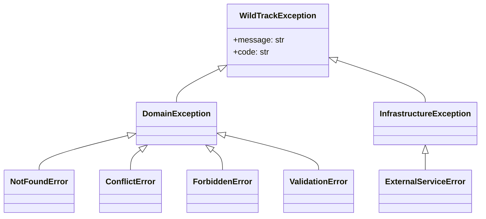

All domain exceptions inherit from `WildTrackException` (defined in `shared/base_exception.py`). Each carries a `message` string and a `code` string constant (matching the error catalog in SDD-04 §3).

### 9.2 Module-Level Exceptions

Each module defines its own exception classes in `exceptions.py` inheriting from the appropriate base:

```
StationNotFoundError(NotFoundError)         code = "NOT_FOUND"
StationCodeConflictError(ConflictError)     code = "STATION_CODE_EXISTS"
StationAccessDeniedError(ForbiddenError)    code = "FORBIDDEN"
```

### 9.3 Global Exception Handler

A global exception handler is registered in `app/main.py` and maps all `WildTrackException` subclasses to their appropriate HTTP status codes:

| Exception base | HTTP code |
|---------------|-----------|
| `NotFoundError` | `404` |
| `ConflictError` | `409` |
| `ForbiddenError` | `403` |
| `ValidationError` | `400` |
| `ExternalServiceError` | `502` |
| `WildTrackException` (fallback) | `400` |

The handler formats the error using the standard `{"detail": "...", "code": "..."}` envelope defined in SDD-04 §2.6.

FastAPI's built-in `RequestValidationError` (Pydantic 422 errors) is also handled by a registered override that returns the same structured format.

Unhandled exceptions produce a `500` response with `{"detail": "Internal server error", "code": "INTERNAL_ERROR"}`. The original exception is logged at ERROR level with a full traceback.

### 9.4 Infrastructure Exception Wrapping

Infrastructure-level exceptions (SQLAlchemy `OperationalError`, Motor `ConnectionFailure`, MinIO `S3Error`) are caught in the repository layer and re-raised as `InfrastructureException` subclasses. They are never allowed to propagate to the service or API layers as raw third-party exceptions.

---

## 10. Logging Strategy

WildTrack uses Python's `logging` module configured with a structured JSON formatter in production and a colored human-readable formatter in development. Log level is controlled by the `LOG_LEVEL` environment variable (default `INFO`).

### 10.1 Application Logs

**What is logged:**
- Every incoming HTTP request: method, URL, response status code, duration in ms, request ID
- Service method entry and exit at DEBUG level in non-production environments
- Dependency startup and shutdown events (PostgreSQL connected, MQTT connected, etc.)
- Unhandled exceptions at ERROR with full traceback

**What is NOT logged:**
- Request or response bodies (to avoid logging credentials or sensitive data)
- Password fields, tokens, or any PII

A unique `X-Request-ID` header is injected by middleware and included in every log line for correlation.

### 10.2 Audit Logs

Security-relevant events are written to a dedicated `audit` logger at INFO level:

| Event | Fields |
|-------|-------|
| User registration | `user_id`, `email`, `timestamp` |
| Login success | `user_id`, `ip_address`, `timestamp` |
| Login failure | `email_attempted`, `ip_address`, `reason`, `timestamp` |
| Role change | `actor_id`, `target_user_id`, `old_role`, `new_role`, `timestamp` |
| Account deactivation | `actor_id`, `target_user_id`, `timestamp` |
| Station deletion | `actor_id`, `station_id`, `timestamp` |

### 10.3 Event Ingestion Logs

MQTT event processing uses a dedicated `ingestion` logger:

| Event | Level | Fields |
|-------|-------|-------|
| Event received | DEBUG | `topic`, `station_id`, `payload_size_bytes` |
| Event ingested successfully | INFO | `event_id`, `station_id`, `device_id`, `event_type`, `duration_ms` |
| Dead-letter written | WARNING | `topic`, `failure_reason`, `station_id` (if parseable) |
| Unresolved RFID | WARNING | `rfid_tag`, `station_id`, `event_id` |
| Alert generated | INFO | `alert_type`, `station_id`, `event_id` |

### 10.4 Telemetry Logs

Device telemetry heartbeats are logged at DEBUG level unless the heartbeat indicates a problem:

| Condition | Level | Fields |
|-----------|-------|-------|
| Heartbeat received | DEBUG | `device_id`, `wifi_signal`, `uptime`, `free_memory` |
| `device_status == "warning"` | WARNING | `device_id`, `device_status`, `station_id` |
| `device_status == "error"` | ERROR | `device_id`, `device_status`, `station_id` |
| Device set offline | WARNING | `device_id`, `station_id`, `last_seen`, `threshold_minutes` |

---

## 11. Testing Strategy

### 11.1 Test Categories

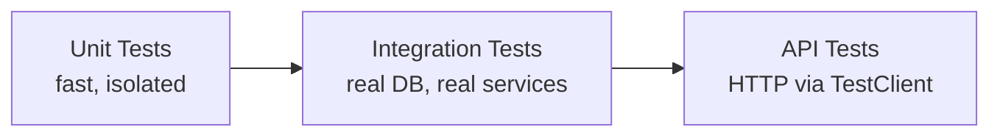

### 11.2 Unit Tests

Unit tests cover service-layer business logic in isolation. External dependencies (repositories, MinIO, MQTT) are replaced with `unittest.mock.AsyncMock` or `pytest-mock` fixtures.

**What is unit tested:**
- All service method branches (happy path + all exception paths)
- Password hashing and JWT encode/decode in `shared/security.py`
- UUID generation in `shared/uuid7.py`
- Pydantic schema validation rules (custom validators)
- Alert evaluation logic
- Dead-letter routing logic in the MQTT dispatcher

**Tool:** `pytest` with `pytest-asyncio` for async test support.

### 11.3 Repository Tests

Repository tests execute real queries against a **disposable test PostgreSQL instance** and a **disposable test MongoDB instance**, both launched via Docker (or test containers) as pytest fixtures.

**What is tested:**
- All `create`, `find`, `list`, `update`, `soft_delete` operations
- Partial unique index behavior (duplicate email with soft-delete, RFID uniqueness)
- PostGIS geometry storage and retrieval
- MongoDB aggregation pipeline correctness
- Soft-delete filtering (deleted records should not appear in lists)

**Test isolation:** Each test runs in a transaction that is rolled back after the test (PostgreSQL). Each MongoDB test drops and re-creates collections in a dedicated test database.

### 11.4 API (Integration) Tests

API tests exercise full request-response cycles using FastAPI's `TestClient` (or `httpx.AsyncClient`). They use a real test database seeded with known fixtures.

**What is tested:**
- All endpoint happy paths (correct input → correct status code and response shape)
- All authorization scenarios (unauthorized, forbidden, admin-only)
- All documented error scenarios (404, 409, 400)
- Pagination behavior
- Station access scoping (researcher sees only their stations)

**Authentication:** API tests use a test JWT signed with a test secret, generated by a `test_token(user)` fixture.

### 11.5 MQTT Integration Tests

The MQTT ingestion pipeline is tested by publishing test messages directly to the event processor function (bypassing the broker) and asserting that the correct MongoDB documents are inserted and the correct alerts are created.

A small subset of MQTT tests uses an embedded Mosquitto instance (via Docker) to verify broker connectivity and QoS 1 acknowledgment.

### 11.6 Coverage Targets

| Layer | Target Coverage |
|-------|----------------|
| Service layer (business logic) | ≥ 90% |
| Repository layer | ≥ 85% |
| API layer (routers) | ≥ 80% |
| Shared utilities | ≥ 95% |
| MQTT pipeline | ≥ 80% |
| **Overall** | **≥ 85%** |

Coverage is measured with `pytest-cov` and reported in CI. PRs that reduce overall coverage below the target are blocked.

---

## 12. Configuration Strategy

### 12.1 `.env` File

All environment-specific values are loaded from a `.env` file at runtime. A `.env.example` is committed to source control with placeholder values and comments. The actual `.env` file is never committed.

```
# ─── Application ─────────────────────────────
APP_ENV=development                  # development | test | production
LOG_LEVEL=INFO
DEBUG=true

# ─── Security ────────────────────────────────
JWT_SECRET_KEY=change-me-in-production
JWT_EXPIRY_SECONDS=86400

# ─── PostgreSQL ──────────────────────────────
POSTGRES_HOST=localhost
POSTGRES_PORT=5432
POSTGRES_DB=wildtrack
POSTGRES_USER=wildtrack
POSTGRES_PASSWORD=wildtrack

# ─── MongoDB ─────────────────────────────────
MONGODB_URI=mongodb://localhost:27017
MONGODB_DB=wildtrack

# ─── MinIO ───────────────────────────────────
MINIO_ENDPOINT=localhost:9000
MINIO_ACCESS_KEY=minioadmin
MINIO_SECRET_KEY=minioadmin
MINIO_BUCKET=wildtrack-media
MINIO_USE_SSL=false
MINIO_PRESIGNED_URL_EXPIRY=900      # seconds

# ─── MQTT ────────────────────────────────────
MQTT_HOST=localhost
MQTT_PORT=1883
MQTT_CLIENT_ID=wildtrack-backend
MQTT_KEEPALIVE=60

# ─── Business thresholds ─────────────────────
DEVICE_OFFLINE_THRESHOLD_MINUTES=10
EMPTY_TANK_THRESHOLD_GRAMS=50
DEVICE_HEALTH_CHECK_INTERVAL_SECONDS=300
MEDIA_MAX_UPLOAD_SIZE_BYTES=10485760  # 10 MB

# ─── Admin Bootstrap ─────────────────────────
ADMIN_SEED_EMAIL=admin@wildtrack.local
ADMIN_SEED_PASSWORD=ChangeThisImmediately!
```

### 12.2 Settings Management

A `Settings` class using **Pydantic `BaseSettings`** is defined in `shared/config.py`. It reads values from environment variables and the `.env` file.

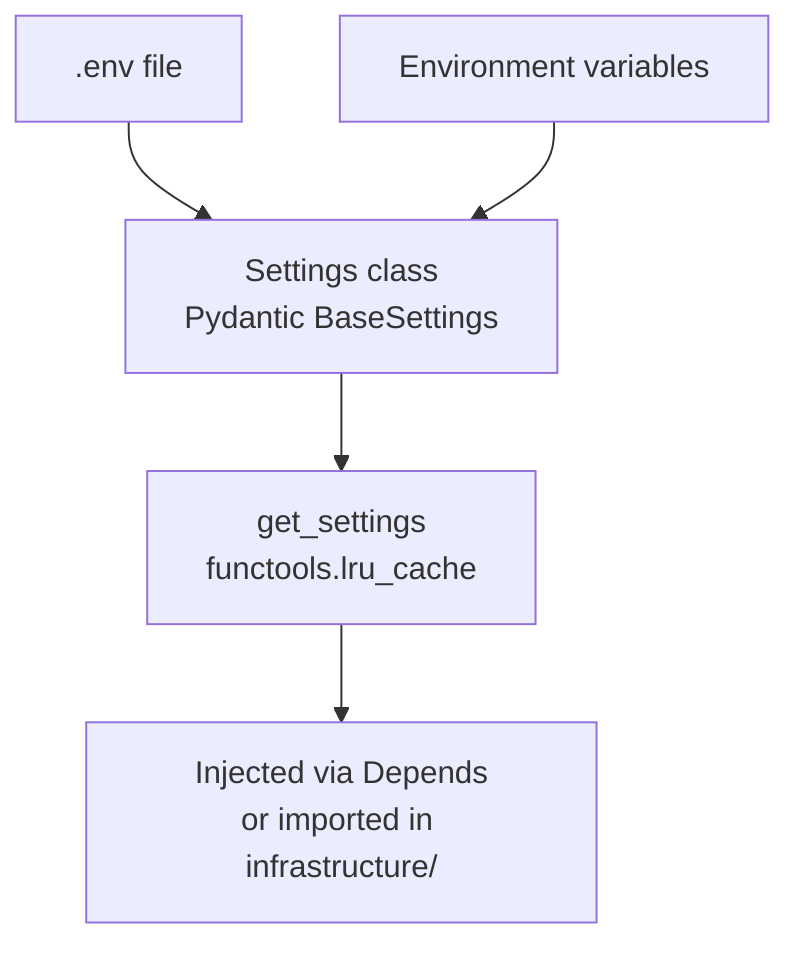

`get_settings()` is cached with `lru_cache` so the `.env` file is parsed only once per process. Tests override settings by patching `get_settings` or setting environment variables before import.

### 12.3 Environment Separation

| Environment | `APP_ENV` | Key differences |
|-------------|-----------|----------------|
| `development` | `development` | `DEBUG=true`, human-readable logging, `.env` loaded from project root |
| `test` | `test` | Separate test DB names (`wildtrack_test`), mock MinIO, reduced token expiry |
| `production` | `production` | `DEBUG=false`, JSON logging, secrets from Docker secrets or secrets manager |

In production, sensitive values (`JWT_SECRET_KEY`, `POSTGRES_PASSWORD`, etc.) must not be stored in `.env`. They are injected via Docker Compose secrets or a secrets manager. The `Settings` class reads them from environment variables that Docker injects at container startup.

---

## 13. ADR Recommendations

Before implementation begins, the following Architecture Decision Records should be created:

### ADR-005 — Async Runtime Strategy

**Question:** Should WildTrack use `asyncio`-native async throughout (async SQLAlchemy, Motor, async MinIO wrapper) or use a mixed sync/async approach?

**Recommendation:** Full async stack using `asyncio`. `asyncio`-native drivers (`asyncpg` via SQLAlchemy, `motor`) avoid blocking the event loop. The MinIO SDK is synchronous and should be wrapped with `asyncio.to_thread()`.

**Why an ADR:** This decision affects every layer of the stack and must be explicit before scaffolding begins.

---

### ADR-006 — Background Task Runner

**Question:** Should the device health monitor and future background jobs run as FastAPI `BackgroundTask`, as an `asyncio` task registered in lifespan, or as a separate Celery/ARQ worker?

**Recommendation (MVP):** `asyncio` tasks registered in `lifespan.py`. The MVP has only one background job (device health monitor) and does not justify a separate task queue. ARQ or Celery should be added if the number of background jobs grows or if retry semantics are needed.

**Why an ADR:** Choosing Celery now would add Redis as a dependency and significantly increase infrastructure complexity.

---

### ADR-007 — MQTT Client Library

**Question:** Should the MQTT subscriber use `paho-mqtt` (synchronous), `aiomqtt` (asyncio-native), or `gmqtt`?

**Recommendation:** `aiomqtt` — an async wrapper over `paho-mqtt` that integrates cleanly with the FastAPI asyncio event loop without blocking threads.

**Why an ADR:** `paho-mqtt` requires a dedicated thread, which complicates integration with an async backend. The choice affects how the client is started, stopped, and tested.

---

### ADR-008 — Test Database Lifecycle

**Question:** Should integration and repository tests use Docker Compose containers started manually before the test suite, or should they use `pytest` plugins that start containers automatically (e.g., `testcontainers-python`)?

**Recommendation:** `testcontainers-python` for local development (containers spun up per test session). CI runs a Docker Compose test profile. This avoids requiring developers to manually manage test DB containers.

**Why an ADR:** This decision affects the onboarding experience for new contributors and CI configuration.

---

### ADR-009 — API Versioning Enforcement

**Question:** How strictly should the `/api/v1` prefix be enforced, and what is the plan for introducing `/api/v2` when breaking changes are needed?

**Recommendation:** All routers are mounted under `/api/v1` from day one. A version-2 router file can coexist in the same module without code changes to v1 handlers. URL-based versioning is preferred over header-based versioning for simplicity.

**Why an ADR:** Establishing this before scaffold prevents future confusion about whether to change existing routes or create new versioned ones.

---

*End of SDD-05 Backend Design — v1.0.0*
