# WildTrack Platform — Frontend Implementation Architecture

**Document:** SDD-06 Frontend Design  
**Version:** 1.0.0  
**Date:** 2026-06-13  
**Status:** Draft — Pending Approval  
**References:** SDD-01 Requirements v1.2.0, SDD-02 Architecture v1.0.0, SDD-04 API Contract v1.0.0

---

## Table of Contents

1. [Frontend Architecture Overview](#1-frontend-architecture-overview)
2. [Folder Structure](#2-folder-structure)
3. [Atomic Design Strategy](#3-atomic-design-strategy)
4. [Routing Architecture](#4-routing-architecture)
5. [Authentication Flow](#5-authentication-flow)
6. [Authorization Strategy](#6-authorization-strategy)
7. [API Client Architecture](#7-api-client-architecture)
8. [TanStack Query Strategy](#8-tanstack-query-strategy)
9. [Layout Architecture](#9-layout-architecture)
10. [Geoportal Architecture](#10-geoportal-architecture)
11. [Dashboard Architecture](#11-dashboard-architecture)
12. [Forms Architecture](#12-forms-architecture)
13. [State Management Strategy](#13-state-management-strategy)
14. [Error Handling Strategy](#14-error-handling-strategy)
15. [Loading States Strategy](#15-loading-states-strategy)
16. [Design System Strategy](#16-design-system-strategy)
17. [Responsive Design Strategy](#17-responsive-design-strategy)
18. [Accessibility Strategy](#18-accessibility-strategy)
19. [Testing Strategy](#19-testing-strategy)
20. [Frontend ADR Recommendations](#20-frontend-adr-recommendations)

---

## 1. Frontend Architecture Overview

### 1.1 Architectural Style

WildTrack's frontend is a **Single Page Application (SPA)** built with React and Vite. It communicates exclusively with the WildTrack FastAPI backend via the REST API (`/api/v1`). It never queries PostgreSQL, MongoDB, or MinIO directly.

The application is organized as a **feature-driven monorepo** using Atomic Design to ensure a reusable, consistent component library. TanStack Query manages all server state. Local UI state (modals, drawer open/closed, form dirty state) lives in component state. There is no global Redux or Zustand store in the MVP.

### 1.2 Technology Decisions Summary

| Concern | Technology | Rationale |
|---------|-----------|-----------|
| Bundler | Vite | Fast dev server with HMR; optimized production build |
| Language | TypeScript | Type safety across API contracts and component props |
| Routing | React Router v6 | Nested routes, route-level code splitting, loader support |
| Server state | TanStack Query v5 | Cache management, background refetch, optimistic updates |
| Map | Leaflet + React-Leaflet | Lightweight, OpenStreetMap compatible, GeoJSON support |
| Styling | SCSS (CSS Modules) | Scoped styles, design token variables, no runtime overhead |
| Forms | React Hook Form | Low re-render overhead, schema-based validation |
| Validation | Zod | TypeScript-first schema validation shared between form and API types |
| HTTP client | Axios | Interceptor support for auth headers and error normalization |
| Testing | Vitest + Testing Library | Vite-native, DOM-accurate, accessible-by-default queries |

### 1.3 High-Level Data Flow

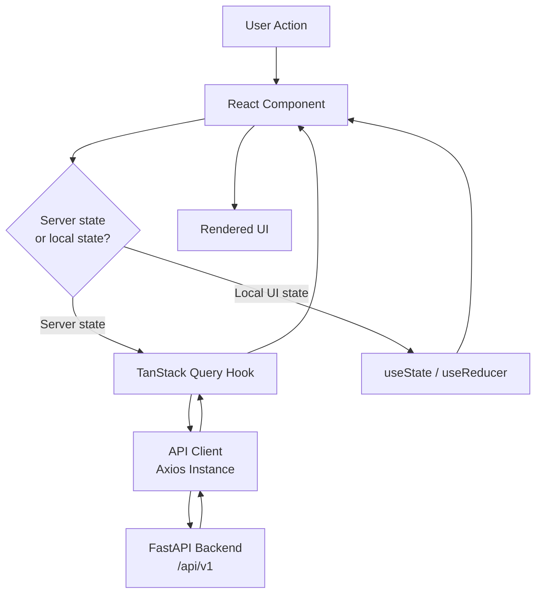

### 1.4 Application Sections

The frontend is divided into three primary areas:

| Section | Path Prefix | Description |
|---------|------------|-------------|
| **Admin Platform** | `/app/*` | Station management, users, animals, foods, alerts, devices |
| **Geoportal** | `/app/map` | Leaflet map with station markers, heatmaps, and overlays |
| **Dashboard** | `/app/dashboard` | KPI cards, charts, analytics views |
| **Auth** | `/auth/*` | Login and registration pages (no sidebar) |

---

## 2. Folder Structure

### 2.1 Top-Level Layout

```
frontend/
├── public/                    # Static assets (favicon, manifest, robot.txt)
├── src/
│   ├── assets/                # Images, icons, static files imported by components
│   ├── components/            # Atomic Design component library
│   ├── features/              # Feature modules (one per business domain)
│   ├── layouts/               # Page layout shells (AppLayout, AuthLayout, MapLayout)
│   ├── pages/                 # Route-level page components
│   ├── router/                # Route definitions and guards
│   ├── api/                   # Axios client, API functions, type definitions
│   ├── hooks/                 # Shared custom hooks
│   ├── store/                 # Auth context and any minimal global state
│   ├── styles/                # Global SCSS: tokens, resets, typography, utilities
│   ├── types/                 # Shared TypeScript type and interface definitions
│   ├── utils/                 # Pure utility functions (format, parse, transform)
│   └── main.tsx               # Vite entry point: renders <App /> with providers
├── tests/
│   ├── unit/                  # Vitest unit tests for hooks and utils
│   ├── components/            # Component tests with Testing Library
│   └── e2e/                   # Playwright end-to-end tests (post-MVP)
├── index.html                 # Vite HTML entry
├── vite.config.ts             # Vite + path alias configuration
├── tsconfig.json              # TypeScript configuration
└── .env.example               # VITE_ prefixed environment variable template
```

### 2.2 `components/` — Atomic Design Library

```
components/
├── atoms/
│   ├── Button/
│   ├── Input/
│   ├── Label/
│   ├── Badge/
│   ├── Spinner/
│   ├── Avatar/
│   ├── Icon/
│   └── Divider/
├── molecules/
│   ├── FormField/
│   ├── SearchBar/
│   ├── StatusBadge/
│   ├── ConfirmDialog/
│   ├── Pagination/
│   ├── EmptyState/
│   └── ToastNotification/
├── organisms/
│   ├── DataTable/
│   ├── Sidebar/
│   ├── TopNav/
│   ├── PageHeader/
│   ├── FilterBar/
│   ├── StatCard/
│   └── AlertBanner/
└── index.ts                   # Barrel export of all components
```

Each component folder contains:

```
Button/
├── Button.tsx                 # Component implementation
├── Button.module.scss         # Scoped styles
├── Button.types.ts            # Props interface
└── Button.test.tsx            # Component tests
```

### 2.3 `features/` — Business Domain Modules

```
features/
├── auth/
├── users/
├── stations/
├── devices/
├── zones/
├── animals/
├── foods/
├── alerts/
├── analytics/
├── geoportal/
└── media/
```

Each feature module:

```
features/stations/
├── api/
│   ├── stations.api.ts        # Axios calls for this feature
│   └── stations.types.ts      # Request/response types (mirrors SDD-04 schemas)
├── hooks/
│   ├── useStations.ts         # TanStack Query hooks for this feature
│   └── useStationDetail.ts
├── components/
│   ├── StationCard/           # Feature-specific components (not reusable globally)
│   ├── StationStatusBadge/
│   └── StationMapMarker/
└── index.ts                   # Barrel re-export
```

### 2.4 `api/` — Shared API Infrastructure

```
api/
├── client.ts                  # Axios instance with interceptors
├── auth.api.ts                # Auth endpoints
└── types/
    ├── common.types.ts        # PaginatedList, BusinessError, etc.
    └── enums.ts               # TypeScript enums matching backend enums
```

### 2.5 `styles/` — Global Design Tokens

```
styles/
├── _tokens.scss               # Color palette, spacing, typography, breakpoints as CSS custom properties
├── _reset.scss                # Minimal CSS reset
├── _typography.scss           # Font scale definitions
├── _utilities.scss            # Utility classes (sr-only, visually-hidden, truncate)
└── main.scss                  # Imports all partials; imported once in main.tsx
```

---

## 3. Atomic Design Strategy

WildTrack follows Atomic Design to ensure every UI element is built from reusable primitives and assembled consistently.

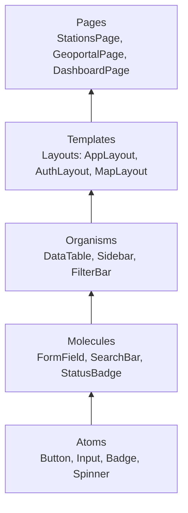

### 3.1 Atoms

Atoms are the smallest interactive or visual units. They:

- Accept only primitive props (strings, numbers, booleans, callbacks)
- Have no knowledge of API data or business concepts
- Own their own SCSS module for scoped styling
- Are always accessible (correct ARIA roles, keyboard focus, color contrast)

Examples: `Button`, `Input`, `Label`, `Badge`, `Spinner`, `Icon`, `Avatar`

### 3.2 Molecules

Molecules combine two or more atoms into a functional unit that solves a single UI problem.

- May hold minimal local state (e.g., `SearchBar` holds the current input value)
- Are still unaware of API data and domain concepts
- Receive data via props; emit events via callbacks

Examples: `FormField` (Label + Input + error text), `SearchBar` (Input + Icon + clear Button), `Pagination` (multiple Buttons + page count display), `ConfirmDialog` (two Buttons + descriptive text)

### 3.3 Organisms

Organisms assemble molecules and atoms into a self-contained section of the UI. They may:

- Consume TanStack Query hooks to fetch their own data
- Contain feature-specific business labels (e.g., column headers referencing "Station Code")
- Be composed from atoms and molecules; they should never import other organisms

Examples: `DataTable` (FilterBar + table rows + Pagination), `Sidebar` (navigation links per role), `TopNav` (Avatar + user menu + notifications icon), `StatCard` (label, number, trend indicator)

### 3.4 Templates (Layouts)

Templates are skeleton page structures with named slots. They define the spatial arrangement of organisms without containing content.

- `AppLayout`: TopNav + Sidebar + main content area
- `AuthLayout`: centered card for login/register — no nav, no sidebar
- `MapLayout`: full-screen Leaflet map + collapsible control panel

### 3.5 Pages

Pages are route components that compose layouts with feature-specific organisms and connect data from TanStack Query hooks.

- One page component per route
- Pages own the data-fetching hooks for their section and pass data down
- Pages orchestrate loading and error state UI

### 3.6 Feature Components

Components inside `features/{name}/components/` are domain-aware components that belong to exactly one feature. They:

- May use feature-specific API hooks and types
- Are not exported to the global `components/` library
- Can consume organisms but do not duplicate them

---

## 4. Routing Architecture

### 4.1 Route Tree

```mermaid
flowchart TD
    A[/] --> B{Is authenticated?}
    B -->|no| C[/auth/login]
    B -->|yes| D[/app]
    C --> E[/auth/register]
    D --> F[/app/dashboard]
    D --> G[/app/map]
    D --> H[/app/stations]
    H --> H1[/app/stations/new]
    H --> H2[/app/stations/:id]
    H2 --> H3[/app/stations/:id/edit]
    H2 --> H4[/app/stations/:id/members]
    H2 --> H5[/app/stations/:id/foods]
    H2 --> H6[/app/stations/:id/events]
    D --> I[/app/devices]
    I --> I1[/app/devices/new]
    I --> I2[/app/devices/:id]
    D --> J[/app/zones]
    J --> J1[/app/zones/new]
    J --> J2[/app/zones/:id/edit]
    D --> K[/app/animals]
    K --> K1[/app/animals/new]
    K --> K2[/app/animals/:id]
    D --> L[/app/foods]
    D --> M[/app/alerts]
    D --> N[/app/users]
    N --> N1[/app/users/:id]
    D --> O[/app/profile]
```

### 4.2 Route Definition Structure

Routes are defined in `router/routes.tsx` using React Router v6's `createBrowserRouter`. Lazy imports (`React.lazy`) are used for every route-level page component to enable code splitting.

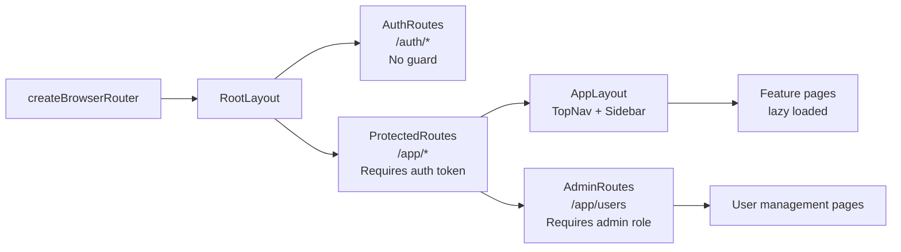

### 4.3 Route Guards

Two guard components wrap route subtrees:

**`RequireAuth`** — redirects to `/auth/login` if no valid token is present in the auth store.

**`RequireRole`** — accepts an array of allowed roles. Renders a 403 page if the authenticated user's role is not in the list.

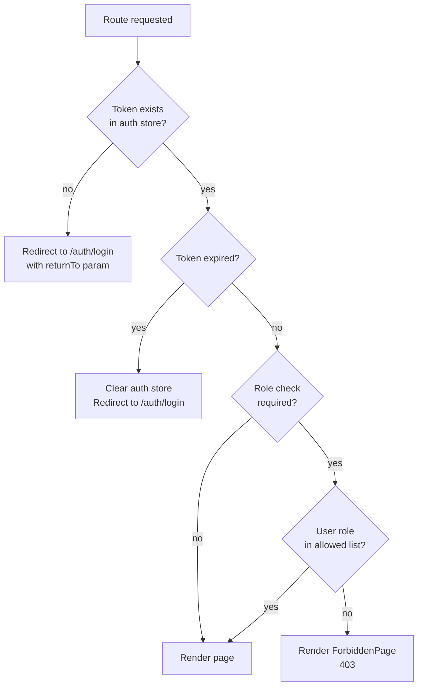

### 4.4 Route-Level Code Splitting

Every page component is imported lazily via `React.lazy()`. Suspense boundaries with skeleton loading fallbacks are placed at the route level in `AppLayout`. This ensures the initial JS bundle is minimal and feature code is loaded on demand.

### 4.5 Navigation State

`React Router`'s `useNavigate` and `useLocation` hooks handle all programmatic navigation. After a successful login, the router redirects to the `returnTo` location stored in navigation state (default: `/app/dashboard`). After creating or editing a record, the router returns to the list page with a success toast.

---

## 5. Authentication Flow

### 5.1 Login Flow

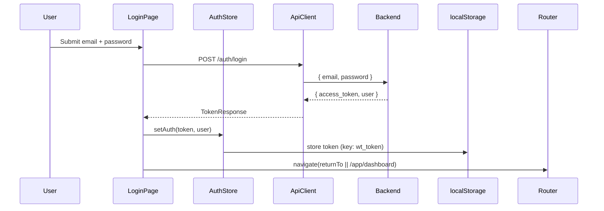

### 5.2 Token Persistence

The JWT token is stored in `localStorage` under key `wt_token`. On application load, `AuthProvider` reads this key, validates expiry from the decoded payload, and restores the authenticated session if the token is still valid. If the token is expired, it is removed and the user is treated as unauthenticated.

`localStorage` is chosen over cookies in the MVP for simplicity. This decision is captured in Frontend ADR-002.

### 5.3 Logout Flow

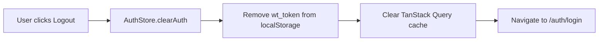

The TanStack Query client cache is cleared on logout to prevent the next user on the same machine from seeing cached data.

### 5.4 Token Injection

The Axios instance in `api/client.ts` has a request interceptor that reads the current token from the auth store and injects it as `Authorization: Bearer <token>` on every outgoing request. No component or hook needs to manually attach the token.

### 5.5 401 Response Handling

The Axios response interceptor catches `401 Unauthorized` responses. When received:

1. `AuthStore.clearAuth()` is called
2. The TanStack Query cache is cleared
3. The user is redirected to `/auth/login` with the current path saved as `returnTo`

This handles both expired tokens and server-side token invalidation (e.g., after an admin deactivates the account).

### 5.6 Registration Flow

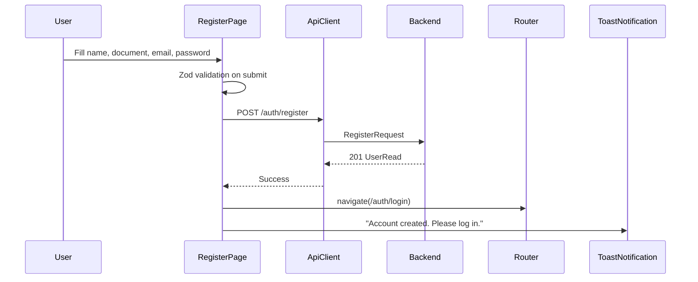

Registration does not auto-login. The user is directed to the login page after successful registration.

---

## 6. Authorization Strategy

### 6.1 Role-Based UI Adaptation

The frontend adapts its UI based on the authenticated user's role, which is stored in the auth store after login. Three adaptation levels exist:

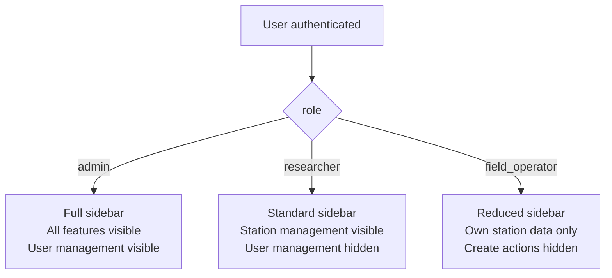

### 6.2 Conditional Rendering by Role

A `useCurrentUser` hook returns the current user's profile including role. Components use this hook to conditionally render actions:

- Create / Edit / Delete buttons are hidden for `field_operator` and shown for `researcher` and `admin`
- The `/app/users` route and its sidebar link are visible only to `admin`
- Device assignment controls are visible only to `admin`
- The "Assign Member" button on a station is visible only to the station `owner` and `admin`

### 6.3 Permission Helper

A `usePermissions` hook exposes boolean flags derived from the current user's role and the context of the current page:

| Flag | True when |
|------|-----------|
| `canManageUsers` | `role === "admin"` |
| `canCreateStation` | `role === "admin" \|\| role === "researcher"` |
| `canAssignDevice` | `role === "admin"` |
| `canEditStation` | `role === "admin"` or user is station `owner` |
| `canManageMembers` | `role === "admin"` or user is station `owner` |
| `canRegisterAnimal` | any authenticated role |
| `canResolveAlert` | any authenticated role with station access |

### 6.4 Backend Enforcement

Frontend authorization is **UI-only**. The backend enforces all rules. If a user manipulates the frontend to reach a forbidden action, the API returns `403` and the frontend shows a toast error. The frontend never trusts its own role checks as a security boundary.

### 6.5 Station-Scoped Access

The `useStations` hook already receives only the stations the user has access to (because the API scopes results server-side). The frontend does not need to filter the station list. Station detail pages redirect to a 403 page if the API returns `403` for that station's endpoints.

---

## 7. API Client Architecture

### 7.1 Axios Instance

A single Axios instance is created in `api/client.ts` and shared across all feature API modules.

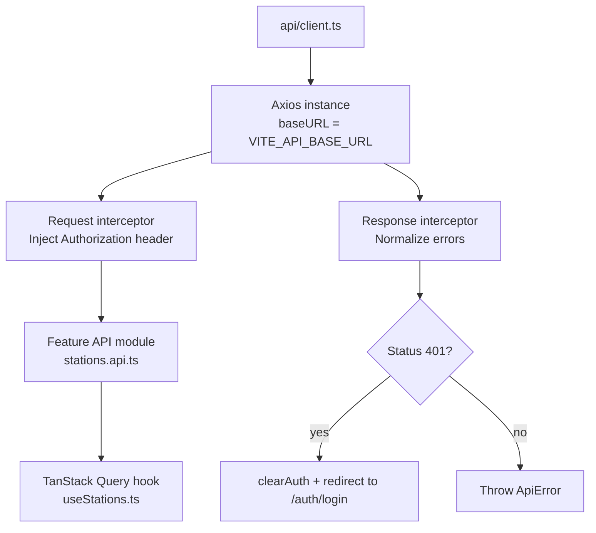

### 7.2 Error Normalization

The response interceptor transforms all non-2xx responses into a typed `ApiError` object:

```
ApiError {
  status: number          // HTTP status code
  code: string            // Backend error code string (e.g., "NOT_FOUND")
  message: string         // Human-readable message from backend detail field
  field?: string          // Optional field name for validation errors
}
```

This means every TanStack Query `error` object in the application is always an `ApiError`. Components never need to inspect raw Axios error shapes.

### 7.3 Feature API Modules

Each feature has its own API module in `features/{name}/api/`. These modules export typed async functions that call the Axios instance and return typed response objects.

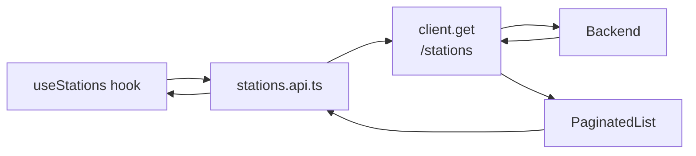

API functions accept typed parameter objects and return typed response models matching SDD-04 schemas. All query string parameters are passed as the Axios `params` option to allow Axios to serialize them correctly.

### 7.4 Type Safety Across Layers

Types flow from SDD-04 API contract → `features/{name}/api/*.types.ts` → hook return values → component props. Zod schemas in `features/{name}/api/` validate API responses at runtime during development (disabled in production for performance).

### 7.5 Base URL Configuration

The API base URL is set via the Vite environment variable `VITE_API_BASE_URL`. In development this points to `http://localhost:8000/api/v1`. In Docker Compose this is overridden to the internal service name. No hardcoded URLs exist in the application code.

---

## 8. TanStack Query Strategy

### 8.1 Query Client Configuration

A single `QueryClient` is created in `main.tsx` and provided via `QueryClientProvider` wrapping the entire application.

Default configuration:

| Option | Value | Rationale |
|--------|-------|-----------|
| `staleTime` | 30 seconds | Prevents redundant refetches on component mount |
| `gcTime` | 5 minutes | Keeps cached data available for back-navigation |
| `retry` | 1 | Retries once on network failure; no retry on 4xx |
| `refetchOnWindowFocus` | `true` (default) | Keeps data fresh when user returns to tab |
| `refetchOnReconnect` | `true` | Refreshes after network reconnection |

### 8.2 Query Key Conventions

Query keys are defined as constants in each feature's `hooks/` directory to prevent typo-driven cache misses:

```
stations.keys = {
  all:        ["stations"],
  list:       (filters) => ["stations", "list", filters],
  detail:     (id)      => ["stations", "detail", id],
  events:     (id, filters) => ["stations", id, "events", filters],
  animals:    (id)      => ["stations", id, "animals"],
  members:    (id)      => ["stations", id, "members"],
  foods:      (id)      => ["stations", id, "foods"],
}
```

Keys are hierarchical so that `queryClient.invalidateQueries(["stations"])` invalidates all station-related queries at once after a mutation.

### 8.3 Query Hooks Pattern

Every feature exposes a set of query hooks in `features/{name}/hooks/`:

| Hook | Wraps | Purpose |
|------|-------|---------|
| `useStations(filters)` | `useQuery` | List with filters and pagination |
| `useStation(id)` | `useQuery` | Single record detail |
| `useStationEvents(id, filters)` | `useQuery` | Sub-resource list |
| `useCreateStation()` | `useMutation` | POST with cache invalidation |
| `useUpdateStation(id)` | `useMutation` | PATCH with cache invalidation |
| `useDeleteStation(id)` | `useMutation` | DELETE with optimistic cache removal |

### 8.4 Mutation and Cache Invalidation

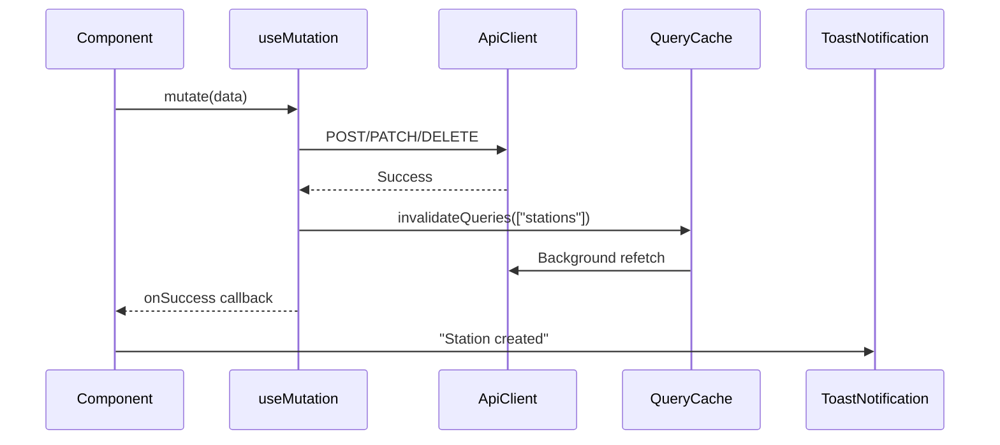

After every successful mutation, the relevant query key hierarchy is invalidated. This triggers a background refetch so lists automatically reflect the change without a manual page refresh.

### 8.5 Optimistic Updates

Optimistic updates are used for high-frequency, low-risk mutations: resolving alerts, toggling food active state, and changing member roles. The pattern:

1. `onMutate`: snapshot current cache, apply optimistic change
2. `onError`: roll back to snapshot, show error toast
3. `onSettled`: invalidate queries to sync with server truth

### 8.6 Prefetching

Station detail pages prefetch event and member data when the user hovers over a station list row. This is done via `queryClient.prefetchQuery()` in a mouse-enter handler on the list row component.

### 8.7 Pagination State

Pagination parameters (`page`, `page_size`) are stored in the URL as query string parameters via `useSearchParams`. This makes pagination state bookmarkable and preservable across navigation. TanStack Query's `placeholderData: keepPreviousData` prevents content flash between page changes.

---

## 9. Layout Architecture

### 9.1 Layout Hierarchy

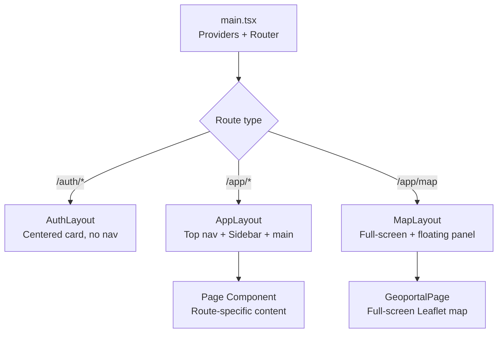

### 9.2 `AppLayout`

The standard layout for all admin and dashboard pages.

```
┌─────────────────────────────────────────────────┐
│ TopNav                                          │ ← fixed header
├───────────┬─────────────────────────────────────┤
│           │                                     │
│  Sidebar  │  <Outlet />                         │ ← scrollable
│  (fixed)  │  Page content                       │
│           │                                     │
└───────────┴─────────────────────────────────────┘
```

- `TopNav`: logo, global search (post-MVP), notification bell (open alert count), user avatar with dropdown (Profile, Logout)
- `Sidebar`: collapsible navigation. Links shown depend on user role (see §6.1)
- `<Outlet />`: React Router outlet renders the current page

### 9.3 `AuthLayout`

Used for `/auth/login` and `/auth/register`. No navigation or sidebar. Centered vertically and horizontally with a brand logo above the card.

### 9.4 `MapLayout`

Used exclusively for the geoportal. The Leaflet map fills the full viewport. A collapsible left panel overlays the map and shows station lists, zone filters, and event details.

```
┌─────────────────────────────────────────────────┐
│ [≡] WildTrack Geoportal       [Home link]       │ ← floating top bar
├──────────┬──────────────────────────────────────┤
│          │                                      │
│  Control │  Leaflet Map (full viewport)         │
│  Panel   │  Markers, heatmap layers, popups     │
│  (float) │                                      │
└──────────┴──────────────────────────────────────┘
```

### 9.5 Sidebar Navigation Structure

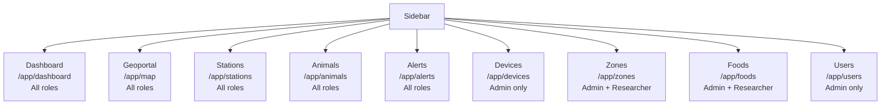

---

## 10. Geoportal Architecture

### 10.1 Component Structure

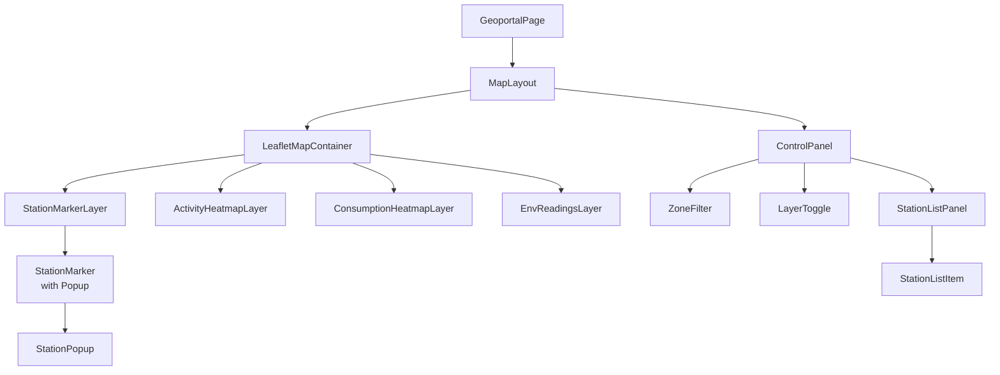

### 10.2 Leaflet Integration

React-Leaflet is used to wrap the Leaflet library in React components. The map container is initialized once; layer components subscribe to data from TanStack Query hooks and update the map imperatively when data changes.

**Map layers:**

| Layer | Data source | Toggle |
|-------|------------|--------|
| Station markers | `GET /geoportal/stations` | Always on |
| Activity heatmap | `GET /geoportal/heatmap/activity` | Optional (LayerToggle) |
| Consumption heatmap | `GET /geoportal/heatmap/consumption` | Optional (LayerToggle) |
| Environmental readings | `GET /geoportal/env-readings` | Optional (LayerToggle) |

### 10.3 Station Marker Color Coding

Station markers use the `StatusBadge` color convention:

| Station Status | Marker Color |
|---------------|-------------|
| `active` | Green |
| `inactive` | Gray |
| `maintenance` | Amber |
| `offline` | Red |

Marker icons are custom SVG icons injected as Leaflet `DivIcon` instances so that color is controlled by CSS variables from the design system.

### 10.4 Station Popup

Clicking a station marker opens a Leaflet popup containing `StationPopup`:

```
┌──────────────────────────────────┐
│ STA-001 · North Ridge Feeder     │
│ Status: ● Active                 │
│ Zone: Andean Forest Reserve A    │
│ Last event: 45 min ago           │
│ Events today: 12                 │
│ Device: WT-ESP32-0042 (online)   │
│                                  │
│ [View station →]                 │
└──────────────────────────────────┘
```

### 10.5 Map Location Picker (Station Registration)

When creating or editing a station, the frontend embeds a `MapPicker` component inside the station form. The `MapPicker` renders a Leaflet map with a draggable marker. On marker drag-end, the map fires a callback with the new latitude/longitude, which React Hook Form stores as form field values. A "Use my location" button triggers the browser Geolocation API and centers the marker at the user's current coordinates.

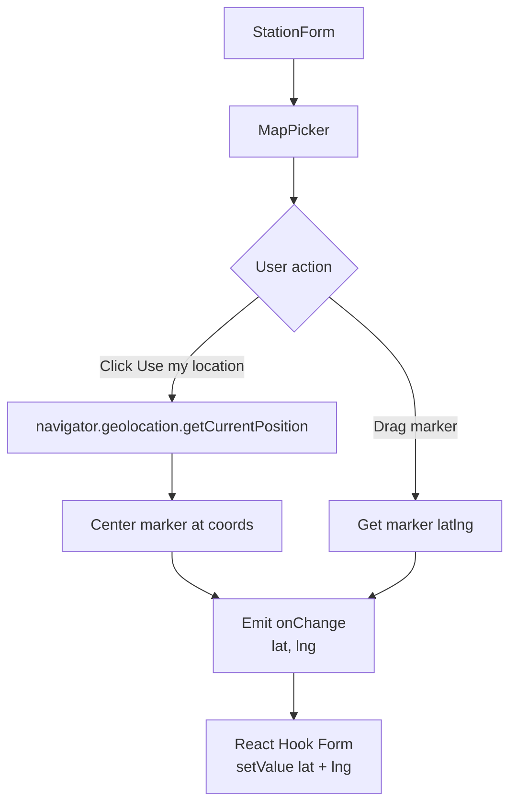

### 10.6 Heatmap Layer

The activity and consumption heatmaps use `leaflet.heat`. Data points from `GET /geoportal/heatmap/activity` and `GET /geoportal/heatmap/consumption` are fed directly as `[lat, lng, weight]` arrays to the `L.heatLayer` instance. The layer is updated reactively when filter parameters change (date range, zone).

### 10.7 Geoportal Data Refresh

Geoportal data refetches every 60 seconds automatically via TanStack Query's `refetchInterval` option. This keeps the map reasonably current without requiring a manual reload. The refetch interval is configurable via `VITE_MAP_REFRESH_INTERVAL_MS`.

---

## 11. Dashboard Architecture

### 11.1 Component Structure

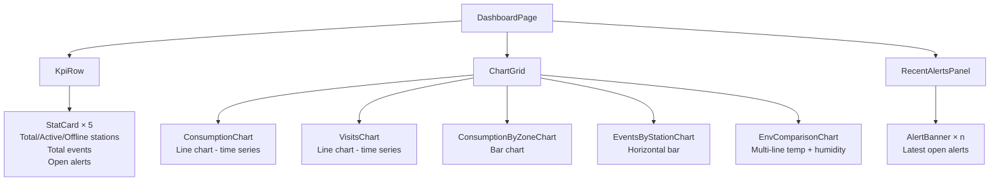

### 11.2 Chart Library

Charts are rendered using **Recharts**. Each chart component:

- Receives data from a TanStack Query hook
- Shows a `Spinner` while loading
- Shows an `EmptyState` when there is no data for the selected time range
- Supports a date range picker (from/to) that updates the query parameters

### 11.3 KPI Cards

The five KPI stat cards at the top of the dashboard consume `GET /analytics/kpi`. Each `StatCard` displays:

- A label ("Active Stations")
- A large number value
- An optional secondary number or percentage delta

### 11.4 Date Range Filter

A shared date range filter at the top of the dashboard controls all chart queries simultaneously. The date range is stored in the URL as `?from=&to=` query parameters so it persists on page refresh and can be bookmarked.

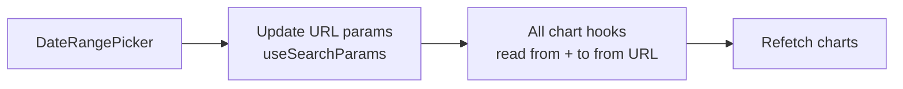

---

## 12. Forms Architecture

### 12.1 Technology Stack

All forms use **React Hook Form** for state management and **Zod** for schema-based validation. Zod schemas are defined alongside API types in `features/{name}/api/*.types.ts` and are shared between form validation and runtime API response validation.

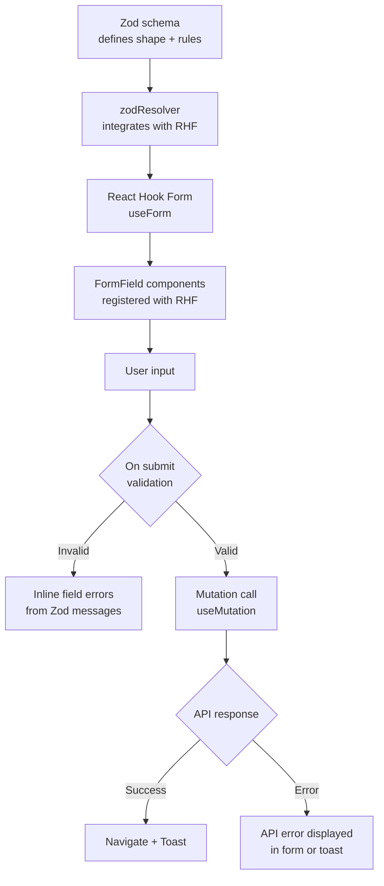

### 12.2 `FormField` Molecule

All form inputs are wrapped in the `FormField` molecule, which composes:

- `Label` (with required indicator)
- The appropriate `Input`, `Select`, or `Textarea` atom
- An inline error message paragraph (populated by RHF's `formState.errors`)

`FormField` accepts a `name` prop that maps directly to the RHF `register` call, keeping the form wiring explicit.

### 12.3 Form Submit States

Every form submit button uses the `Button` atom with a `loading` prop. While the mutation is pending:

- The submit button is disabled and shows a `Spinner`
- Form fields are not disabled (to allow edits before the request completes)
- Double-submit is prevented by the disabled state

On error, the `Button` returns to its default state and the error is shown in a toast notification or inline on the relevant field (for 409 conflicts on unique fields).

### 12.4 Multi-Step Form: Station Creation

Station creation is the most complex form in the MVP. It uses a two-step layout:

**Step 1:** Name, code, zone selection  
**Step 2:** Location — MapPicker with geolocation button

State between steps is held in local component state. On Step 2 submit, both sets of data are merged into a single API request.

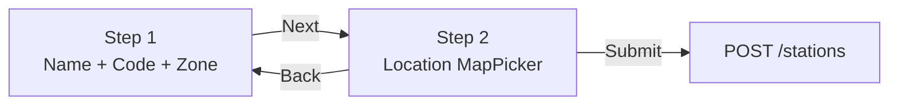

### 12.5 Server-Side Validation Errors

After a form is submitted, API `422` (schema) and `409` (conflict) errors are mapped back to specific form fields using RHF's `setError`:

| API Error | Maps to field |
|-----------|--------------|
| `EMAIL_ALREADY_EXISTS` | `email` |
| `STATION_CODE_EXISTS` | `code` |
| `RFID_TAG_EXISTS` | `rfid_tag` |
| `SERIAL_EXISTS` | `serial_number` |
| `FOOD_NAME_EXISTS` | `name` |

All other API errors show as a toast notification rather than a field-level error.

---

## 13. State Management Strategy

### 13.1 State Categories

WildTrack uses no global state library in the MVP. State is categorized and stored at the appropriate level:

```mermaid
flowchart TD
    A[Application State] --> B[Server State\nTanStack Query]
    A --> C[Auth State\nAuthContext]
    A --> D[URL State\nReact Router]
    A --> E[Local UI State\nuseState / useReducer]
```

### 13.2 Server State

All data fetched from the API (stations, animals, events, alerts, etc.) is server state. It lives exclusively in the TanStack Query cache. Components never copy server state into `useState`. Updates happen by invalidating and refetching queries after mutations.

### 13.3 Auth State

Authentication state (current user, JWT token, role) is managed by `AuthContext` defined in `store/auth.context.tsx`. It is provided at the root of the application and consumed via `useCurrentUser()` and `useAuth()` hooks.

The auth store:
- Reads and writes `localStorage` for token persistence
- Does not use TanStack Query (auth is not server-fetched state)
- Is the single source of truth for whether the user is logged in

### 13.4 URL State

Filters, pagination parameters, date ranges, and selected tab states are stored in the URL via `useSearchParams`. This ensures state survives page refresh, is shareable via URL, and integrates with browser back/forward navigation.

| State | Storage |
|-------|---------|
| Pagination `page`, `page_size` | URL query params |
| Filter `status`, `zone_id`, `role` | URL query params |
| Date range `from`, `to` | URL query params |
| Active chart tab | URL query params |

### 13.5 Local UI State

Ephemeral UI interactions use `useState`:

- Modal open/closed
- Accordion expanded/collapsed
- Map layer visibility toggles
- Form dirty state (RHF manages this)
- Toast message queue (managed by a minimal context)

---

## 14. Error Handling Strategy

### 14.1 Error Boundary

A React `ErrorBoundary` component wraps the `<Outlet />` in `AppLayout`. It catches rendering errors (component crashes) and displays a styled error page with a "Reload" button and the error message. It does not catch asynchronous API errors (those are handled by TanStack Query).

### 14.2 API Error Handling

```mermaid
flowchart TD
    A[API call fails] --> B{HTTP status}
    B -->|401| C[Interceptor: clear auth\nRedirect to /auth/login]
    B -->|403| D[Toast: You do not have\npermission for this action]
    B -->|404| E[Page renders NotFound\nor toast depending on context]
    B -->|409| F[Field-level error\nvia RHF setError]
    B -->|500| G[Toast: Something went wrong.\nPlease try again.]
    B -->|Network error| H[Toast: Connection failed.\nCheck your network.]
```

### 14.3 Query Error State

TanStack Query provides `isError` and `error` to every query hook consumer. Page-level queries (the primary data for a page) show an inline `ErrorState` component with a retry button when the query fails. Sub-resource queries (events list, members list) show a smaller inline error message.

### 14.4 Toast Notification System

A `ToastContext` provides a `showToast(message, type)` function available via `useToast()`. Toast types: `success`, `error`, `warning`, `info`. Toasts:

- Auto-dismiss after 4 seconds (errors stay for 6 seconds)
- Stack vertically in the bottom-right corner
- Can be dismissed manually by clicking ✕
- Are announced to screen readers via `role="status"` and `aria-live="polite"`

### 14.5 Not Found and Forbidden Pages

Two standalone full-page error components handle route-level errors:

- `NotFoundPage` (404): shown when a route does not match any defined path
- `ForbiddenPage` (403): shown when `RequireRole` denies access; includes a link back to the dashboard

---

## 15. Loading States Strategy

### 15.1 Loading Hierarchy

```mermaid
flowchart TD
    A[Page navigated to] --> B{Is page data\nloading?}
    B -->|yes| C[PageSkeleton\nfull-page skeleton]
    B -->|no| D[Render page content]
    D --> E{Is sub-resource\nloading?}
    E -->|yes| F[InlineSkeleton\nor Spinner in section]
    E -->|no| G[Render sub-resource]
    G --> H{Is data empty?}
    H -->|yes| I[EmptyState component]
    H -->|no| J[Render data]
```

### 15.2 Skeleton Screens

Skeleton screens (animated placeholder shapes) are preferred over centered spinners for page-level loading. Each major page has a corresponding `*Skeleton` component that mirrors the layout of the loaded content.

| Page | Skeleton |
|------|---------|
| Stations list | `StationsListSkeleton` — 5 placeholder table rows |
| Station detail | `StationDetailSkeleton` — header + two column panels |
| Dashboard | `DashboardSkeleton` — 5 KPI card outlines + 2 chart outlines |
| Geoportal | Map tiles load via Leaflet; a spinner overlay appears during initial GeoJSON fetch |

### 15.3 Inline Spinners

Smaller data sections (events list inside a station detail page, members panel) use a `Spinner` atom while loading, rather than a full skeleton. This is appropriate when the section is secondary to the main page content.

### 15.4 Mutation Pending State

All mutation buttons show a spinner and become disabled while the mutation is pending. This applies to submit buttons, delete buttons, and toggle actions. The user receives visual feedback within the element they interacted with, not in a global loading bar.

### 15.5 Background Refetch Indicator

TanStack Query's `isFetching` flag (distinct from `isLoading`) is used to show a subtle top-of-page progress bar (using `NProgress` or an equivalent lightweight library) during background refetches. This indicates freshness is being checked without disrupting the current view.

---

## 16. Design System Strategy

### 16.1 Design Tokens

All visual values are defined as CSS custom properties in `styles/_tokens.scss` and are the single source of truth for color, spacing, typography, and motion. No magic numbers are used in component SCSS files.

```
/* Color palette */
--color-primary-500: #2E7D32;
--color-primary-400: #43A047;
--color-danger-500: #C62828;
--color-warning-500: #F57F17;
--color-neutral-100: #F5F5F5;
--color-neutral-800: #212121;

/* Spacing scale (base 4px) */
--space-1: 0.25rem;  /* 4px */
--space-2: 0.5rem;   /* 8px */
--space-4: 1rem;     /* 16px */
--space-6: 1.5rem;   /* 24px */
--space-8: 2rem;     /* 32px */

/* Typography */
--font-size-sm: 0.875rem;
--font-size-base: 1rem;
--font-size-lg: 1.125rem;
--font-size-xl: 1.5rem;
--font-weight-normal: 400;
--font-weight-medium: 500;
--font-weight-bold: 700;
--line-height-base: 1.5;

/* Borders and radii */
--radius-sm: 4px;
--radius-md: 8px;
--radius-lg: 12px;
--border-width: 1px;
--border-color: var(--color-neutral-300);

/* Shadows */
--shadow-sm: 0 1px 3px rgba(0,0,0,0.12);
--shadow-md: 0 4px 12px rgba(0,0,0,0.15);

/* Motion */
--transition-fast: 150ms ease;
--transition-base: 250ms ease;
```

### 16.2 Color Semantics

| Semantic name | Usage |
|---------------|-------|
| `primary` | Buttons, active nav links, interactive elements |
| `success` (green) | Active status badges, success toasts |
| `warning` (amber) | Maintenance status, warning toasts |
| `danger` (red) | Offline status, error toasts, delete actions |
| `neutral` | Backgrounds, borders, inactive text |

Station and device status colors are mapped to these semantic tokens, not to raw color values.

### 16.3 SCSS Modules

Every component file has a companion `.module.scss` file. Styles are scoped to the component via CSS Modules. Global utility classes from `_utilities.scss` are imported explicitly when needed.

```mermaid
flowchart LR
    A[_tokens.scss\nCSS custom properties] --> B[Component .module.scss\nuses var() references]
    C[_utilities.scss\nglobal utility classes] --> D[Imported in component\nwhen needed]
    B --> E[Scoped class names\nno leakage]
```

### 16.4 Icon System

Icons use a single SVG sprite or individual SVG files imported as React components. All icons are wrapped in the `Icon` atom which handles sizing, ARIA labeling, and color via CSS `currentColor`. No icon font libraries (Font Awesome, Material Icons) are used to avoid loading unused glyph data.

### 16.5 Dark Mode

Dark mode is out of scope for the MVP. The design token system is structured to support it (all colors use CSS custom properties), so adding a `[data-theme="dark"]` override in a future iteration requires only adding a second token set.

---

## 17. Responsive Design Strategy

### 17.1 Breakpoint System

```
$bp-sm:  640px;   /* Small phone landscape */
$bp-md:  768px;   /* Tablet portrait */
$bp-lg:  1024px;  /* Tablet landscape / small laptop */
$bp-xl:  1280px;  /* Desktop */
$bp-2xl: 1536px;  /* Wide desktop */
```

WildTrack is designed **desktop-first** because wildlife researchers and field operators primarily use the platform on laptops and tablets. Mobile support is added at breakpoints for the most common read-only views.

### 17.2 Layout Adaptation

| Breakpoint | AppLayout behavior |
|-----------|-------------------|
| `< md` | Sidebar collapses to off-screen drawer; TopNav shows hamburger icon |
| `md – lg` | Sidebar collapses to icon-only mode (no labels) |
| `> lg` | Sidebar fully expanded with labels |

### 17.3 Data Tables on Small Screens

The `DataTable` organism at `< md` viewport:
- Switches to a card-per-row layout
- Shows only the most important columns (name, status, actions)
- Secondary data is shown in a disclosure (expandable row)

### 17.4 Geoportal on Mobile

The geoportal map fills the full viewport on all screen sizes. The control panel becomes a bottom sheet (slides up from the bottom of the screen) instead of a left panel on `< md` viewports.

### 17.5 Forms on Mobile

Forms remain single-column on all breakpoints. Multi-column form grids (used on desktop for Zone form) collapse to single column below `md`.

---

## 18. Accessibility Strategy

### 18.1 Target Compliance

WildTrack targets **WCAG 2.1 Level AA** compliance for all UI components and page content.

### 18.2 Semantic HTML

- Page headings follow a logical `h1 → h2 → h3` hierarchy. Every page has exactly one `h1` (the page title).
- Navigation landmarks use `<nav>` with `aria-label` (e.g., `aria-label="Main navigation"`)
- Main content is wrapped in `<main>`
- Data tables use `<table>`, `<thead>`, `<th scope="col">`, `<tbody>`
- Lists of items (station list cards) use `<ul>` + `<li>`
- Icons used decoratively carry `aria-hidden="true"`; icons used as interactive controls carry `aria-label`

### 18.3 Keyboard Navigation

All interactive elements (buttons, links, form fields, map controls) are reachable by keyboard. Custom interactive components implement:

- `tabIndex={0}` for focusable elements that are not natively focusable
- `onKeyDown` handlers for Enter and Space on button-like elements
- Focus trapping inside modals (using `focus-trap-react` or equivalent)
- Focus restoration when modals close (focus returns to the trigger element)

### 18.4 Color and Contrast

- All text meets a **4.5:1 contrast ratio** against its background (WCAG AA)
- Status badges use both color and a label (never color alone to convey meaning)
- Map markers use both color and shape/icon (not color alone)
- Error messages use both red color and an error icon + text

### 18.5 Forms

- Every input has an associated `<label>` (via `htmlFor` or wrapped)
- Required fields are marked with `aria-required="true"` and a visible `*` indicator
- Error messages are associated with their input via `aria-describedby`
- Success messages after form submission are announced via `aria-live="polite"`

### 18.6 Leaflet Map Accessibility

The Leaflet map is inherently limited for keyboard and screen reader users. The following mitigations are applied:

- A text-based alternative view of station data is accessible via the `StationListPanel` in the control panel
- All map action controls (zoom, layer toggle) have visible labels and keyboard focus
- The map container carries `aria-label="Wildlife monitoring map"` and `role="application"`
- Station data available on the map is also available in the stations list page in a fully accessible table

### 18.7 Focus Indicators

The default browser focus outline is not removed. It is augmented with a consistent `:focus-visible` style using `--color-primary-500` outline:

```
:focus-visible {
  outline: 2px solid var(--color-primary-500);
  outline-offset: 2px;
}
```

### 18.8 Testing Accessibility

- `axe-core` is integrated into the Vitest component test suite via `jest-axe` (compatible with Vitest). Every component test asserts `expect(results).toHaveNoViolations()`.
- Playwright e2e tests (post-MVP) include keyboard navigation smoke tests.

---

## 19. Testing Strategy

### 19.1 Test Categories

```mermaid
flowchart LR
    A[Unit Tests\nUtils + hooks\nVitest] --> B[Component Tests\nTesting Library\nVitest]
    B --> C[Integration Tests\nFull page tests with\nMSW mock server]
    C --> D[E2E Tests\nPlaywright\npost-MVP]
```

### 19.2 Unit Tests

Unit tests cover:

- Utility functions in `utils/` (date formatting, unit conversion, string helpers)
- Custom hooks in `hooks/` and `features/*/hooks/` in isolation using `renderHook`
- Auth context logic (token parse, expiry check, setAuth, clearAuth)
- Query key factory functions
- Zod schema validation rules

Tool: **Vitest** with `@testing-library/react-hooks` for hook testing.

### 19.3 Component Tests

Component tests render components in isolation using **Testing Library** and assert on:

- Correct text, labels, and ARIA attributes are present
- Interactive elements respond to user events (click, type, submit)
- Conditional rendering based on props (e.g., a delete button is absent when `canDelete = false`)
- Loading and error states render the correct skeleton or error message
- Accessibility: `axe-core` via `jest-axe` runs on every rendered component

Tools: **Vitest** + **@testing-library/react** + **@testing-library/user-event** + **jest-axe**

### 19.4 Integration Tests (Page-Level)

Page-level integration tests render the full page component tree against **Mock Service Worker (MSW)** handlers that intercept Axios requests and return fixture data. They test:

- A complete page renders correctly given a specific API response
- Form submission flow (fill form → submit → mutation called → success toast shown)
- Error flow (API returns 409 → field-level error appears on correct input)
- Pagination behavior (clicking next page updates the query and re-renders the list)
- Role-based rendering (admin sees delete button, researcher does not)

MSW handlers are defined in `tests/mocks/handlers.ts` and mirror every endpoint in SDD-04.

### 19.5 Mocking Strategy

| What is mocked | How |
|----------------|-----|
| API calls | MSW intercepts at the network layer; no Axios mocking |
| Auth state | Test wrapper provides a pre-configured `AuthContext` with a seeded user |
| Browser APIs | `navigator.geolocation` is mocked per-test with preset coordinates |
| `localStorage` | Mocked via `vitest-localstorage-mock` |
| Leaflet | Leaflet is mocked at the module level; map rendering tests use snapshot testing |

### 19.6 Coverage Targets

| Layer | Target |
|-------|--------|
| Utility functions | ≥ 95% |
| Custom hooks | ≥ 90% |
| Atom components | ≥ 90% |
| Molecule components | ≥ 85% |
| Organism components | ≥ 80% |
| Page components (integration) | ≥ 75% |
| **Overall** | **≥ 80%** |

Coverage is reported by Vitest and CI blocks PRs that drop overall coverage below the target.

---

## 20. Frontend ADR Recommendations

### ADR-010 — Token Storage: localStorage vs. HttpOnly Cookie

**Question:** Should the JWT be stored in `localStorage` (accessible to JavaScript) or in an `HttpOnly` cookie (inaccessible to JavaScript, protecting against XSS)?

**MVP Decision:** `localStorage` for simplicity. The backend does not currently have a cookie-based session endpoint.

**Recommendation for production:** Move to `HttpOnly` cookies served by the backend's `/auth/login` endpoint. This eliminates the XSS-to-token-theft attack vector. The backend ADR should capture the `/auth/refresh` endpoint needed to support cookie-based auth.

**Why an ADR:** This is a security-relevant decision that affects both frontend and backend and must be revisited before a public-facing deployment.

---

### ADR-011 — State Management: Context vs. Zustand

**Question:** Should minimal global state (auth, toast queue, sidebar collapsed) use React Context or a lightweight store library like Zustand?

**MVP Decision:** React Context only. The application has very little global mutable state. Adding Zustand now would be premature.

**Trigger for revisiting:** If more than three independent pieces of global state exist, or if Context re-renders cause measurable performance problems, migrate to Zustand.

**Why an ADR:** Prevents ad-hoc introduction of Zustand by individual contributors without a documented decision.

---

### ADR-012 — Map Library: React-Leaflet vs. MapLibre GL

**Question:** Should the geoportal use React-Leaflet (raster tiles, simpler API) or MapLibre GL (vector tiles, WebGL, better performance at scale)?

**MVP Decision:** React-Leaflet with OpenStreetMap raster tiles. The MVP has fewer than 100 stations and does not need vector tile rendering or 3D visualization.

**Trigger for revisiting:** If the number of concurrent map features exceeds ~500 or if heatmap rendering performance degrades.

**Why an ADR:** MapLibre GL has a significantly different API and integration model. Switching post-MVP is non-trivial and must be a deliberate decision.

---

### ADR-013 — Chart Library: Recharts vs. Chart.js

**Question:** Should charts use Recharts (React-native, composable) or Chart.js (imperative, more chart types)?

**MVP Decision:** Recharts. It integrates naturally with React's render model, supports responsive containers out of the box, and requires no imperative lifecycle management.

**Trigger for revisiting:** If a chart type required by analytics (e.g., radar, polar area) is unavailable in Recharts and Chart.js supports it.

**Why an ADR:** Mixing two charting libraries increases bundle size. The decision should be explicit.

---

### ADR-014 — End-to-End Testing Tool

**Question:** Should end-to-end tests use Playwright or Cypress?

**Recommendation:** Playwright. It supports multiple browsers natively, has first-class TypeScript support, runs in CI without a paid plan, and its async API aligns with the rest of the testing stack.

**Why an ADR:** E2E tests are deferred to post-MVP but the choice affects CI configuration, test fixture design, and developer tooling. Establishing the decision now prevents a mixed ecosystem.

---

### ADR-015 — Icon System: SVG Sprite vs. SVG React Components

**Question:** Should icons be bundled as an SVG sprite (a single file with symbol elements) or as individual SVG files imported as React components (via `vite-plugin-svgr`)?

**Recommendation:** Individual SVG React components via `vite-plugin-svgr`. This allows tree-shaking (only used icons are bundled), easy per-icon color and size control via props, and avoids the CORS and cache invalidation complexity of an external sprite file.

**Why an ADR:** This decision affects the icon workflow for every developer on the team. Documenting it prevents half the team importing sprites and half importing components.

---

*End of SDD-06 Frontend Design — v1.0.0*
