# WildTrack Platform — IoT Device Architecture

**Document:** SDD-08 Device and IoT Design  
**Version:** 1.0.0  
**Date:** 2026-06-13  
**Status:** Draft — Pending Approval  
**References:** SDD-01 Requirements v1.2.0, SDD-03 Data Model v1.0.0, SDD-04 API Contract v1.0.0, SDD-05 Backend Design v1.0.0, SDD-07 Infrastructure Design v1.0.0

---

## Table of Contents

1. [IoT Architecture Overview](#1-iot-architecture-overview)
2. [Device Hardware Architecture](#2-device-hardware-architecture)
3. [Device Provisioning Process](#3-device-provisioning-process)
4. [Device Registration Workflow](#4-device-registration-workflow)
5. [MQTT Topic Hierarchy](#5-mqtt-topic-hierarchy)
6. [Event Schema](#6-event-schema)
7. [Telemetry Schema](#7-telemetry-schema)
8. [RFID Animal Identification Flow](#8-rfid-animal-identification-flow)
9. [Offline Synchronization Strategy](#9-offline-synchronization-strategy)
10. [Device Heartbeat Strategy](#10-device-heartbeat-strategy)
11. [Firmware Update Strategy](#11-firmware-update-strategy)
12. [Device Security Model](#12-device-security-model)
13. [Device Authentication](#13-device-authentication)
14. [Local Buffering Strategy](#14-local-buffering-strategy)
15. [Event Deduplication Strategy](#15-event-deduplication-strategy)
16. [MongoDB Ingestion Strategy](#16-mongodb-ingestion-strategy)
17. [Geoportal Integration](#17-geoportal-integration)
18. [Alert Generation Strategy](#18-alert-generation-strategy)
19. [Future Camera Integration](#19-future-camera-integration)
20. [Device ADRs](#20-device-adrs)

---

## 1. IoT Architecture Overview

### 1.1 System Context

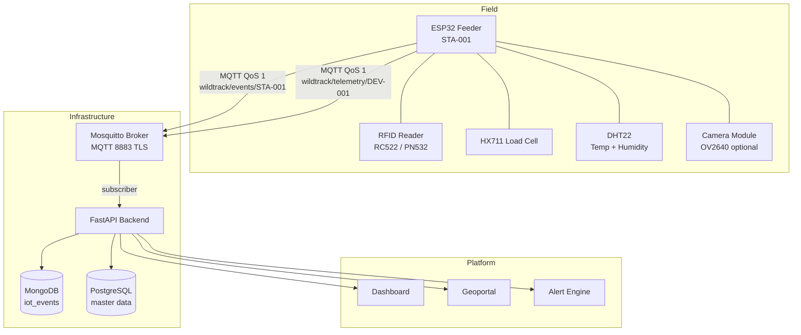

### 1.2 Design Principles

**The IoT device is dumb by design.** The ESP32 collects sensor data, packages it, and publishes it. All business logic (animal identification, alert evaluation, consumption analysis) runs in the backend. This minimizes firmware complexity and allows platform rules to evolve without firmware updates.

**The device must survive connectivity loss.** Field deployments often have intermittent WiFi. The ESP32 buffers events locally in flash memory and replays them when connectivity is restored.

**The device never writes to a database.** All data flows exclusively through MQTT to the backend. There is no direct database connection from any device.

**Events are immutable once published.** If a published event contains an error (e.g., a bad sensor reading), a new corrective event is published. Events are never edited in MongoDB.

**Every event carries a unique ID generated by the device.** This enables backend-side deduplication when offline events are replayed.

> **Scope note:** Firmware development is outside the scope of this software implementation phase. The hardware prototype (ESP32, MFRC522, HX711, DHT22) has been validated separately. This document defines the software-side ingestion contract — MQTT topics, payload schemas, and backend processing logic — that the firmware must satisfy. Firmware implementation is the developer's responsibility and is not tracked in this SDD.

### 1.3 MVP Scope vs. Future Scope

| Capability | MVP | Future |
|-----------|-----|--------|
| RFID animal identification | ✅ | — |
| Weight measurement (food consumption) | ✅ | — |
| Temperature and humidity | ✅ | — |
| MQTT over TLS | ✅ production / ⚠️ plain port 1883 for local dev | — |
| Local event buffering (flash) | ✅ | — |
| OTA firmware updates | ❌ post-MVP | Rolling / delta |
| Camera photo capture | ❌ post-MVP | ✅ |
| Video streaming | ❌ | Future |
| GPS location reporting | ❌ | Future |
| LoRa / cellular fallback | ❌ | Future |
| Battery power monitoring | 🔲 Schema reserved | ✅ |

---

## 2. Device Hardware Architecture

### 2.1 Component Overview

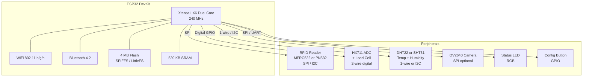

### 2.2 Hardware Interface Summary

| Peripheral | Interface | GPIO pins | Notes |
|-----------|-----------|-----------|-------|
| RFID Reader (MFRC522) | SPI | GPIO 5 (SS), 18 (SCK), 19 (MISO), 23 (MOSI) | Standard SPI bus |
| HX711 Load Cell ADC | Digital | GPIO 26 (DT), 27 (SCK) | 2-wire; clock controlled by ESP32 |
| DHT22 Temperature/Humidity | 1-Wire | GPIO 4 | Or SHT31 via I2C for better accuracy |
| OV2640 Camera (optional) | SPI / UART | GPIO 14 (CS), shared SPI | Requires firmware image with camera support |
| Status RGB LED | PWM GPIO | GPIO 21, 22, 25 | Visual feedback during provisioning and operation |
| Config Button | Digital input | GPIO 0 | Hold 5s to enter provisioning mode |

### 2.3 Firmware Architecture Layers

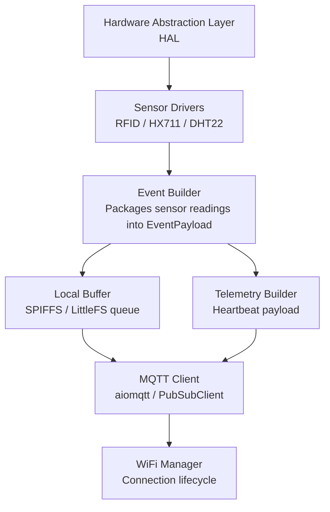

The firmware is organized in layers. The hardware abstraction layer isolates sensor-specific code. The event builder transforms raw readings into the documented JSON schema. The local buffer intercepts events when MQTT is unavailable. The MQTT client handles connection, reconnection, and QoS 1 acknowledgment.

### 2.4 Memory and Storage Budget

| Resource | Total | Used by firmware | Available for buffer |
|----------|-------|-----------------|---------------------|
| Flash (SPI) | 4 MB | ~1.5 MB | ~2 MB |
| SRAM | 520 KB | ~150 KB | ~370 KB runtime |
| SPIFFS / LittleFS | ~2 MB | Config files (~10 KB) | ~1.9 MB event buffer |

With an average event payload of ~500 bytes and a 1.9 MB buffer, the device can store approximately **3,800 events** offline before the buffer is full. At one event per 5 minutes, this covers approximately **13 days** of offline operation.

---

## 3. Device Provisioning Process

Provisioning is the one-time process of configuring a new ESP32 with WiFi credentials and MQTT credentials before field deployment.

### 3.1 Provisioning Flow

```mermaid
flowchart TD
    A[New ESP32\nfactory firmware] --> B{Config button\nheld 5 seconds?}
    B -->|yes| C[Enter Provisioning Mode\nStatus LED: blue blink]
    B -->|no| D[Normal boot\nread config from flash]
    C --> E[ESP32 starts\nWiFi Access Point\nSSID: WildTrack-Setup-{serial}]
    E --> F[Field operator connects\nlaptop or phone to AP]
    F --> G[Operator opens\n192.168.4.1 in browser\nCaptive portal]
    G --> H[Operator enters:\n- WiFi SSID\n- WiFi Password\n- MQTT Host\n- MQTT Port\n- MQTT Username\n- MQTT Password\n- Station ID]
    H --> I[ESP32 validates\nWiFi credentials\nby attempting connection]
    I --> J{WiFi connected?}
    J -->|no| K[Show error\nReturn to form]
    J -->|yes| L[Test MQTT connection\nwith provided credentials]
    L --> M{MQTT connected?}
    M -->|no| N[Show error\nReturn to form]
    M -->|yes| O[Save config to flash\nLittleFS /config.json]
    O --> P[Reboot into normal mode\nStatus LED: green solid]
```

### 3.2 Provisioning Configuration File

The configuration persisted to the device flash contains:

| Field | Type | Description |
|-------|------|-------------|
| `wifi_ssid` | string | WiFi network name |
| `wifi_password` | string | WiFi password (stored in flash; see §12 for security) |
| `mqtt_host` | string | MQTT broker hostname or IP |
| `mqtt_port` | integer | MQTT port (1883 dev / 8883 prod) |
| `mqtt_username` | string | Device-specific MQTT username (`device-{device_id}`) |
| `mqtt_password` | string | Device-specific MQTT password |
| `station_id` | string | UUID of the associated station (set by operator) |
| `device_id` | string | UUID assigned during backend registration |
| `tls_enabled` | boolean | Whether to use TLS for MQTT |
| `firmware_version` | string | Current firmware version string |

### 3.3 Provisioning Mode Indicators

The RGB status LED provides visual feedback during provisioning:

| LED state | Meaning |
|-----------|---------|
| Blue — fast blink | Access Point active, waiting for connection |
| Blue — slow blink | Operator connected, form active |
| Yellow — fast blink | Testing WiFi / MQTT credentials |
| Red — solid 3s | Credentials test failed |
| Green — solid | Provisioning complete, rebooting |

### 3.4 Re-provisioning

Holding the config button for 10 seconds at any time clears the stored configuration and re-enters provisioning mode. This is the field reset procedure when a device is moved to a different station.

---

## 4. Device Registration Workflow

Registration is the backend-side process of creating a `Device` record in PostgreSQL and linking it to a `Station`. It must be completed **before** the device is provisioned — the operator needs the `device_id` and MQTT credentials to enter during provisioning.

### 4.1 Pre-Deployment Registration Flow

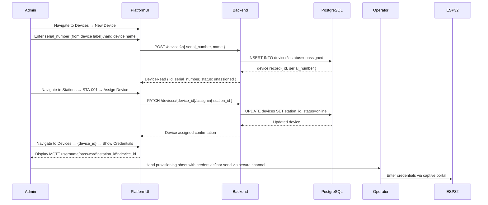

### 4.2 Provisioning Sheet

Before field deployment, a printed or digital provisioning sheet is prepared for each device:

```
WildTrack Device Provisioning Sheet
──────────────────────────────────
Serial Number: WT-ESP32-0042
Device ID:     019281aa-cd34-7e00-af5c-c3d4e5f6a7b8
Station:       STA-001 — North Ridge Feeder
Station ID:    019281ac-1234-7200-ad7e-e5f6a7b8c9d0

WiFi Network:  WildTrack-Field-A
WiFi Password: [REDACTED — see secure channel]

MQTT Host:     mqtt.wildtrack.example.com
MQTT Port:     8883
MQTT Username: device-019281aa-cd34
MQTT Password: [REDACTED — see secure channel]

TLS:           Enabled
Firmware:      1.0.0
──────────────────────────────────
Provisioned by: _______________
Date:           _______________
```

### 4.3 Post-Provisioning Verification

After the device is provisioned and rebooted, it immediately publishes a telemetry heartbeat on `wildtrack/telemetry/{device_id}`. The backend receives this, updates `devices.last_seen`, and sets `devices.status = online`. The platform UI shows the device as online within 60 seconds of first connection.

---

## 5. MQTT Topic Hierarchy

### 5.1 Topic Structure

```mermaid
flowchart TD
    ROOT[wildtrack/] --> EVT[events/]
    ROOT --> TEL[telemetry/]
    ROOT --> STA[status/]
    ROOT --> CMD[commands/]
    ROOT --> OTA[ota/]

    EVT --> EVT1[{station_id}\nFeeding session events]
    TEL --> TEL1[{device_id}\nHeartbeat telemetry]
    STA --> STA1[{device_id}\nLWT online/offline]
    CMD --> CMD1[{device_id}\nBackend commands to device]
    OTA --> OTA1[{device_id}\nFirmware update notifications]
```

### 5.2 Topic Reference

| Topic | Direction | QoS | Retained | Publisher | Subscriber |
|-------|-----------|-----|----------|-----------|-----------|
| `wildtrack/events/{station_id}` | Device → Broker → Backend | 1 | No | ESP32 | Backend |
| `wildtrack/telemetry/{device_id}` | Device → Broker → Backend | 1 | No | ESP32 | Backend |
| `wildtrack/status/{device_id}` | Device → Broker (LWT) | 1 | Yes | ESP32 (LWT) | Backend |
| `wildtrack/commands/{device_id}` | Backend → Broker → Device | 1 | No | Backend | ESP32 |
| `wildtrack/ota/{device_id}` | Backend → Broker → Device | 1 | No | Backend | ESP32 |

### 5.3 Topic Design Rules

**Rule 1 — Station ID in event topics:** Events use `station_id` (not `device_id`) as the topic segment. This allows the backend to identify the station without parsing the payload. If a device is moved to a new station, the topic changes accordingly.

**Rule 2 — Device ID in telemetry topics:** Telemetry uses `device_id` because heartbeats describe the physical device's health, independent of which station it is currently assigned to.

**Rule 3 — Retained flag on LWT:** The `wildtrack/status/{device_id}` topic carries `retain=true` for the LWT message. A backend that reconnects to the broker can immediately read the last known status of every device by subscribing to `wildtrack/status/#` with `retain`.

**Rule 4 — Wildcard subscriptions by backend:** The backend subscribes to `wildtrack/events/#`, `wildtrack/telemetry/#`, and `wildtrack/status/#` using wildcard patterns. This ensures new devices are automatically covered without restarting the backend.

### 5.4 Retained Messages and Last Will

Each device connects with a **Last Will and Testament** configured as follows:

| LWT field | Value |
|-----------|-------|
| Topic | `wildtrack/status/{device_id}` |
| Payload | `{"status": "offline", "device_id": "{device_id}"}` |
| QoS | 1 |
| Retain | `true` |

On a clean device connection, the device also publishes `{"status": "online", "device_id": "{device_id}"}` to the same topic with `retain=true` to overwrite the LWT.

---

## 6. Event Schema

### 6.1 Event Types

| Event Type | Trigger | Contains |
|-----------|---------|---------|
| `feeding_session` | Animal detected, feeding completes | RFID, weight before/after, temp, humidity |
| `presence_detected` | Presence sensor activated, no RFID read | Weight, temp, humidity — no animal ID |
| `rfid_read` | RFID scanned but no feeding activity detected | RFID tag, minimal sensor data |
| `sensor_reading` | Scheduled environmental reading | Temp, humidity only — no animal activity |

### 6.2 Feeding Session Event (Primary Event)

The most complete event type. Published when an animal completes a feeding interaction.

```json
{
  "event_id": "ESP32-WT0042-1718272800123-A1B2",
  "schema_version": "1.0",
  "event_type": "feeding_session",
  "station_id": "019281ac-1234-7200-ad7e-e5f6a7b8c9d0",
  "device_id": "019281aa-cd34-7e00-af5c-c3d4e5f6a7b8",
  "timestamp": "2026-06-13T09:45:00Z",
  "sensors": {
    "rfid": {
      "detected": true,
      "tag": "RFID-00A1B2C3",
      "read_quality": "good"
    },
    "weight": {
      "initial_grams": 500.0,
      "final_grams": 454.8,
      "consumed_grams": 45.2,
      "tare_grams": 120.0,
      "calibration_factor": 2280.0
    },
    "environment": {
      "temperature_celsius": 18.4,
      "humidity_percent": 72.1,
      "sensor_model": "DHT22"
    },
    "presence": {
      "detected": true,
      "duration_seconds": 34
    }
  },
  "location": {
    "latitude": 4.7125,
    "longitude": -74.0710,
    "source": "provisioned"
  },
  "device_health": {
    "wifi_rssi": -58,
    "uptime_seconds": 86400,
    "free_heap_bytes": 142336,
    "battery_percent": null,
    "firmware_version": "1.0.0",
    "status": "ok"
  },
  "media": {
    "captured": false,
    "url": null
  },
  "meta": {
    "buffered": false,
    "buffer_duration_seconds": null,
    "publish_attempt": 1
  }
}
```

### 6.3 Presence Detected Event (No RFID)

Published when a presence sensor fires but the RFID reader does not obtain a valid read (animal approached but was not tagged, or tag was not in range).

```json
{
  "event_id": "ESP32-WT0042-1718272900456-C3D4",
  "schema_version": "1.0",
  "event_type": "presence_detected",
  "station_id": "019281ac-1234-7200-ad7e-e5f6a7b8c9d0",
  "device_id": "019281aa-cd34-7e00-af5c-c3d4e5f6a7b8",
  "timestamp": "2026-06-13T09:46:40Z",
  "sensors": {
    "rfid": {
      "detected": false,
      "tag": null,
      "read_quality": null
    },
    "weight": {
      "initial_grams": 454.8,
      "final_grams": 441.2,
      "consumed_grams": 13.6,
      "tare_grams": 120.0,
      "calibration_factor": 2280.0
    },
    "environment": {
      "temperature_celsius": 18.5,
      "humidity_percent": 71.8,
      "sensor_model": "DHT22"
    },
    "presence": {
      "detected": true,
      "duration_seconds": 12
    }
  },
  "location": {
    "latitude": 4.7125,
    "longitude": -74.0710,
    "source": "provisioned"
  },
  "device_health": {
    "wifi_rssi": -60,
    "uptime_seconds": 86500,
    "free_heap_bytes": 140288,
    "battery_percent": null,
    "firmware_version": "1.0.0",
    "status": "ok"
  },
  "media": {
    "captured": false,
    "url": null
  },
  "meta": {
    "buffered": false,
    "buffer_duration_seconds": null,
    "publish_attempt": 1
  }
}
```

### 6.4 Sensor Reading Event (Scheduled)

Published on a fixed schedule (e.g., every 30 minutes) to record ambient conditions even when no animal activity occurs.

```json
{
  "event_id": "ESP32-WT0042-1718274000789-E5F6",
  "schema_version": "1.0",
  "event_type": "sensor_reading",
  "station_id": "019281ac-1234-7200-ad7e-e5f6a7b8c9d0",
  "device_id": "019281aa-cd34-7e00-af5c-c3d4e5f6a7b8",
  "timestamp": "2026-06-13T10:00:00Z",
  "sensors": {
    "rfid": null,
    "weight": {
      "current_grams": 441.2,
      "tare_grams": 120.0,
      "calibration_factor": 2280.0
    },
    "environment": {
      "temperature_celsius": 19.1,
      "humidity_percent": 70.3,
      "sensor_model": "DHT22"
    },
    "presence": null
  },
  "location": {
    "latitude": 4.7125,
    "longitude": -74.0710,
    "source": "provisioned"
  },
  "device_health": {
    "wifi_rssi": -57,
    "uptime_seconds": 87100,
    "free_heap_bytes": 143360,
    "battery_percent": null,
    "firmware_version": "1.0.0",
    "status": "ok"
  },
  "media": null,
  "meta": {
    "buffered": false,
    "buffer_duration_seconds": null,
    "publish_attempt": 1
  }
}
```

### 6.5 Field Definitions

| Field | Type | Required | Description |
|-------|------|----------|-------------|
| `event_id` | string | YES | Device-generated unique ID (see §15 for format) |
| `schema_version` | string | YES | Schema version for backward compatibility |
| `event_type` | string | YES | `feeding_session`, `presence_detected`, `rfid_read`, `sensor_reading` |
| `station_id` | string (UUID) | YES | Station UUID from provisioned config |
| `device_id` | string (UUID) | YES | Device UUID from provisioned config |
| `timestamp` | ISO 8601 UTC | YES | Device clock time of event — may differ from ingestion time |
| `sensors.rfid.detected` | boolean | YES | Whether RFID tag was read |
| `sensors.rfid.tag` | string | NO | RFID tag identifier; null if not detected |
| `sensors.rfid.read_quality` | string | NO | `good`, `partial`, `retry` |
| `sensors.weight.initial_grams` | float | NO | Weight before feeding (net of tare) |
| `sensors.weight.final_grams` | float | NO | Weight after feeding (net of tare) |
| `sensors.weight.consumed_grams` | float | NO | Calculated: initial − final |
| `sensors.weight.tare_grams` | float | YES | Tare weight of the food container |
| `sensors.weight.calibration_factor` | float | YES | HX711 calibration divisor |
| `sensors.environment.temperature_celsius` | float | YES | Ambient temperature |
| `sensors.environment.humidity_percent` | float | YES | Relative humidity |
| `sensors.environment.sensor_model` | string | YES | Sensor model identifier |
| `sensors.presence.detected` | boolean | NO | Whether PIR/IR presence sensor fired |
| `sensors.presence.duration_seconds` | integer | NO | Time animal was detected at feeder |
| `location.latitude` | float | YES | From provisioned config |
| `location.longitude` | float | YES | From provisioned config |
| `location.source` | string | YES | `provisioned` (MVP); `gps` (future) |
| `device_health.*` | object | YES | Health snapshot at time of event |
| `media.captured` | boolean | YES | Whether a photo was taken |
| `media.url` | string | NO | MinIO URL (populated after upload); null if no camera |
| `meta.buffered` | boolean | YES | `true` if this event was stored offline before publishing |
| `meta.buffer_duration_seconds` | integer | NO | Time the event spent in the buffer before publishing |
| `meta.publish_attempt` | integer | YES | Number of publish attempts (1 = first try) |

---

## 7. Telemetry Schema

### 7.1 Purpose

Telemetry heartbeats are periodic health signals separate from event data. They allow the backend to detect offline devices without waiting for a feeding event. Heartbeats are published every 60 seconds (configurable).

### 7.2 Telemetry Payload

```json
{
  "telemetry_id": "ESP32-WT0042-TEL-1718272860000",
  "schema_version": "1.0",
  "device_id": "019281aa-cd34-7e00-af5c-c3d4e5f6a7b8",
  "station_id": "019281ac-1234-7200-ad7e-e5f6a7b8c9d0",
  "timestamp": "2026-06-13T09:41:00Z",
  "connectivity": {
    "wifi_ssid": "WildTrack-Field-A",
    "wifi_rssi": -58,
    "wifi_channel": 6,
    "mqtt_connected": true,
    "ip_address": "192.168.1.42"
  },
  "runtime": {
    "uptime_seconds": 86400,
    "free_heap_bytes": 142336,
    "min_free_heap_bytes": 138240,
    "cpu_freq_mhz": 240,
    "flash_used_bytes": 1572864,
    "flash_total_bytes": 4194304,
    "buffer_event_count": 0
  },
  "power": {
    "battery_percent": null,
    "charging": null,
    "power_source": "wired"
  },
  "sensors": {
    "rfid_reader_ok": true,
    "weight_sensor_ok": true,
    "temp_humidity_ok": true,
    "camera_ok": null
  },
  "firmware": {
    "version": "1.0.0",
    "build_date": "2026-05-20",
    "ota_pending": false
  }
}
```

### 7.3 Telemetry Field Definitions

| Field | Type | Description |
|-------|------|-------------|
| `telemetry_id` | string | Device-generated unique ID for this heartbeat |
| `connectivity.wifi_rssi` | integer (dBm) | WiFi signal strength; < −80 dBm is poor |
| `connectivity.mqtt_connected` | boolean | Whether MQTT session is active at time of heartbeat |
| `runtime.uptime_seconds` | integer | Seconds since last reboot |
| `runtime.free_heap_bytes` | integer | Available SRAM heap |
| `runtime.min_free_heap_bytes` | integer | Minimum heap since boot (detects memory leaks) |
| `runtime.buffer_event_count` | integer | Events currently in local buffer waiting to be sent |
| `power.battery_percent` | integer | null for wired devices (reserved) |
| `power.power_source` | string | `wired` or `battery` |
| `sensors.rfid_reader_ok` | boolean | Self-test result at startup |
| `sensors.weight_sensor_ok` | boolean | HX711 responded within timeout |
| `sensors.temp_humidity_ok` | boolean | DHT22/SHT31 responded |
| `sensors.camera_ok` | boolean | null if no camera module |
| `firmware.ota_pending` | boolean | `true` if a firmware update has been downloaded and awaits reboot |

### 7.4 Sensor Self-Test

At boot and on each heartbeat, the firmware performs lightweight self-tests:

| Sensor | Test | Pass condition |
|--------|------|---------------|
| RFID reader | SPI communication check | Device responds to version read |
| HX711 | Read raw value within 1 second | Value is non-zero and within calibrated range |
| DHT22/SHT31 | Read temperature and humidity | Values within physical plausibility range (−40°C to +80°C, 0–100%) |
| Camera | SPI/UART ping | Device acknowledges (if module present) |

A sensor reporting `false` triggers a `sensor_failure` alert on the backend.

---

## 8. RFID Animal Identification Flow

### 8.1 On-Device Flow

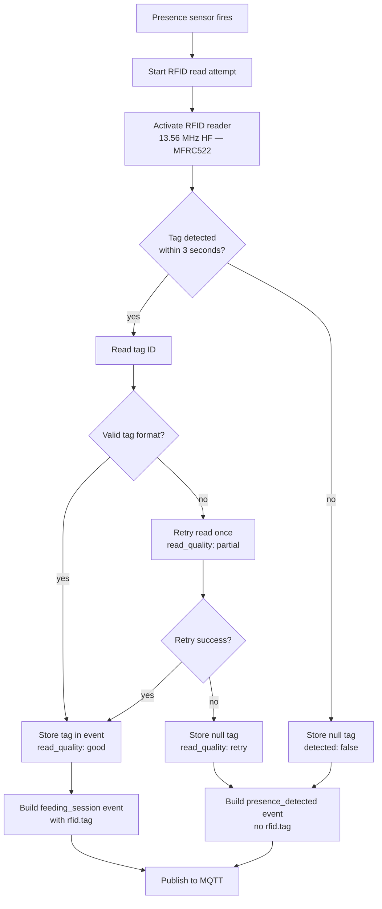

### 8.2 Backend Resolution Flow

The device only reports the RFID tag string. Animal identity resolution happens exclusively on the backend.

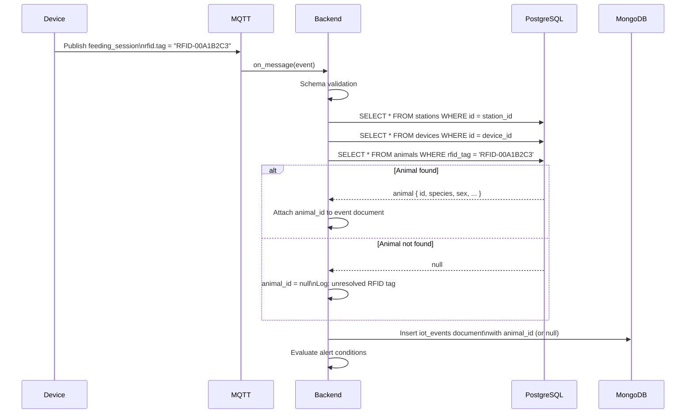

### 8.3 RFID Technology Notes

> **Validated prototype hardware.** The MFRC522 module operating at 13.56 MHz HF has been physically tested in the WildTrack hardware prototype. This section documents the validated configuration; firmware implementation must match these characteristics.

The MFRC522 is a 13.56 MHz HF RFID reader supporting ISO 14443 (Mifare, NTAG) and ISO 15693 tag families. It communicates with the ESP32 via SPI.

| Standard | Frequency | Chip | Range | Compatible tag types |
|----------|-----------|------|-------|---------------------|
| HF RFID | 13.56 MHz | MFRC522 | 3–10 cm | ISO 14443-A (Mifare Classic, NTAG), ISO 15693 (ear tags, collar tags) |

> **Important:** The MFRC522 operates at 13.56 MHz HF and **cannot** read 125 kHz LF animal microchips (ISO 11784/11785 FDX-B PIT tags implanted in wildlife). If the project requires reading implanted PIT microchips, a separate 125 kHz LF reader module (e.g., RDM6300 or ID-12LA) must be added to the hardware design. The current validated prototype uses the MFRC522 with HF RFID tags (ear tags, collar tags, or custom NFC tags attached to the animals or their environment).

**WildTrack MVP RFID approach:** Use the validated MFRC522 with 13.56 MHz HF tags (ISO 15693 or ISO 14443-A). Animals are identified by tags attached externally (ear tags, collar tags, or custom enclosures). This is the configuration confirmed by hardware testing.

### 8.4 Tag ID Format

RFID tags read by the ESP32 are formatted as a hex string: `RFID-{hex_digits}`. The prefix `RFID-` is added by the firmware to distinguish tag IDs from other identifier types. This format is stored directly in both the event payload and the `animals.rfid_tag` column.

---

## 9. Offline Synchronization Strategy

### 9.1 Connectivity States

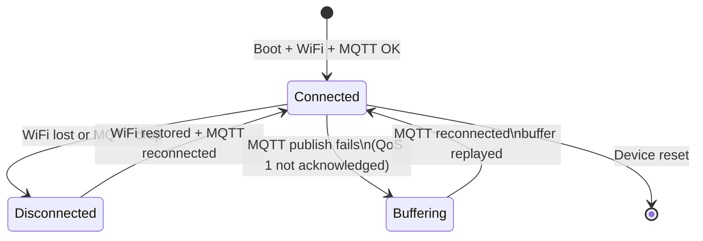

### 9.2 Buffer Write Strategy

When the MQTT client cannot publish (either because WiFi is unavailable or the broker is unreachable), events are written to the local flash buffer instead of being dropped.

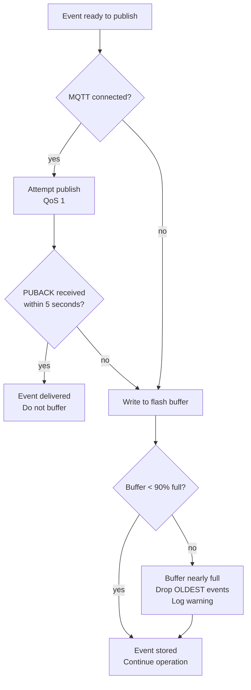

### 9.3 Buffer Replay Strategy

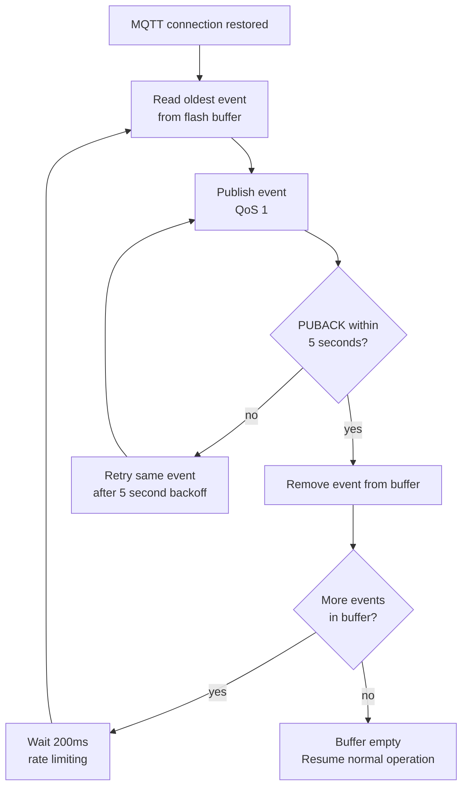

**Replay rate limit:** Buffered events are replayed at a maximum rate of 5 events per second (one every 200ms). This prevents flooding the MQTT broker and backend when connectivity is restored after a long offline period.

**Event ordering:** Events are replayed in strict FIFO order (oldest first) to preserve chronological integrity in MongoDB.

### 9.4 Buffer Overflow Policy

When the flash buffer approaches capacity (90% full), the oldest events are dropped to make room for new ones. The rationale: recent events (e.g., current feeding activity) are more operationally valuable than week-old buffered events. Dropped events are counted and reported in the next telemetry heartbeat (`runtime.buffer_overflow_count` — reserved field).

### 9.5 Device Clock Drift

The ESP32 does not have a real-time clock (RTC) with battery backup. On boot, the firmware synchronizes time via **NTP** as soon as WiFi is available. If NTP cannot be reached, the device falls back to a relative timestamp based on `millis()` since boot.

Events published while NTP is unavailable carry a `meta.clock_synced: false` flag. The backend stores these with their reported timestamp but logs the clock uncertainty. This is acceptable for the MVP — wildlife activity patterns at minute-level granularity are not impacted by a few minutes of clock drift.

**NTP server:** `pool.ntp.org` (no infrastructure dependency). The backup is the Mosquitto broker's `$SYS/broker/time` topic (broker time is available immediately after MQTT connection).

---

## 10. Device Heartbeat Strategy

### 10.1 Heartbeat Schedule

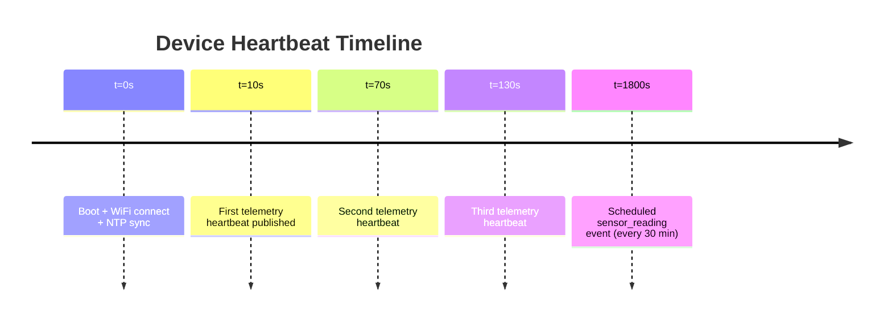

The heartbeat interval is **60 seconds** by default. This provides the backend with a 10-minute offline detection window (threshold = 10 minutes = 10 missed heartbeats). The interval is configurable via a command message (see §5.2, `wildtrack/commands/{device_id}`).

### 10.2 Heartbeat Topics and QoS

Heartbeats are published on `wildtrack/telemetry/{device_id}` at **QoS 1**. QoS 1 ensures that if the broker is temporarily unreachable, the heartbeat is buffered by the MQTT client and delivered when the connection is restored.

Note: If the device is offline, heartbeats are **not buffered to flash** (unlike feeding events). Missed heartbeats are expected when a device is offline. Only feeding events are buffered.

### 10.3 Backend Processing of Heartbeats

On receiving a heartbeat, the backend:

1. Validates the schema
2. Updates `devices.last_seen = timestamp` and `devices.firmware_version = firmware.version` in PostgreSQL
3. Inserts the heartbeat document into `device_telemetry` MongoDB collection
4. Checks `sensors.*_ok` fields — creates a `sensor_failure` alert if any sensor reports `false`
5. Checks `runtime.buffer_event_count` — if > 100, logs a warning (device has many buffered events, suggesting extended offline period)

### 10.4 Offline Detection

The **Device Health Monitor** background task (described in SDD-05 §8.3) runs every 5 minutes and queries:

```
SELECT id, station_id, last_seen
FROM devices
WHERE status != 'unassigned'
  AND deleted_at IS NULL
  AND last_seen < NOW() - INTERVAL '{DEVICE_OFFLINE_THRESHOLD_MINUTES} minutes'
```

Devices exceeding the threshold transition to `status = offline`. Their associated stations transition to `status = offline`. A `device_offline` alert is created.

**Default threshold: 10 minutes.** With a 60-second heartbeat interval, 10 minutes represents 10 consecutive missed heartbeats — a reliable indicator of connectivity loss rather than a transient network glitch.

---

## 11. Firmware Update Strategy (Post-MVP Reference)

> **This entire section is post-MVP.** OTA firmware update management is not required for the WildTrack MVP. It is documented here as a reference for future implementation. During MVP development, firmware updates are applied manually by reflashing the device via USB.

### 11.1 OTA Update Flow

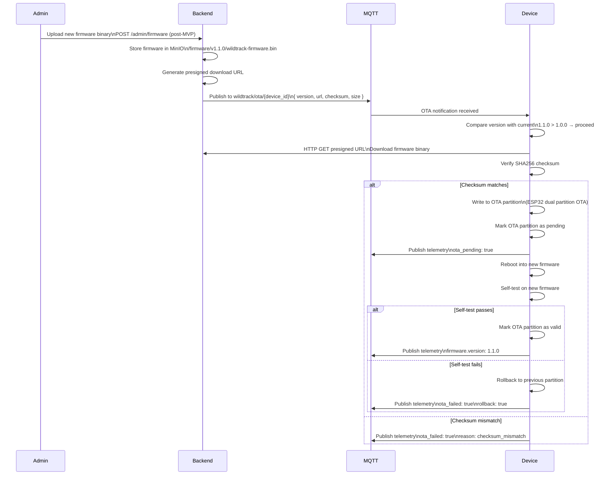

### 11.2 OTA Command Payload

Published to `wildtrack/ota/{device_id}`:

```json
{
  "command": "update_firmware",
  "version": "1.1.0",
  "url": "https://minio.wildtrack.example.com/firmware/v1.1.0/wildtrack-firmware.bin?X-Amz-Signature=...",
  "checksum_sha256": "a1b2c3d4e5f6...",
  "size_bytes": 1048576,
  "issued_at": "2026-06-13T12:00:00Z",
  "expires_at": "2026-06-13T14:00:00Z"
}
```

The presigned URL expires after 2 hours. If the device does not complete the download before expiry, it must wait for a new OTA command.

### 11.3 ESP32 Partition Strategy

The ESP32 firmware uses the standard dual-partition OTA layout:

```
Flash partition table:
├── nvs          (0x9000,  24KB)  — Non-volatile storage for config
├── otadata      (0xE000,   8KB)  — Tracks active OTA partition
├── ota_0        (0x10000, 1.5MB) — Primary firmware slot
├── ota_1        (0x1A0000, 1.5MB) — Secondary firmware slot
└── spiffs       (0x340000, 900KB) — Event buffer + config files
```

The ESP32 IDF OTA library manages partition switching. If the new firmware fails to boot (watchdog timeout or explicit `esp_ota_mark_app_invalid_rollback_and_reboot()`), the bootloader automatically rolls back to the previous partition.

### 11.4 Staged Rollout (Post-MVP)

The MVP supports only per-device OTA commands (send to a specific `device_id`). Post-MVP, the admin can issue a group OTA command targeting all devices with firmware version `< 1.1.0`. The backend tracks update progress per device via `devices.firmware_version` in PostgreSQL.

---

## 12. Device Security Model

### 12.1 Threat Model

| Threat | Mitigation |
|--------|-----------|
| Eavesdropping on MQTT traffic | TLS 1.2+ on port 8883; all messages encrypted in transit |
| Device impersonation | Unique per-device username/password; ACL restricts each device to its own topics |
| Broker flooding | Mosquitto `max_inflight_messages` and `max_queued_messages` limits |
| Physical device compromise | Config in flash (not plaintext accessible without flash dump); no hardcoded master credentials |
| Replay attack | `event_id` deduplication on backend; `timestamp` validation (reject events > 24h old) |
| OTA firmware tampering | SHA256 checksum verified before flash write; presigned URL expires in 2 hours |
| WiFi password exposure | Stored in LittleFS; encrypted at rest using ESP32 NVS encryption (post-MVP) |

### 12.2 TLS Configuration

In production, all device MQTT connections use **TLS 1.2 minimum** on port 8883. The device must be provisioned with:

- The **CA certificate** to validate the broker's server certificate
- The **broker hostname** (must match the certificate CN/SAN)

The CA certificate is baked into the firmware image. When the CA certificate changes (e.g., Let's Encrypt root rotation), a firmware update carries the new certificate.

**Certificate pinning (optional):** For higher security, the firmware can pin the expected certificate fingerprint and reject connections if the fingerprint does not match. This adds protection against rogue CA attacks but requires a firmware update whenever the certificate is renewed.

### 12.3 Credentials Storage

| Secret | Storage location | Protection |
|--------|-----------------|-----------|
| WiFi password | LittleFS `/config.json` | Flash encryption (post-MVP, ESP32 NVS encryption) |
| MQTT password | LittleFS `/config.json` | Flash encryption (post-MVP) |
| CA certificate | Compiled into firmware | Read-only; updated via OTA |
| Device UUID | LittleFS `/config.json` | Not secret but unique |

MVP: Credentials are stored in LittleFS without hardware encryption. Physical access to the device with a flash reader could expose credentials. This is accepted for the MVP given the field deployment context (remote locations, low physical-access risk).

Post-MVP: ESP32 flash encryption and secure boot should be enabled to protect credentials from physical extraction.

### 12.4 Network Isolation

Devices in the field connect only to:
- The configured WiFi network (SSID from provisioning)
- The MQTT broker on port 8883
- NTP servers (`pool.ntp.org`)
- The MinIO presigned URL domain (for OTA and future media upload)

Devices never initiate connections to PostgreSQL, MongoDB, or the FastAPI REST API.

---

## 13. Device Authentication

### 13.1 Authentication Model

Each device authenticates to the Mosquitto broker with a **unique username and password pair**. No shared credentials exist.

| Credential | Value | Created by |
|------------|-------|-----------|
| Username | `device-{device_id_short}` | Admin during device registration |
| Password | Random 32-character alphanumeric string | Admin during device registration |

`device_id_short` is the first 8 characters of the device UUID: `device-019281aa`.

### 13.2 MQTT ACL Rules

Each device's ACL entry is configured in Mosquitto's ACL file:

```
user device-019281aa
topic write wildtrack/events/019281ac-1234-7200-ad7e-e5f6a7b8c9d0
topic write wildtrack/telemetry/019281aa-cd34-7e00-af5c-c3d4e5f6a7b8
topic write wildtrack/status/019281aa-cd34-7e00-af5c-c3d4e5f6a7b8
topic read  wildtrack/commands/019281aa-cd34-7e00-af5c-c3d4e5f6a7b8
topic read  wildtrack/ota/019281aa-cd34-7e00-af5c-c3d4e5f6a7b8
```

**The device cannot:**
- Publish to any topic not in its ACL
- Subscribe to event topics of other devices
- Subscribe to other devices' telemetry or command topics
- Access the `$SYS` topic namespace

### 13.3 Backend MQTT Authentication

The backend authenticates to Mosquitto as a privileged subscriber:

```
user backend
topic read wildtrack/events/#
topic read wildtrack/telemetry/#
topic read wildtrack/status/#
topic write wildtrack/commands/#
topic write wildtrack/ota/#
```

### 13.4 Credential Rotation

Device credentials can be rotated by:
1. Admin generates new password in the platform (post-MVP endpoint)
2. New password written to Mosquitto passwd file (`mosquitto_passwd -b passwd {username} {new_password}`)
3. `SIGHUP` sent to Mosquitto to reload the passwd file without restart
4. Backend sends credential update command to device via `wildtrack/commands/{device_id}` (post-MVP)
5. Device updates stored password and reconnects

In the MVP, credential rotation requires re-provisioning the device manually. This is acceptable given the expected low frequency of credential changes.

---

## 14. Local Buffering Strategy

### 14.1 Buffer Architecture

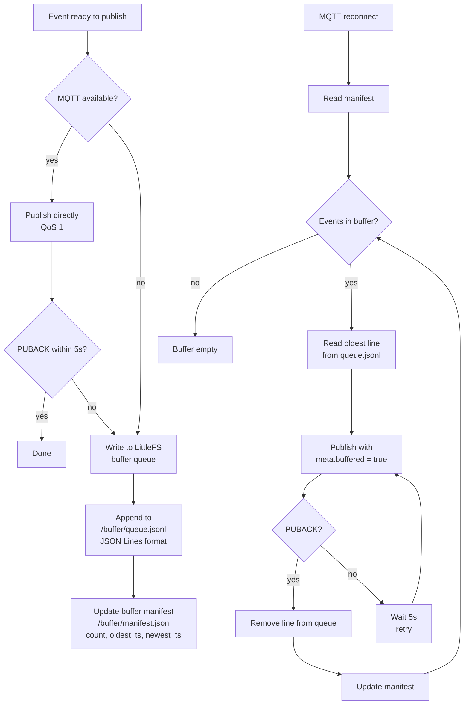

### 14.2 Buffer File Format

Events are stored in **JSON Lines** format (one JSON object per line) in `/buffer/queue.jsonl`. This format:
- Allows appending without reading the whole file
- Allows reading the oldest line with a seek to the file start
- Survives partial writes (incomplete last line can be detected and discarded)
- Is human-readable for debugging via serial monitor

The `/buffer/manifest.json` tracks:

```json
{
  "count": 42,
  "oldest_timestamp": "2026-06-13T07:00:00Z",
  "newest_timestamp": "2026-06-13T09:45:00Z",
  "total_size_bytes": 21504,
  "overflow_count": 0
}
```

### 14.3 Buffer Size Management

| Threshold | Action |
|-----------|--------|
| Buffer < 70% full | Normal operation |
| Buffer 70–90% full | Log warning; report in telemetry heartbeat |
| Buffer > 90% full | Begin dropping oldest events (FIFO eviction) |
| Buffer 100% full | All new events dropped until buffer drains |

The 90% threshold at ~1.9 MB gives approximately 3,800 events of headroom. The eviction policy prioritizes event freshness over completeness.

### 14.4 Buffer Integrity on Unexpected Reboot

When the ESP32 reboots (power loss, watchdog reset, OTA reboot), the buffer file in LittleFS is preserved. On next boot:

1. The firmware mounts LittleFS
2. Reads `/buffer/manifest.json` — if `count > 0`, buffer replay begins after MQTT connection is established
3. Validates the last line of `queue.jsonl` — if it is malformed (partial write at reboot), it is discarded

LittleFS is designed for power-loss resilience and does not corrupt existing valid lines during an unexpected reboot.

---

## 15. Event Deduplication Strategy

### 15.1 Event ID Format

Event IDs are generated on the device using a composite format designed to be unique without requiring a UUID library:

```
{device_prefix}-{millis_since_epoch}-{4_char_random_hex}

Example: ESP32-WT0042-1718272800123-A1B2
```

| Segment | Value | Purpose |
|---------|-------|---------|
| `ESP32-WT0042` | Device serial number prefix (first 7 chars) | Namespace per device |
| `1718272800123` | Unix timestamp in milliseconds | Temporal uniqueness |
| `A1B2` | 4-character random hex | Collision avoidance within same millisecond |

For telemetry heartbeats, the prefix `TEL-` is used: `ESP32-WT0042-TEL-1718272860000`.

### 15.2 Backend Deduplication

MongoDB enforces uniqueness via a **unique index on `iot_events.event_id`**. When the backend attempts to insert a duplicate event (e.g., during buffer replay after a connectivity blip that caused a partial PUBACK):

1. `Motor.insert_one()` raises `DuplicateKeyError`
2. The backend catches this exception and logs: `"Duplicate event_id, skipping: {event_id}"`
3. The MQTT PUBACK is still sent — the device considers the event delivered
4. No error alert is generated — duplicates are expected and handled gracefully

### 15.3 Timestamp Validation

The backend validates event timestamps on ingestion:

| Condition | Action |
|-----------|--------|
| `timestamp` is in the future by > 5 minutes | Reject to dead-letter: `future_timestamp` |
| `timestamp` is older than 30 days | Reject to dead-letter: `stale_event` (configurable) |
| `timestamp` is older than 24 hours | Accept but log warning and set `meta.late_ingestion: true` |
| `meta.clock_synced: false` | Accept with flag; analytics exclude these from time-sensitive aggregations |

The 30-day stale event threshold prevents replay attacks where an attacker captures and re-publishes old MQTT packets. This threshold is configurable via `EVENT_MAX_AGE_DAYS`.

---

## 16. MongoDB Ingestion Strategy

### 16.1 Ingestion Pipeline

```mermaid
flowchart TD
    A[MQTT Message\nwildtrack/events/{station_id}] --> B[MQTT Dispatcher]
    B --> C[Event Handler]
    C --> D{JSON parseable?}
    D -->|no| E[Dead letter\nfailure_reason: json_parse_error]
    D -->|yes| F{Schema valid?\nPydantic model}
    F -->|no| G[Dead letter\nfailure_reason: schema_invalid]
    F -->|yes| H{station_id in\nPostgreSQL?}
    H -->|no| I[Dead letter\nfailure_reason: unknown_station]
    H -->|yes| J{device_id in\nPostgreSQL?}
    J -->|no| K[Dead letter\nfailure_reason: unknown_device]
    J -->|yes| L[RFID tag → animal_id resolution\nPostgreSQL lookup]
    L --> M[Build MongoDB document]
    M --> N[Insert into iot_events\nwith duplicate check]
    N --> O{DuplicateKeyError?}
    O -->|yes| P[Log duplicate\nACK to MQTT]
    O -->|no| Q[Alert evaluation]
    Q --> R[Update device.last_seen\nPostgreSQL]
    R --> S[MQTT PUBACK]
```

### 16.2 MongoDB Document Structure

The document stored in `iot_events` is an enriched version of the device payload:

```json
{
  "_id": "ObjectId(auto)",
  "event_id": "ESP32-WT0042-1718272800123-A1B2",
  "schema_version": "1.0",
  "event_type": "feeding_session",
  "station_id": "019281ac-1234-7200-ad7e-e5f6a7b8c9d0",
  "device_id": "019281aa-cd34-7e00-af5c-c3d4e5f6a7b8",
  "animal_id": "019281b0-def0-7600-e1b2-c9d0e1f2a3b4",
  "rfid_tag": "RFID-00A1B2C3",
  "timestamp": "2026-06-13T09:45:00Z",
  "ingested_at": "2026-06-13T09:45:02Z",
  "temperature": 18.4,
  "humidity": 72.1,
  "initial_weight": 500.0,
  "final_weight": 454.8,
  "consumed_grams": 45.2,
  "presence_duration_seconds": 34,
  "latitude": 4.7125,
  "longitude": -74.0710,
  "media_url": null,
  "device_status": "ok",
  "buffered": false,
  "buffer_duration_seconds": null,
  "clock_synced": true,
  "raw_payload": { ... }
}
```

**Flattening strategy:** The nested `sensors.*` structure from the device payload is flattened into top-level fields for MongoDB. The original `raw_payload` is preserved verbatim for debugging and audit.

### 16.3 Ingestion Latency

Expected end-to-end latency from sensor reading to MongoDB storage:

| Step | Duration |
|------|---------|
| Sensor reading (DHT22 + HX711) | ~500ms |
| Event build and serialize | ~10ms |
| MQTT publish (QoS 1 roundtrip, good WiFi) | ~50–200ms |
| Backend ingestion (PostgreSQL lookup + Mongo insert) | ~20–50ms |
| **Total** | **~600ms – 800ms** |

### 16.4 High-Volume Handling

At the MVP scale (< 50 devices × 20 events/day = 1,000 events/day), MongoDB can handle ingestion with no performance concerns. At scale (1,000 devices × 50 events/day = 50,000 events/day ≈ 35 events/minute), the ingestion pipeline remains well within MongoDB's capabilities on the recommended hardware.

---

## 17. Geoportal Integration

### 17.1 Data Flow to Geoportal

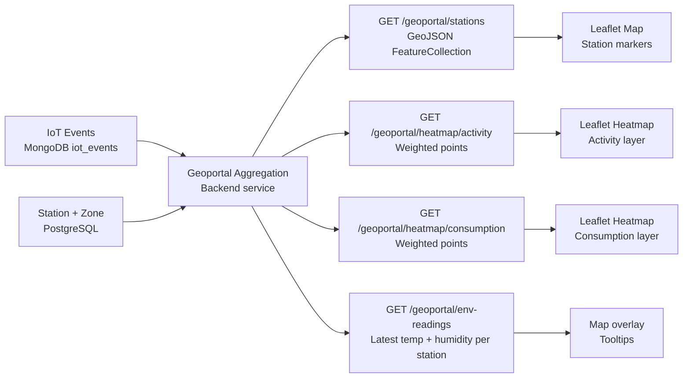

### 17.2 Location Data Source

In the MVP, device location comes from the **provisioned configuration** (latitude/longitude entered via the captive portal or stored during station registration). The event payload carries `location.source: "provisioned"`.

Future: If a GPS module is added to the ESP32, the device reports real-time GPS coordinates. The backend detects `location.source: "gps"` and uses the event coordinates instead of the station's registered coordinates. This enables detection of feeder movement (tampering or repositioning).

### 17.3 Event Coordinates vs. Station Coordinates

For the geoportal heatmap, event coordinates (`latitude`, `longitude` in the `iot_events` document) are used rather than the station's registered PostgreSQL coordinates. This:

- Allows future GPS refinement per-event without updating the station record
- Preserves historical accuracy if a station is physically relocated

In the MVP (all events carry `location.source: "provisioned"`), both values are identical.

### 17.4 Environmental Reading Layer

The geoportal's temperature/humidity overlay uses `GET /geoportal/env-readings`, which queries MongoDB for the **most recent `sensor_reading` or `feeding_session` event per station** and returns the `temperature` and `humidity` values. This data is at most 30 minutes stale (the scheduled sensor reading interval).

---

## 18. Alert Generation Strategy

### 18.1 Alert Trigger Conditions

Alerts are evaluated by the backend after every event ingestion and on every heartbeat processing. They are written to the `alerts` MongoDB collection.

| Alert Type | Trigger Condition | Source |
|-----------|------------------|--------|
| `sensor_failure` | `device_health.status == "error"` OR any `sensors.*_ok == false` in telemetry | Event or Heartbeat |
| `empty_tank` | `sensors.weight.final_grams < EMPTY_TANK_THRESHOLD_GRAMS` (configurable, default 50g net) | Event |
| `rfid_read_failure` | `sensors.rfid.detected == true` AND `sensors.rfid.tag == null` AND `read_quality == "retry"` | Event |
| `camera_failure` | `media.captured == false` AND station config indicates camera is expected | Event |
| `device_offline` | `devices.last_seen < NOW() - threshold` (background task) | Background task |
| `inactive_station` | No events for station in > 24 hours AND device is `online` (background task) | Background task |
| `abnormal_consumption` | `consumed_grams > ABNORMAL_CONSUMPTION_THRESHOLD_GRAMS` (e.g., > 500g in one session) | Event |

### 18.2 Alert Deduplication

Duplicate alerts for the same condition on the same station are suppressed:

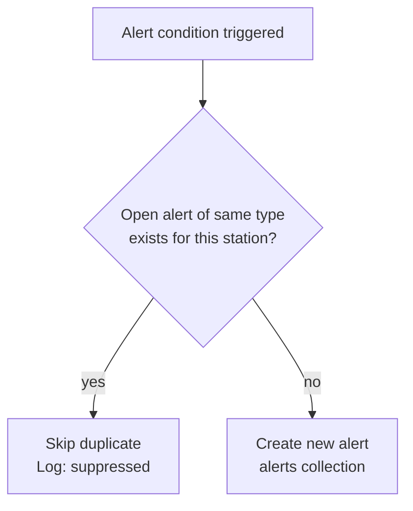

An open alert is defined as `status == "open"` and `resolved_at == null`. Once an alert is resolved, the same condition can trigger a new alert.

### 18.3 Alert Resolution

Alerts are resolved in two ways:

**Manual resolution:** A user calls `PATCH /alerts/{alert_id}/resolve` from the platform UI. This sets `status = resolved` and `resolved_at = now()`.

**Automatic resolution:** The backend auto-resolves specific alert types when the condition clears:

| Alert Type | Auto-resolve trigger |
|-----------|---------------------|
| `device_offline` | Device publishes a heartbeat (comes back online) |
| `sensor_failure` | Subsequent heartbeat reports all sensors OK |
| `inactive_station` | A new event is received from the station |

### 18.4 Alert Notification (Post-MVP)

In the MVP, alerts are visible only in the platform UI and as count badges in the dashboard. Post-MVP notifications:

- Email alerts via SMTP for `device_offline` and `empty_tank`
- In-browser push notifications using Web Push API
- Optional webhook to external systems (Slack, PagerDuty)

---

## 19. Future Camera Integration

### 19.1 Camera Hardware Options

| Camera Module | Interface | Resolution | Notes |
|--------------|-----------|-----------|-------|
| OV2640 | SPI / DVP | 2 MP | Common, cheap, supported by ESP32-CAM variant |
| OV5640 | MIPI / DVP | 5 MP | Better quality; requires ESP32-S3 |
| ESP32-CAM board | Integrated | 2 MP (OV2640) | All-in-one module; adds significant power consumption |

**Recommended:** ESP32-CAM (OV2640 integrated board) for prototyping. For production, a dedicated ESP32-S3 DevKit with OV5640 for better image quality.

### 19.2 Photo Capture Flow

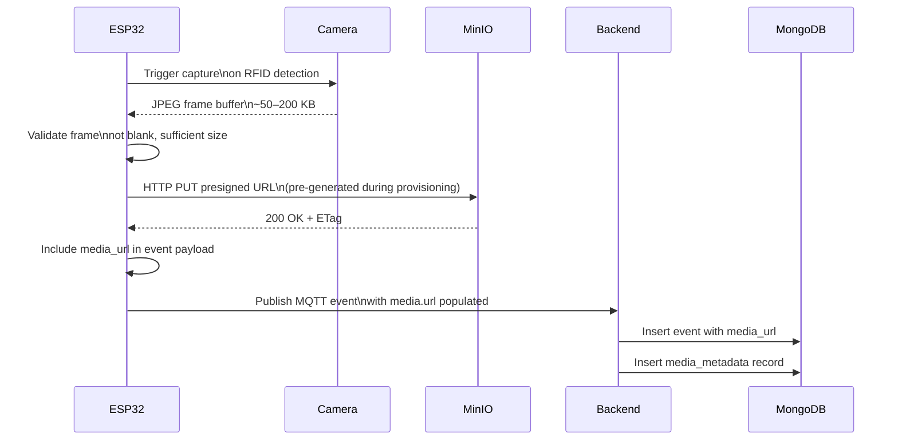

### 19.3 Camera-Specific Event Fields

When a camera is present and captures a photo, the `media` object in the event payload is populated:

```json
{
  "media": {
    "captured": true,
    "url": "http://minio:9000/wildtrack-media/019281ac.../2026/06/capture.jpg",
    "type": "photo",
    "size_bytes": 98304,
    "captured_at": "2026-06-13T09:45:01Z"
  }
}
```

### 19.4 Presigned Upload URL Strategy

For the camera upload, the ESP32 cannot generate its own presigned MinIO URLs (it doesn't have MinIO credentials). Two options exist:

**Option A — Pre-generated per session (MVP approach):** During each MQTT connection establishment, the backend pushes a batch of 10 presigned upload URLs to the device via `wildtrack/commands/{device_id}`. The device consumes one URL per photo. When running low (< 3 URLs remaining), it requests more.

**Option B — Backend media proxy (simpler):** The device sends the photo as binary data inside the MQTT message (limited to MQTT broker message size, typically 256 MB but recommended < 100 KB). The backend extracts the binary and uploads to MinIO. This approach is simpler but blocks the MQTT ingestion pipeline for large payloads.

**Recommendation for MVP:** Option B for simplicity (photos only, JPEG compressed to < 100 KB). Option A for production at scale (avoids MQTT pipeline blocking).

### 19.5 Power Budget for Camera

Adding a camera significantly increases ESP32 power consumption:

| Mode | Current draw |
|------|------------|
| ESP32 WiFi active (no camera) | ~80 mA |
| ESP32 WiFi + OV2640 active | ~250 mA |
| ESP32 deep sleep | ~10 µA |

For battery-powered deployments, the camera should be powered only during the capture window (2–3 seconds per event) using a MOSFET-controlled power rail controlled by an ESP32 GPIO pin. This is a hardware design consideration noted here for the firmware team.

---

## 20. Software-Only Ingestion Contract

> This section defines the contract between the firmware and the backend. It lists the MQTT topics, payload schemas, required fields, and expected backend behavior that firmware must satisfy. Firmware developers must implement this contract. Backend developers must implement the corresponding ingestion handlers.

### 20.1 Required MQTT Topics

| Topic | Direction | Description |
|-------|-----------|-------------|
| `wildtrack/events/{station_id}` | Device → Backend | Feeding session events (primary data) |
| `wildtrack/telemetry/{device_id}` | Device → Backend | Periodic health telemetry |
| `wildtrack/status/{device_id}` | Device → Backend | LWT online/offline messages |
| `wildtrack/commands/{device_id}` | Backend → Device | Backend commands (post-MVP: camera URLs, config) |

All device-published messages must use **QoS 1** (at-least-once delivery). The backend must deduplicate by `event_id`.

### 20.2 MQTT Connection Parameters

| Parameter | Local dev | Production |
|-----------|-----------|-----------|
| Broker host | `mosquitto` (Docker service name) or `localhost` | VPS hostname / domain |
| Port | `1883` (plain, no TLS) | `8883` (TLS) |
| Authentication | username + password | username + password + CA cert |
| Client ID | `wildtrack-{device_id}` | `wildtrack-{device_id}` |
| Keep-alive | 60 seconds | 60 seconds |
| Clean session | `false` | `false` |

> **Local dev:** Use plain MQTT on port 1883 (no TLS certificate setup required). TLS is a production requirement only.

### 20.3 Feeding Session Event — Required Fields

Published to `wildtrack/events/{station_id}`.

```json
{
  "event_id": "ESP32-WT0042-1718272800123-A1B2",
  "event_type": "feeding_session",
  "station_id": "019281ac-3d47-7e2a-b1c4-d5e6f7a8b9c0",
  "device_id": "019281ac-3d47-7e2a-b1c4-aabbccddeeff",
  "timestamp": "2026-06-13T09:45:00Z",
  "rfid": {
    "detected": true,
    "tag": "RFID-00A1B2C3",
    "read_quality": "good"
  },
  "sensors": {
    "temperature_c": 22.5,
    "humidity_pct": 68.0
  },
  "weight": {
    "initial_grams": 450,
    "final_grams": 380,
    "consumed_grams": 70
  },
  "device_status": {
    "wifi_rssi_dbm": -65,
    "battery_pct": null,
    "firmware_version": "1.0.0"
  },
  "media": {
    "captured": false,
    "url": null
  }
}
```

**Required fields (backend will reject if missing):** `event_id`, `event_type`, `station_id`, `device_id`, `timestamp`.

**Optional fields (nullable):** `rfid.tag` (null if no tag detected), `weight.*` (null if sensor failed), `sensors.*` (null if sensor failed), `media.url` (null if no camera).

### 20.4 Presence Detected Event — Required Fields

Published to `wildtrack/events/{station_id}` when presence is detected but no RFID tag is read.

```json
{
  "event_id": "ESP32-WT0042-1718272800456-C3D4",
  "event_type": "presence_detected",
  "station_id": "019281ac-3d47-7e2a-b1c4-d5e6f7a8b9c0",
  "device_id": "019281ac-3d47-7e2a-b1c4-aabbccddeeff",
  "timestamp": "2026-06-13T09:47:00Z",
  "rfid": {
    "detected": false,
    "tag": null,
    "read_quality": null
  },
  "sensors": {
    "temperature_c": 22.6,
    "humidity_pct": 68.2
  },
  "weight": {
    "initial_grams": 380,
    "final_grams": 340,
    "consumed_grams": 40
  },
  "device_status": {
    "wifi_rssi_dbm": -66,
    "battery_pct": null,
    "firmware_version": "1.0.0"
  },
  "media": {
    "captured": false,
    "url": null
  }
}
```

### 20.5 Telemetry Heartbeat — Required Fields

Published to `wildtrack/telemetry/{device_id}` every 5 minutes.

```json
{
  "device_id": "019281ac-3d47-7e2a-b1c4-aabbccddeeff",
  "station_id": "019281ac-3d47-7e2a-b1c4-d5e6f7a8b9c0",
  "timestamp": "2026-06-13T09:50:00Z",
  "uptime_seconds": 3600,
  "wifi_rssi_dbm": -65,
  "heap_free_bytes": 180000,
  "buffer_events_queued": 0,
  "sensors": {
    "rfid_ok": true,
    "weight_ok": true,
    "temp_humidity_ok": true,
    "camera_ok": null
  },
  "firmware": {
    "version": "1.0.0",
    "ota_pending": false
  }
}
```

### 20.6 LWT (Last Will and Testament) Status Messages

The device sets its LWT at connection time. When the device disconnects ungracefully, the broker publishes the offline payload automatically.

Published to `wildtrack/status/{device_id}`:

**Online** (published on connect):
```json
{ "device_id": "...", "status": "online", "timestamp": "..." }
```

**Offline** (published by broker on ungraceful disconnect):
```json
{ "device_id": "...", "status": "offline", "timestamp": "..." }
```

### 20.7 Expected Backend Behavior

| Event received | Backend action |
|---------------|----------------|
| `feeding_session` or `presence_detected` | Validate schema → verify `station_id` exists → verify `device_id` exists → resolve `rfid.tag` to `animal_id` (or null) → insert into `iot_events` MongoDB collection → evaluate alert conditions |
| Duplicate `event_id` | Detect by querying `iot_events` for existing `event_id` → skip insert → return QoS 1 ACK (idempotent) |
| Unknown `station_id` | Insert into `dead_letter_events` with reason `unknown_station` → log warning |
| Schema validation failure | Insert into `dead_letter_events` with reason `schema_error` → log error |
| `telemetry` heartbeat | Upsert device health into `device_telemetry` MongoDB collection → update `devices.last_seen_at` in PostgreSQL |
| `status: offline` | Update `devices.status = 'offline'` in PostgreSQL → generate alert if station was `active` |
| `status: online` | Update `devices.status = 'online'` in PostgreSQL → resolve offline alert if open |

---

## 21. Device ADRs

### ADR-021 — RFID Hardware: MFRC522 13.56 MHz HF (Validated Prototype)

**Question:** Which RFID standard and reader module should WildTrack feeders use for animal identification?

**Decision:** 13.56 MHz HF RFID using the MFRC522 reader module (SPI interface). This is the hardware used in the validated WildTrack prototype.

**Rationale:** The MFRC522 has been physically tested with the ESP32 prototype. It operates at 13.56 MHz HF and supports ISO 14443-A (Mifare Classic, NTAG) and ISO 15693 (HF ear tags, collar tags) tag families. The hardware is working, low cost (~$1–2 per module), and widely available. Read range is 3–10 cm, which is sufficient for animals accessing the feeder food trough.

**Important constraint:** The MFRC522 operates exclusively at 13.56 MHz HF and **cannot** read 125 kHz LF animal microchips (ISO 11784/11785 FDX-B PIT tags). If future project requirements include reading implanted PIT microchips, a separate 125 kHz LF reader module must be evaluated and added to the hardware design. That decision is deferred to post-MVP.

**Animal identification approach for MVP:** Animals are identified via external HF RFID tags (13.56 MHz), such as ISO 15693 ear tags or collar-mounted NFC tags. The platform stores the `rfid_tag` hex string and associates it with an `animals` record. The RFID standard used does not affect backend software design.

**Consequence:** RFID tag format is a hex string (e.g., `RFID-00A1B2C3`). All animal records in PostgreSQL use this format in the `rfid_tag` column regardless of which physical tag type was read.

**Why an ADR:** RFID hardware selection determines tag procurement, antenna geometry, and read range. Using validated prototype hardware avoids rework and de-risks the MVP.

---

### ADR-022 — Event ID Generation: Device-Generated vs. Server-Assigned

**Question:** Should the `event_id` be generated on the ESP32 (device-generated) or assigned by the backend on ingestion (server-assigned)?

**Decision:** Device-generated composite ID (`{device_prefix}-{timestamp_ms}-{random_hex}`).

**Rationale:** A server-assigned ID requires a request/response cycle before the event is published, which is incompatible with offline buffering. The device must know the event ID at the time it is stored in the local buffer so that the same ID is used when the event is later replayed. Server-side deduplication via a unique index on `event_id` handles rare collisions.

**Trade-off:** Device-generated IDs are less globally unique than UUID v7 (which requires a monotonic clock). The composite format provides sufficient uniqueness for WildTrack's event volume.

**Why an ADR:** This decision affects the deduplication strategy, buffer file format, and MongoDB index design.

---

### ADR-023 — Offline Buffering: SPIFFS vs. LittleFS vs. SD Card

**Question:** Should the local event buffer use SPIFFS (legacy ESP32 filesystem), LittleFS (recommended replacement), or an external SD card for larger capacity?

**Decision:** LittleFS for the MVP.

**Rationale:** LittleFS supersedes SPIFFS with better wear leveling, power-loss resilience, and no directory size limitations. The 4 MB onboard flash provides approximately 13 days of buffering at normal activity levels — sufficient for field deployments with weekly maintenance visits. An SD card adds hardware complexity (an additional SPI device, higher failure rate in field conditions) that is not justified at the MVP scale.

**Trigger for SD card:** If the deployment context requires > 30 days of offline operation (e.g., remote sites with monthly maintenance), an SD card module should be added and LittleFS used on the SD card for its larger capacity.

**Why an ADR:** Filesystem choice affects partition table design, power-loss recovery behavior, and maximum buffer capacity. Changing filesystems post-deployment requires a firmware update and erases the buffer.

---

### ADR-024 — WiFi vs. LoRa vs. LTE for Connectivity

**Question:** Should ESP32 feeders connect via WiFi (requires local AP), LoRa (long range, very low bandwidth), or LTE/NB-IoT (cellular, no local AP required)?

**Decision:** WiFi only for the MVP.

**Rationale:** WiFi is built into the ESP32 and requires no additional hardware or recurring cost. The feeding station can be powered by a local power supply that also provides WiFi via a small outdoor AP. WiFi bandwidth is sufficient for JSON events and OTA updates.

**Alternatives and triggers:**

| Alternative | Trigger |
|------------|---------|
| LoRa (via LoRaWAN) | Remote sites > 5 km from WiFi AP; low bandwidth (< 250 bytes/event) acceptable |
| LTE / NB-IoT (via SIM7600 module) | Remote sites with cellular coverage; willing to pay SIM card cost (~$5–15/month/device) |
| Satellite (Iridium / Starlink Mini) | Extreme remote sites; very high cost; post-MVP |

LoRa would require redesigning the event schema to fit within LoRaWAN payload limits (typically 51–242 bytes vs. WildTrack's ~500-byte events). A compact binary encoding (CBOR or Protobuf) would be needed.

**Why an ADR:** Connectivity choice determines hardware BOM, recurring cost, event schema constraints, and deployment site requirements. This decision must be made per deployment context, not globally.

---

### ADR-025 — Time Synchronization: NTP vs. RTC Module vs. GPS

**Question:** Should the ESP32 synchronize time via NTP (network), a hardware RTC module (DS3231), or a GPS module?

**Decision:** NTP via `pool.ntp.org` as primary; relative `millis()` fallback when NTP is unavailable.

**Rationale:** NTP is zero-cost and zero-hardware — the ESP32 has built-in NTP support. NTP accuracy (±50ms) is more than sufficient for WildTrack's minute-level event timestamps. A hardware RTC module (DS3231) adds cost and a hardware dependency while providing only marginal benefit (accurate time during boot before WiFi connects). GPS adds significant cost and power draw.

**Trade-off:** If the device boots and cannot reach NTP before the first event (WiFi is available but NTP server is blocked), timestamps use a relative offset from boot. These events are flagged with `meta.clock_synced: false` and treated as approximately-timed in analytics.

**Trigger for hardware RTC:** If the deployment context frequently has WiFi but no internet access (e.g., a local WiFi AP with no internet gateway), an RTC module should be added so the device always has accurate time regardless of internet availability.

**Why an ADR:** Time synchronization strategy affects timestamp accuracy, event ordering guarantees, and the handling of buffered events replayed after connectivity restoration.

---

### ADR-027 — Device Identity Strategy: serial_number, MAC Address, and Device UUID

**Question:** How should a WildTrack device be identified, and what is the relationship between the ESP32 hardware MAC address, the admin-assigned serial number, and the backend-assigned device UUID?

**Decision:** Three identity layers are used, each with a distinct purpose. They must never be confused or used interchangeably.

| Identity | Where it lives | Who assigns it | Purpose |
|----------|---------------|---------------|---------|
| `serial_number` | PostgreSQL `devices.serial_number` | Admin (physical label on device) | Human-readable hardware identifier; used at device registration |
| ESP32 MAC address | Device flash / WiFi stack | ESP32 hardware | Used as the MQTT `client_id` during initial provisioning, before UUID is assigned |
| `device_id` (UUID v7) | PostgreSQL `devices.id` + device flash `/config.json` | Backend (on registration) | Platform identity; used in all MQTT topics, event payloads, and API references |

**How they work together:**

1. **Manufacturing / flash time:** The device is flashed with a provisioning firmware. At this point it has only its hardware MAC address (e.g., `AA:BB:CC:DD:EE:FF`).

2. **First registration:** An admin registers the device in the platform UI by entering the `serial_number` (printed on the device label) and optionally a name. The backend creates a `devices` record and issues a UUID v7 as `device_id`.

3. **Provisioning step:** The admin copies the `device_id`, MQTT credentials, and broker address into a config file (`/config.json` on the device's LittleFS filesystem), either via USB serial console or a one-time provisioning web portal served by the device itself. After this step, the device uses `device_id` exclusively.

4. **Runtime identity:** All MQTT topics use `device_id`: `wildtrack/events/{station_id}`, `wildtrack/telemetry/{device_id}`, `wildtrack/status/{device_id}`. The MAC address is never sent in MQTT payloads. The `serial_number` is never sent in MQTT payloads.

**Why serial_number is not the primary platform key:**

- `serial_number` is entered by a human and may contain typos, formatting inconsistencies (`WT-0042` vs `WT0042`), or manufacturer differences.
- UUID v7 is generated by the backend with guaranteed uniqueness and time-ordering, and is opaque to typos.
- If a device is replaced (hardware failure), a new `serial_number` is registered and a new `device_id` is assigned. The old device's UUID is retired (`deleted_at` set). The station continues uninterrupted with the new device.

**Why MAC address is not used as the platform key:**

- MAC addresses can be spoofed or reused across chip batches.
- The ESP32 WiFi MAC is a 6-byte hardware value not suitable as a database primary key.
- MAC addresses are not stable across all ESP32 variants (some allow MAC address customization).
- Using MAC as the primary identity couples the platform to hardware details that may change.

**Where `mac_address` may optionally appear:**

The `devices` table may store the MAC address as an informational field (`mac_address VARCHAR(17)`, nullable) for debugging and provisioning traceability. It is not a unique constraint and is not referenced in any API, MQTT topic, or MongoDB document.

**Provisioning config format (`/config.json` on device LittleFS):**

```json
{
  "device_id": "019281ac-3d47-7e2a-b1c4-aabbccddeeff",
  "serial_number": "WT-0042",
  "mqtt_host": "mqtt.wildtrack.example.com",
  "mqtt_port": 8883,
  "mqtt_user": "device-019281aa",
  "mqtt_password": "s3cr3tpassword",
  "use_tls": true
}
```

For local development, `mqtt_port: 1883` and `use_tls: false`.

**Consequence:** The backend `devices` module must validate `serial_number` uniqueness at registration time and return the assigned `device_id` in the response. The firmware provisioning step is manual for the MVP (USB serial or web portal); automated provisioning is post-MVP.

**Why an ADR:** Without a documented three-layer identity strategy, developers may conflate `device_id`, `serial_number`, and MAC address in API design, MQTT topics, and firmware config — leading to inconsistencies that are difficult to untangle post-deployment.

---

*End of SDD-08 Device and IoT Design — v1.1.0*
